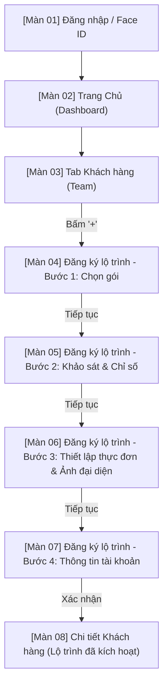

# As-Is Notes — Phân tích Luồng Đăng nhập & Tạo Khách hàng HLV (AN-Care)

Tài liệu này ghi chép kết quả phân tích từ video screen record quy trình đăng nhập bằng tài khoản Huấn Luyện Viên (HLV) và thực hiện thêm mới thành viên trên ứng dụng di động AN-Care (link nguồn: [YouTube Video](https://www.youtube.com/watch?v=hTXHwBV2toU)).

---

## 1. Sơ đồ luồng tổng quát

Quy trình thao tác thực tế của HLV trong video diễn ra theo luồng nghiệp vụ khép kín sau:

---

## 2. Mô tả chi tiết từng màn hình

Dưới đây là chi tiết giao diện, các trường thông tin (Bắt buộc/Tùy chọn) và nút chức năng của từng màn hình xuất hiện trong luồng video.

### Màn 01 — Đăng nhập (Login & Authentication)
- **Path ảnh:** `screenshots-hlv/01_dang_nhap.png`
- **Vai trò:** HLV
- **Luồng:** Mở ứng dụng → Màn hình đăng nhập chính. Sau khi đăng nhập thành công, chuyển đến Trang Chủ.
- **Trường thông tin hiển thị & nhập liệu:**
  - **Số điện thoại hoặc Email** — *Bắt buộc*: Nhập chuỗi định dạng SĐT hoặc Email (Placeholder: "Nhập số điện thoại hoặc email").
  - **Mật khẩu** — *Bắt buộc*: Nhập mật khẩu tài khoản (Placeholder: "Nhập mật khẩu"). Có icon hình con mắt ở bên phải để bật/tắt chế độ ẩn/hiện mật khẩu.
- **Các nút chức năng:**
  - **Đăng nhập**: Nút chính (màu xanh lá đậm, chữ trắng) thực hiện xác thực và chuyển vào Trang Chủ.
  - **Quên mật khẩu?**: Liên kết chuyển sang luồng khôi phục mật khẩu.
  - **Đăng ký**: Liên kết chuyển sang luồng tạo tài khoản HLV mới.
  - **Face ID**: Trình xác thực sinh trắc học tích hợp của hệ điều hành tự động kích hoạt.
    - *Popup Face ID:* "Không nhận ra khuôn mặt" nếu quét lỗi.
    - *Nút popup:* "Thử lại Face ID" và "Hủy" (để chuyển qua nhập mật mã thiết bị/mật khẩu thủ công).
- **AI phân tích As-Is:**
  - **Bố cục:** Tông màu chủ đạo xanh lá đậm `#1E3322` tạo cảm giác về sức khỏe/thiên nhiên. Logo "AN Care" với biểu tượng chiếc lá xanh nằm chính giữa góc trên. Form đăng nhập tối giản và tập trung.
  - **Trạng thái:** Hỗ trợ lưu thông tin đăng nhập và nhận diện sinh trắc học Face ID giúp tối ưu thời gian truy cập.
  - **Hạn chế:** Khoảng cách lề giữa nút Quên mật khẩu và Đăng ký xếp cạnh nhau ở góc dưới hơi hẹp, dễ bấm nhầm trên màn hình nhỏ.

---

### Màn 02 — Trang Chủ (Dashboard)
- **Path ảnh:** `screenshots-hlv/02_dashboard.png`
- **Vai trò:** HLV
- **Luồng:** Từ Đăng nhập thành công → Trang Chủ.
- **Trường thông tin hiển thị:**
  - **Số liệu KPIs chính**: Khách hàng, NPP (Nhà Phân Phối), Doanh thu (Ví dụ hiển thị: "0 Khách hàng - NPP 0đ Doanh thu" trên một dòng).
  - **Công việc hôm nay (To-do list)**: Danh sách các tác vụ cần thực hiện (ví dụ: nhắc cập nhật chỉ số Tanita, chăm sóc hội viên).
  - **Thanh điều hướng dưới (Bottom Tab Bar)**: Gồm 5 tab: *Trang Chủ*, *Team/Khách hàng*, *Chat*, *HLV*, *Hồ sơ*.
- **Các nút chức năng:**
  - **Các Tab trên Navigation Bar**: Chuyển đổi qua lại giữa các phân hệ của ứng dụng.
  - **Click vào thẻ Task To-do**: Dẫn thẳng tới màn hình thực hiện công việc tương ứng.
- **AI phân tích As-Is:**
  - **Bố cục:** Phần trên chứa thông tin tóm tắt và lời chào HLV, phần giữa là danh sách công việc dạng thẻ card, phần dưới là Menu.
  - **Trạng thái:** Dữ liệu thời gian thực hiển thị tiến độ trong ngày của HLV.
  - **Hạn chế:** Nhãn tab điều hướng bên dưới sử dụng ký tự đặc biệt lồng văn bản, đôi khi hiển thị không đồng nhất trên các dòng máy khác nhau. KPIs hiển thị dồn cục cần tách rời trực quan hơn.

---

### Màn 03 — Tab Khách hàng (Team Management)
- **Path ảnh:** `screenshots-hlv/03_danh_sach_kh.png`
- **Vai trò:** HLV
- **Luồng:** Nhấp vào tab "Team" (hoặc tab Khách hàng trên thanh điều hướng dưới) → Hiển thị danh sách hội viên.
- **Trường thông tin hiển thị:**
  - **Thanh tìm kiếm**: Nhập tên hoặc SĐT để lọc nhanh khách hàng.
  - **Danh sách khách hàng**: Hiển thị các thẻ thành viên kèm thông tin avatar, họ tên, gói đang sử dụng và tiến độ ngày chăm sóc.
- **Các nút chức năng:**
  - **Nút '+' (Thêm mới khách hàng)**: Nằm ở góc dưới cùng bên phải (nút nổi FAB). Bấm vào đây để bắt đầu luồng đăng ký lộ trình mới cho khách hàng.
- **AI phân tích As-Is:**
  - **Bố cục:** Danh sách cuộn dọc đơn giản, hiển thị đầy đủ thông tin tóm tắt của từng khách hàng giúp HLV bao quát nhanh.
  - **Hạn chế:** Thiếu bộ lọc nhanh theo trạng thái gói (Đang hoạt động/Hết hạn/Chưa kích hoạt) ngay trên đầu danh sách.

---

### Màn 04 — Đăng ký lộ trình - Bước 1: Chọn gói (Subscription Setup)
- **Path ảnh:** `screenshots-hlv/04_chon_goi.png`
- **Vai trò:** HLV
- **Luồng:** Từ tab Khách hàng → Bấm nút '+' → Bước 1 của Wizard đăng ký.
- **Trường thông tin hiển thị & nhập liệu:**
  - **Chọn gói dịch vụ** — *Bắt buộc*: Dropdown danh sách các gói có sẵn (ví dụ trong video chọn: "Gói 1 tháng").
  - **Ngày bắt đầu kích hoạt gói** — *Bắt buộc*: Trình chọn ngày (Date Picker), mặc định là ngày hiện tại.
- **Các nút chức năng:**
  - **Tiếp tục**: Nút ở chân màn hình, chuyển sang Bước 2. Chỉ bật sáng khi đã chọn gói và ngày hợp lệ.
  - **Hủy/Quay lại**: Hủy thao tác và quay về Danh sách Khách hàng.
- **AI phân tích As-Is:**
  - **Bố cục:** Form dạng thẻ card nổi trên nền xám nhạt, trường nhập liệu rõ ràng, dễ thao tác.
  - **Trạng thái:** Tự động tính toán ngày kết thúc tương ứng dựa trên thời hạn gói (nhưng không hiển thị rõ ở màn này, sẽ hiển thị ở màn cuối).

---

### Màn 05 — Đăng ký lộ trình - Bước 2: Khảo sát & Chỉ số (Survey & Metrics)
- **Path ảnh:** `screenshots-hlv/05_khao_sat_chi_so.png`
- **Vai trò:** HLV
- **Luồng:** Bước 1 → Bấm "Tiếp tục" → Bước 2.
- **Trường thông tin hiển thị & nhập liệu:**
  - **Giới tính** — *Bắt buộc*: Chọn Nữ / Nam / Khác (dạng nút bấm chọn nhanh).
  - **Ngày sinh** — *Bắt buộc*: Trình chọn ngày sinh để tính tuổi (ví dụ: `01/01/2000`).
  - **Chiều cao** — *Bắt buộc*: Ô nhập số (cm, ví dụ: `158`).
  - **Cân nặng hiện tại** — *Bắt buộc*: Ô nhập số (kg, ví dụ: `58`).
  - **Cân nặng mục tiêu** — *Bắt buộc*: Ô nhập số (kg, ví dụ: `54`).
  - **Mức độ hoạt động** — *Bắt buộc*: Dropdown chọn mức độ (trong video chọn: *Nhẹ - chủ yếu ngồi làm việc, tập thể dục nhẹ 1-3 lần/tuần*).
  - **Năng lượng nghỉ ngơi (RMR)** — *Tự động*: Hệ thống tự động tính dựa trên chiều cao, cân nặng, giới tính, tuổi (trong video tính ra: **1276 kcal/ngày**).
  - **Gợi ý Calo mục tiêu hàng ngày** — *Tự động*: Hệ thống tự đề xuất dựa trên RMR và mục tiêu thâm hụt calo (trong video đề xuất: **1359 kcal/ngày**).
- **Các nút chức năng:**
  - **Tiếp tục**: Chuyển sang Bước 3.
  - **Quay lại**: Quay về Bước 1 để sửa gói.
- **AI phân tích As-Is:**
  - **Điểm mạnh:** Các ô nhập liệu có nhãn đơn vị rõ ràng (cm, kg). Tính toán RMR và gợi ý calo ngay lập tức sau khi điền đủ thông tin mà không cần tải lại trang.
  - **Hạn chế:** Không có thanh trượt hoặc phím tăng giảm nhanh cho chiều cao/cân nặng mà hoàn toàn phải gõ bàn phím số.

---

### Màn 06 — Đăng ký lộ trình - Bước 3: Thiết lập thực đơn & Ảnh đại diện (Meal Setup & Profile Picture)
- **Path ảnh:** `screenshots-hlv/06_thiet_lap_bua_an.png`
- **Vai trò:** HLV
- **Luồng:** Bước 2 → Bấm "Tiếp tục" → Bước 3.
- **Trường thông tin hiển thị & nhập liệu:**
  - **Phân phối bữa ăn** — *Bắt buộc*: Dropdown chọn số lượng bữa ăn trong ngày (trong video chọn: *4 bữa*).
  - **Thực đơn gợi ý chi tiết**: Hiển thị danh sách các món ăn tự động phân bổ theo tổng calo mục tiêu (1359 kcal) chia cho 4 bữa:
    - *Bữa sáng*: Ví dụ: F1 + PPP + Trà thảo mộc.
    - *Bữa trưa*: Ví dụ: Cơm lứt (1/2 bát) + Ức gà (150g) + Rau luộc.
    - *Bữa xế*: Ví dụ: Trái cây ít ngọt (ổi/táo).
    - *Bữa tối*: Ví dụ: Cơm lứt + Cá hấp + Rau.
    - HLV có thể bấm chỉnh sửa nguyên liệu hoặc lượng calo của từng món.
  - **Ảnh đại diện** — *Tùy chọn*: Khung ảnh trống đại diện cho khách hàng. Cho phép chụp trực tiếp hoặc chọn ảnh từ thư viện thiết bị.
- **Các nút chức năng:**
  - **Chọn ảnh**: Kích hoạt bộ chọn ảnh hệ điều hành để tải ảnh đại diện lên.
  - **Tiếp tục**: Chuyển sang Bước 4.
  - **Quay lại**: Quay về Bước 2.
- **AI phân tích As-Is:**
  - **Điểm mạnh:** Tự động đề xuất danh mục thực phẩm lành mạnh khớp với lượng Calo của Bước 2. Phân chia rõ ràng định lượng giúp HLV dễ giải thích cho khách hàng.
  - **Hạn chế:** Giao diện chỉnh sửa thực đơn cuộn dọc khá dài. Thao tác thay thế món ăn hoặc tùy chỉnh danh mục nguyên liệu còn thủ công, chưa có thư viện món ăn để chọn nhanh.

---

### Màn 07 — Đăng ký lộ trình - Bước 4: Thông tin tài khoản (Account Credentials)
- **Path ảnh:** `screenshots-hlv/07_thong_tin_tai_khoan.png`
- **Vai trò:** HLV
- **Luồng:** Bước 3 → Bấm "Tiếp tục" → Bước 4.
- **Trường thông tin hiển thị & nhập liệu:**
  - **Họ tên khách hàng** — *Bắt buộc*: Ô nhập chữ (trong video nhập: `Khách hàng 01`).
  - **Email** — *Bắt buộc*: Ô nhập email để làm tên đăng nhập của khách hàng (trong video nhập: `tes@gmail.com`).
  - **Mật khẩu** — *Bắt buộc*: Thiết lập mật khẩu cho khách hàng đăng nhập lần đầu.
- **Các nút chức năng:**
  - **Xác nhận**: Nút hành động cuối cùng để hoàn tất việc đăng ký, lưu dữ liệu vào hệ thống và kích hoạt tài khoản.
  - **Quay lại**: Quay về Bước 3.
- **AI phân tích As-Is:**
  - **Bố cục:** Form đơn giản gồm 3 trường thông tin cốt lõi để khởi tạo tài khoản.
  - **Điểm mạnh:** Tránh việc bắt khách hàng tự đăng ký phức tạp, HLV chủ động thiết lập sẵn thông tin đăng nhập giúp cải thiện tỷ lệ kích hoạt tài khoản.

---

### Màn 08 — Chi tiết Khách hàng (Client Details - Plan Active)
- **Path ảnh:** `screenshots-hlv/08_chi_tiet_kh.png`
- **Vai trò:** HLV
- **Luồng:** Từ Bước 4 → Bấm "Xác nhận" → Chuyển tiếp đến trang chi tiết của khách hàng vừa tạo thành công.
- **Trường thông tin hiển thị:**
  - **Tên khách hàng**: `Khách hàng 01` kèm nhãn trạng thái `"Đã mua gói"`.
  - **Thời gian áp dụng**: Từ ngày kích hoạt đến ngày kết thúc gói (Ví dụ trong video: `2026-07-02` đến `2026-07-12` - gói thử nghiệm 10 ngày).
  - **Kế hoạch dinh dưỡng**: Hiển thị tổng Calo (`1359 kcal/ngày`), lượng Đạm mục tiêu (`86g`), lượng Nước mục tiêu (`3770 ml`) và số bữa ăn (`4 meals`).
  - **Mục tiêu cân nặng**: Cân nặng bắt đầu (`58 kg`) vs Cân nặng mục tiêu (`54 kg`).
- **Các nút chức năng:**
  - **Chỉnh sửa gợi ý bữa ăn**: Chuyển lại vào màn hình thiết lập thực đơn để thay đổi phiên bản thực đơn.
  - **Điều chỉnh mục tiêu**: Cho phép thay đổi cân nặng mục tiêu, calo nạp vào.
  - **Gửi tin nhắn (Chat)**: Mở khung chat 1-1 với khách hàng này.
- **AI phân tích As-Is:**
  - **Điểm mạnh:** Tổng hợp đầy đủ tất cả dữ liệu lộ trình vừa thiết lập trên một màn hình dashboard cá nhân hóa của khách hàng. Trực quan hóa tiến trình cân nặng.
  - **Hạn chế:** Các chỉ số Đạm và Nước được tính toán tự động nhưng chưa hiển thị công thức hay lý do đằng sau con số đó (ví dụ: nước tính theo công thức `0.4L/10kg` cộng thêm bù hao vận động).

---

