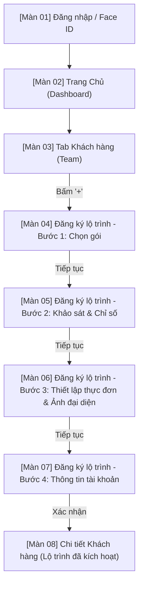
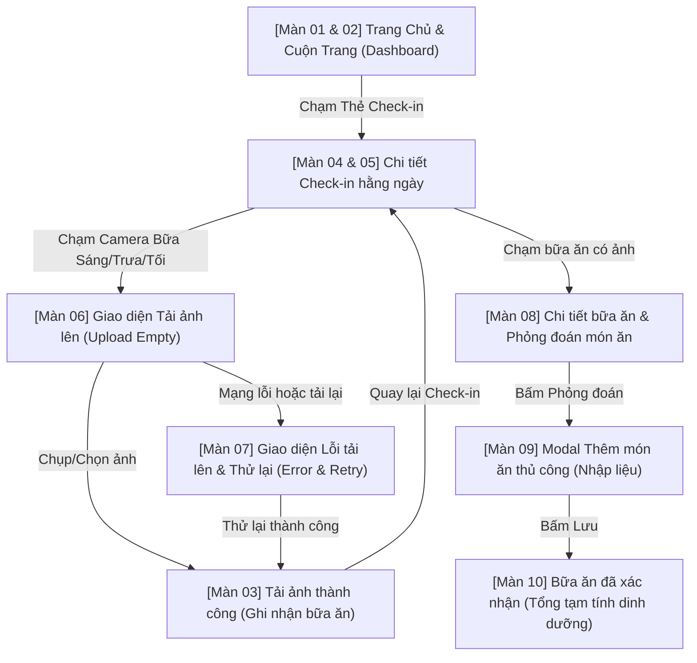

# As-Is Notes — Phân tích Luồng Nghiệp vụ HLV & Khách Hàng (AN-Care)

Tài liệu này ghi chép kết quả phân tích từ hai video screen record quy trình nghiệp vụ trên ứng dụng di động AN-Care:
1. Quy trình đăng nhập bằng tài khoản Huấn Luyện Viên (HLV) và thực hiện thêm mới thành viên (link nguồn: [YouTube Video](https://www.youtube.com/watch?v=hTXHwBV2toU)).
2. Quy trình check-in hằng ngày và phỏng đoán dinh dưỡng món ăn bằng AI của vai trò Khách Hàng (KH) (nguồn: file video `screen-record-KH.mp4`).

---

## 1. Sơ đồ luồng tổng quát

Quy trình thao tác thực tế của HLV trong video diễn ra theo luồng nghiệp vụ khép kín sau:

---

## 2. Mô tả chi tiết từng màn hình

Dưới đây là chi tiết giao diện, các trường thông tin (Bắt buộc/Tùy chọn) và nút chức năng của từng màn hình xuất hiện trong luồng video.

### Màn 01 — Đăng nhập (Login & Authentication)
- **Path ảnh:** `screenshots-hlv/01_dang_nhap.png`
- **Vai trò:** HLV
- **Luồng:** Mở ứng dụng → Màn hình đăng nhập chính. Sau khi đăng nhập thành công, chuyển đến Trang Chủ.
- **Trường thông tin hiển thị & nhập liệu:**
  - **Số điện thoại hoặc Email** — *Bắt buộc*: Nhập chuỗi định dạng SĐT hoặc Email (Placeholder: "Nhập số điện thoại hoặc email").
  - **Mật khẩu** — *Bắt buộc*: Nhập mật khẩu tài khoản (Placeholder: "Nhập mật khẩu"). Có icon hình con mắt ở bên phải để bật/tắt chế độ ẩn/hiện mật khẩu.
- **Các nút chức năng:**
  - **Đăng nhập**: Nút chính (màu xanh lá đậm, chữ trắng) thực hiện xác thực và chuyển vào Trang Chủ.
  - **Quên mật khẩu?**: Liên kết chuyển sang luồng khôi phục mật khẩu.
  - **Đăng ký**: Liên kết chuyển sang luồng tạo tài khoản HLV mới.
  - **Face ID**: Trình xác thực sinh trắc học tích hợp của hệ điều hành tự động kích hoạt.
    - *Popup Face ID:* "Không nhận ra khuôn mặt" nếu quét lỗi.
    - *Nút popup:* "Thử lại Face ID" và "Hủy" (để chuyển qua nhập mật mã thiết bị/mật khẩu thủ công).
- **AI phân tích As-Is:**
  - **Bố cục:** Tông màu chủ đạo xanh lá đậm `#1E3322` tạo cảm giác về sức khỏe/thiên nhiên. Logo "AN Care" với biểu tượng chiếc lá xanh nằm chính giữa góc trên. Form đăng nhập tối giản và tập trung.
  - **Trạng thái:** Hỗ trợ lưu thông tin đăng nhập và nhận diện sinh trắc học Face ID giúp tối ưu thời gian truy cập.
  - **Hạn chế:** Khoảng cách lề giữa nút Quên mật khẩu và Đăng ký xếp cạnh nhau ở góc dưới hơi hẹp, dễ bấm nhầm trên màn hình nhỏ.

---

### Màn 02 — Trang Chủ (Dashboard)
- **Path ảnh:** `screenshots-hlv/02_dashboard.png`
- **Vai trò:** HLV
- **Luồng:** Từ Đăng nhập thành công → Trang Chủ.
- **Trường thông tin hiển thị:**
  - **Số liệu KPIs chính**: Khách hàng, NPP (Nhà Phân Phối), Doanh thu (Ví dụ hiển thị: "0 Khách hàng - NPP 0đ Doanh thu" trên một dòng).
  - **Công việc hôm nay (To-do list)**: Danh sách các tác vụ cần thực hiện (ví dụ: nhắc cập nhật chỉ số Tanita, chăm sóc hội viên).
  - **Thanh điều hướng dưới (Bottom Tab Bar)**: Gồm 5 tab: *Trang Chủ*, *Team/Khách hàng*, *Chat*, *HLV*, *Hồ sơ*.
- **Các nút chức năng:**
  - **Các Tab trên Navigation Bar**: Chuyển đổi qua lại giữa các phân hệ của ứng dụng.
  - **Click vào thẻ Task To-do**: Dẫn thẳng tới màn hình thực hiện công việc tương ứng.
- **AI phân tích As-Is:**
  - **Bố cục:** Phần trên chứa thông tin tóm tắt và lời chào HLV, phần giữa là danh sách công việc dạng thẻ card, phần dưới là Menu.
  - **Trạng thái:** Dữ liệu thời gian thực hiển thị tiến độ trong ngày của HLV.
  - **Hạn chế:** Nhãn tab điều hướng bên dưới sử dụng ký tự đặc biệt lồng văn bản, đôi khi hiển thị không đồng nhất trên các dòng máy khác nhau. KPIs hiển thị dồn cục cần tách rời trực quan hơn.

---

### Màn 03 — Tab Khách hàng (Team Management)
- **Path ảnh:** `screenshots-hlv/03_danh_sach_kh.png`
- **Vai trò:** HLV
- **Luồng:** Nhấp vào tab "Team" (hoặc tab Khách hàng trên thanh điều hướng dưới) → Hiển thị danh sách hội viên.
- **Trường thông tin hiển thị:**
  - **Thanh tìm kiếm**: Nhập tên hoặc SĐT để lọc nhanh khách hàng.
  - **Danh sách khách hàng**: Hiển thị các thẻ thành viên kèm thông tin avatar, họ tên, gói đang sử dụng và tiến độ ngày chăm sóc.
- **Các nút chức năng:**
  - **Nút '+' (Thêm mới khách hàng)**: Nằm ở góc dưới cùng bên phải (nút nổi FAB). Bấm vào đây để bắt đầu luồng đăng ký lộ trình mới cho khách hàng.
- **AI phân tích As-Is:**
  - **Bố cục:** Danh sách cuộn dọc đơn giản, hiển thị đầy đủ thông tin tóm tắt của từng khách hàng giúp HLV bao quát nhanh.
  - **Hạn chế:** Thiếu bộ lọc nhanh theo trạng thái gói (Đang hoạt động/Hết hạn/Chưa kích hoạt) ngay trên đầu danh sách.

---

### Màn 04 — Đăng ký lộ trình - Bước 1: Chọn gói (Subscription Setup)
- **Path ảnh:** `screenshots-hlv/04_chon_goi.png`
- **Vai trò:** HLV
- **Luồng:** Từ tab Khách hàng → Bấm nút '+' → Bước 1 của Wizard đăng ký.
- **Trường thông tin hiển thị & nhập liệu:**
  - **Chọn gói dịch vụ** — *Bắt buộc*: Dropdown danh sách các gói có sẵn (ví dụ trong video chọn: "Gói 1 tháng").
  - **Ngày bắt đầu kích hoạt gói** — *Bắt buộc*: Trình chọn ngày (Date Picker), mặc định là ngày hiện tại.
- **Các nút chức năng:**
  - **Tiếp tục**: Nút ở chân màn hình, chuyển sang Bước 2. Chỉ bật sáng khi đã chọn gói và ngày hợp lệ.
  - **Hủy/Quay lại**: Hủy thao tác và quay về Danh sách Khách hàng.
- **AI phân tích As-Is:**
  - **Bố cục:** Form dạng thẻ card nổi trên nền xám nhạt, trường nhập liệu rõ ràng, dễ thao tác.
  - **Trạng thái:** Tự động tính toán ngày kết thúc tương ứng dựa trên thời hạn gói (nhưng không hiển thị rõ ở màn này, sẽ hiển thị ở màn cuối).

---

### Màn 05 — Đăng ký lộ trình - Bước 2: Khảo sát & Chỉ số (Survey & Metrics)
- **Path ảnh:** `screenshots-hlv/05_khao_sat_chi_so.png`
- **Vai trò:** HLV
- **Luồng:** Bước 1 → Bấm "Tiếp tục" → Bước 2.
- **Trường thông tin hiển thị & nhập liệu:**
  - **Giới tính** — *Bắt buộc*: Chọn Nữ / Nam / Khác (dạng nút bấm chọn nhanh).
  - **Ngày sinh** — *Bắt buộc*: Trình chọn ngày sinh để tính tuổi (ví dụ: `01/01/2000`).
  - **Chiều cao** — *Bắt buộc*: Ô nhập số (cm, ví dụ: `158`).
  - **Cân nặng hiện tại** — *Bắt buộc*: Ô nhập số (kg, ví dụ: `58`).
  - **Cân nặng mục tiêu** — *Bắt buộc*: Ô nhập số (kg, ví dụ: `54`).
  - **Mức độ hoạt động** — *Bắt buộc*: Dropdown chọn mức độ (trong video chọn: *Nhẹ - chủ yếu ngồi làm việc, tập thể dục nhẹ 1-3 lần/tuần*).
  - **Năng lượng nghỉ ngơi (RMR)** — *Tự động*: Hệ thống tự động tính dựa trên chiều cao, cân nặng, giới tính, tuổi (trong video tính ra: **1276 kcal/ngày**).
  - **Gợi ý Calo mục tiêu hàng ngày** — *Tự động*: Hệ thống tự đề xuất dựa trên RMR và mục tiêu thâm hụt calo (trong video đề xuất: **1359 kcal/ngày**).
- **Các nút chức năng:**
  - **Tiếp tục**: Chuyển sang Bước 3.
  - **Quay lại**: Quay về Bước 1 để sửa gói.
- **AI phân tích As-Is:**
  - **Điểm mạnh:** Các ô nhập liệu có nhãn đơn vị rõ ràng (cm, kg). Tính toán RMR và gợi ý calo ngay lập tức sau khi điền đủ thông tin mà không cần tải lại trang.
  - **Hạn chế:** Không có thanh trượt hoặc phím tăng giảm nhanh cho chiều cao/cân nặng mà hoàn toàn phải gõ bàn phím số.

---

### Màn 06 — Đăng ký lộ trình - Bước 3: Thiết lập thực đơn & Ảnh đại diện (Meal Setup & Profile Picture)
- **Path ảnh:** `screenshots-hlv/06_thiet_lap_bua_an.png`
- **Vai trò:** HLV
- **Luồng:** Bước 2 → Bấm "Tiếp tục" → Bước 3.
- **Trường thông tin hiển thị & nhập liệu:**
  - **Phân phối bữa ăn** — *Bắt buộc*: Dropdown chọn số lượng bữa ăn trong ngày (trong video chọn: *4 bữa*).
  - **Thực đơn gợi ý chi tiết**: Hiển thị danh sách các món ăn tự động phân bổ theo tổng calo mục tiêu (1359 kcal) chia cho 4 bữa:
    - *Bữa sáng*: Ví dụ: F1 + PPP + Trà thảo mộc.
    - *Bữa trưa*: Ví dụ: Cơm lứt (1/2 bát) + Ức gà (150g) + Rau luộc.
    - *Bữa xế*: Ví dụ: Trái cây ít ngọt (ổi/táo).
    - *Bữa tối*: Ví dụ: Cơm lứt + Cá hấp + Rau.
    - HLV có thể bấm chỉnh sửa nguyên liệu hoặc lượng calo của từng món.
  - **Ảnh đại diện** — *Tùy chọn*: Khung ảnh trống đại diện cho khách hàng. Cho phép chụp trực tiếp hoặc chọn ảnh từ thư viện thiết bị.
- **Các nút chức năng:**
  - **Chọn ảnh**: Kích hoạt bộ chọn ảnh hệ điều hành để tải ảnh đại diện lên.
  - **Tiếp tục**: Chuyển sang Bước 4.
  - **Quay lại**: Quay về Bước 2.
- **AI phân tích As-Is:**
  - **Điểm mạnh:** Tự động đề xuất danh mục thực phẩm lành mạnh khớp với lượng Calo của Bước 2. Phân chia rõ ràng định lượng giúp HLV dễ giải thích cho khách hàng.
  - **Hạn chế:** Giao diện chỉnh sửa thực đơn cuộn dọc khá dài. Thao tác thay thế món ăn hoặc tùy chỉnh danh mục nguyên liệu còn thủ công, chưa có thư viện món ăn để chọn nhanh.

---

### Màn 07 — Đăng ký lộ trình - Bước 4: Thông tin tài khoản (Account Credentials)
- **Path ảnh:** `screenshots-hlv/07_thong_tin_tai_khoan.png`
- **Vai trò:** HLV
- **Luồng:** Bước 3 → Bấm "Tiếp tục" → Bước 4.
- **Trường thông tin hiển thị & nhập liệu:**
  - **Họ tên khách hàng** — *Bắt buộc*: Ô nhập chữ (trong video nhập: `Khách hàng 01`).
  - **Email** — *Bắt buộc*: Ô nhập email để làm tên đăng nhập của khách hàng (trong video nhập: `tes@gmail.com`).
  - **Mật khẩu** — *Bắt buộc*: Thiết lập mật khẩu cho khách hàng đăng nhập lần đầu.
- **Các nút chức năng:**
  - **Xác nhận**: Nút hành động cuối cùng để hoàn tất việc đăng ký, lưu dữ liệu vào hệ thống và kích hoạt tài khoản.
  - **Quay lại**: Quay về Bước 3.
- **AI phân tích As-Is:**
  - **Bố cục:** Form đơn giản gồm 3 trường thông tin cốt lõi để khởi tạo tài khoản.
  - **Điểm mạnh:** Tránh việc bắt khách hàng tự đăng ký phức tạp, HLV chủ động thiết lập sẵn thông tin đăng nhập giúp cải thiện tỷ lệ kích hoạt tài khoản.

---

### Màn 08 — Chi tiết Khách hàng (Client Details - Plan Active)
- **Path ảnh:** `screenshots-hlv/08_chi_tiet_kh.png`
- **Vai trò:** HLV
- **Luồng:** Từ Bước 4 → Bấm "Xác nhận" → Chuyển tiếp đến trang chi tiết của khách hàng vừa tạo thành công.
- **Trường thông tin hiển thị:**
  - **Tên khách hàng**: `Khách hàng 01` kèm nhãn trạng thái `"Đã mua gói"`.
  - **Thời gian áp dụng**: Từ ngày kích hoạt đến ngày kết thúc gói (Ví dụ trong video: `2026-07-02` đến `2026-07-12` - gói thử nghiệm 10 ngày).
  - **Kế hoạch dinh dưỡng**: Hiển thị tổng Calo (`1359 kcal/ngày`), lượng Đạm mục tiêu (`86g`), lượng Nước mục tiêu (`3770 ml`) và số bữa ăn (`4 meals`).
  - **Mục tiêu cân nặng**: Cân nặng bắt đầu (`58 kg`) vs Cân nặng mục tiêu (`54 kg`).
- **Các nút chức năng:**
  - **Chỉnh sửa gợi ý bữa ăn**: Chuyển lại vào màn hình thiết lập thực đơn để thay đổi phiên bản thực đơn.
  - **Điều chỉnh mục tiêu**: Cho phép thay đổi cân nặng mục tiêu, calo nạp vào.
  - **Gửi tin nhắn (Chat)**: Mở khung chat 1-1 với khách hàng này.
- **AI phân tích As-Is:**
  - **Điểm mạnh:** Tổng hợp đầy đủ tất cả dữ liệu lộ trình vừa thiết lập trên một màn hình dashboard cá nhân hóa của khách hàng. Trực quan hóa tiến trình cân nặng.
  - **Hạn chế:** Các chỉ số Đạm và Nước được tính toán tự động nhưng chưa hiển thị công thức hay lý do đằng sau con số đó (ví dụ: nước tính theo công thức `0.4L/10kg` cộng thêm bù hao vận động).

---

## 3. Sơ đồ luồng tổng quát phía Khách Hàng (KH)

Quy trình thao tác của Khách hàng (KH) trong video `screen-record-KH.mp4` mô tả hoạt động check-in hằng ngày, tải ảnh bữa ăn, xử lý lỗi upload và sử dụng AI phỏng đoán dinh dưỡng món ăn diễn ra theo luồng nghiệp vụ sau:

---

## 4. Mô tả chi tiết từng màn hình phía Khách Hàng (KH)

Dưới đây là chi tiết giao diện, các trường thông tin (Bắt buộc/Tùy chọn) và nút chức năng của từng màn hình xuất hiện trong luồng video của vai trò Khách hàng (KH).

### Màn 01 — Trang Chủ (Dashboard - KH)
- **Path ảnh:** `screenshots-kh/01_dashboard.png`
- **Vai trò:** Khách hàng (KH)
- **Luồng:** Mở ứng dụng → Đăng nhập tự động/thành công → Trang Chủ của Khách hàng.
- **Trường thông tin hiển thị:**
  - **Lời chào & Tên người dùng**: "Chào buổi tối, Mipt01!" kèm Avatar và nhãn VIP, ngày hết hạn gói `"HH 02/10/2026"`.
  - **Thẻ Check-in hôm nay**: Hiển thị tiến độ hoàn thành các chỉ mục check-in: `"Check-in hôm nay 1/5 mục đã ghi"`, danh sách các chỉ mục gồm `"Nước • Bữa • Ngủ • Cân"`, kèm thanh tiến độ 5 chấm tròn.
  - **Tiến trình**: Thông báo `"Chưa có báo cáo tiến trình. Huấn luyện viên sẽ xuất báo cáo đánh giá tiến độ cho bạn theo định kỳ."`
  - **Mục tiêu của bạn**: Hiển thị chỉ số ngày `"Ngày 1/11"`. Thông báo `"Chưa có mục tiêu. Liên hệ huấn luyện viên để thiết lập mục tiêu của bạn."` và chuỗi liên tiếp `"0 ngày liên tiếp"`.
  - **Giảm cân**: Hiển thị mục tiêu `"Giảm cân"`, chỉ số lượng calo khuyên dùng `"1.988 kcal/ngày • CSKD"`.
  - **Thanh điều hướng dưới (Bottom Tab Bar)**: Gồm 4 tab: *Trang Chủ*, *Chat*, *Lịch sử*, *Hồ sơ*.
- **Các nút chức năng:**
  - **Nút Nhắn HLV**: Nằm trong mục Tiến trình, mở màn hình Chat trực tiếp với HLV.
  - **Thẻ Check-in hôm nay**: Bấm vào để chuyển đến màn hình "Check-in hằng ngày" chi tiết.
- **AI phân tích As-Is:**
  - **Bố cục:** Thiết kế theo dạng thẻ (Card) trực quan trên nền xám nhạt, sử dụng màu xanh lục thương hiệu cho các phần quan trọng.
  - **Điểm mạnh:** Thanh tiến độ check-in 5 chấm giúp người dùng có động lực hoàn thành các chỉ tiêu trong ngày.
  - **Hạn chế:** Khi chưa được HLV cập nhật mục tiêu hoặc báo cáo, các ô hiển thị thông tin trống chiếm khá nhiều diện tích.

---

### Màn 02 — Trang Chủ - Chỉ số cơ thể & Thực đơn (Dashboard Scroll - KH)
- **Path ảnh:** `screenshots-kh/02_dashboard_scroll.png`
- **Vai trò:** Khách hàng (KH)
- **Luồng:** Cuộn xuống từ Trang Chủ.
- **Trường thông tin hiển thị:**
  - **Bảng chỉ số cơ thể**: Tiêu đề `"Chỉ số cơ thể (02/07)"` kèm nhãn xanh `"Đã cập nhật"`. Bảng hiển thị 8 chỉ số chính đo từ cân Tanita:
    - *C.Nặng*: `80.0` kg
    - *Mỡ (%)*: `38.0` %
    - *Cơ (kg)*: `28.0` kg
    - *Nước*: `55.0` %
    - *Mỡ NT*: `4.0` lvl
    - *Xương*: `2.7` kg
    - *Tuổi SH*: `25` tuổi
    - *BMR*: `1400` kcal
  - **Thực đơn hôm nay**: Tiêu đề `"Thực đơn hôm nay"` kèm nhãn `"Ngày 1/11"`. Danh sách món ăn gợi ý theo bữa:
    - *Ăn sáng* (217 kcal):
      - Đạm: Sữa F1 (Bữa ăn lành mạnh) - 2 muỗng + 250ml (87 kcal)
      - Rau / vitamin: Canh rau - 1 bát (39 kcal)
      - Tinh bột: 2 thìa vừng đen - 2 thìa (91 kcal)
    - *Ăn trưa* (904 kcal):
      - Đạm: Ức gà áp chảo - 1.5 lạng (362 kcal)
      - (phần dưới bị khuất)
- **Các nút chức năng:**
  - **Nút tích chọn xanh (Check-in nhanh)**: Nằm bên phải tên bữa ăn, dùng để đánh dấu đã hoàn thành bữa ăn.
  - **Nút Camera**: Dùng để chụp ảnh hoặc tải ảnh món ăn lên cho bữa đó.
- **AI phân tích As-Is:**
  - **Điểm mạnh:** Hiển thị chi tiết calo và thành phần dinh dưỡng (Đạm, Rau, Tinh bột) cho từng nguyên liệu trong thực đơn, giúp người dùng dễ dàng theo dõi.

---

### Màn 03 — Ghi nhận bữa ăn thành công (Meal Logged Successfully)
- **Path ảnh:** `screenshots-kh/03_ghi_nhan_bua_an_thanh_cong.png`
- **Vai trò:** Khách hàng (KH)
- **Luồng:** Từ Trang chủ → Click nút Camera ở bữa ăn → Chụp/Chọn ảnh → Tải lên thành công.
- **Trường thông tin hiển thị:**
  - **Ảnh bữa ăn**: Hiển thị ảnh món ăn vừa chụp/chọn ở kích thước lớn.
  - **Nhãn trạng thái**: Biểu tượng tick xanh lớn kèm dòng chữ `"Đã ghi nhận bữa Sáng"` (hoặc bữa Trưa/Tối tương ứng) và `"Ảnh đã được ghi nhận."`
  - **Danh sách ảnh đã chụp hôm nay (1)**: Hiển thị các thumbnail ảnh đã tải lên trong ngày.
- **Các nút chức năng:**
  - **Nút Chụp lại**: Bấm để chụp hoặc chọn ảnh khác thay thế cho ảnh hiện tại.
  - **Nút quay lại (<)**: Ở góc trên bên trái để quay về màn hình trước đó.
- **AI phân tích As-Is:**
  - **Điểm mạnh:** Thông báo thành công trực quan, hiển thị rõ ràng hình ảnh đã tải lên để người dùng tự kiểm tra lại.

---

### Màn 04 — Chi tiết Check-in hằng ngày (Daily Check-in Details)
- **Path ảnh:** `screenshots-kh/04_check_in_hang_ngay.png`
- **Vai trò:** Khách hàng (KH)
- **Luồng:** Bấm vào thẻ "Check-in hôm nay" từ Trang chủ.
- **Trường thông tin hiển thị:**
  - **Bảng chỉ số cơ thể**: Hiển thị chi tiết các chỉ số đo cơ thể dưới dạng các ô thẻ nhỏ (Cân nặng 80.0 kg, Chiều cao -- cm, BMI --, Tỷ lệ mỡ 38.0 %, Cơ 28.0 kg, Tỷ lệ nước 55.0 %, Xương 2.7 kg, Mỡ nội tạng 4 lvl, Tuổi TĐC 25 t, BMR (TĐC cơ bản) 1400 kcal/ngày).
  - **Thực đơn hôm nay**: Hiển thị thực đơn tương tự màn Trang Chủ, nhưng lúc này bữa ăn đã log thành công (ví dụ "Ăn sáng") sẽ có dấu tick xanh lá nổi bật và phần "Ảnh đã chụp (1)" hiển thị thumbnail kèm nút "+ thêm ảnh" nét đứt.
- **Các nút chức năng:**
  - **Nút Chạm để cân lại hôm nay >**: Cho phép người dùng kết nối cân hoặc nhập lại chỉ số cơ thể của ngày hôm nay.
  - **Nút "+ thêm ảnh"**: Nằm cạnh ảnh đã chụp để người dùng có thể đăng thêm ảnh cho cùng một bữa ăn.
- **AI phân tích As-Is:**
  - **Điểm mạnh:** Tập trung toàn bộ thông tin kiểm tra hằng ngày (chỉ số cơ thể, thực đơn ăn uống, trạng thái check-in) vào một nơi duy nhất.

---

### Màn 05 — Chi tiết Check-in hằng ngày - Phần dưới (Daily Check-in Scroll)
- **Path ảnh:** `screenshots-kh/05_check_in_hang_ngay_scroll.png`
- **Vai trò:** Khách hàng (KH)
- **Luồng:** Cuộn xuống dưới cùng của màn hình "Check-in hằng ngày".
- **Trường thông tin hiển thị:**
  - **Phỏng đoán bữa ăn**: Hiển thị danh sách các bữa ăn đã được AI/Hệ thống phỏng đoán và xác nhận (Ví dụ: `"Bữa trưa - Đã xác nhận"`, `"Bữa sáng - Đã xác nhận"`).
  - **Nước, shake & sức khoẻ**:
    - **Nước lọc**: Hiển thị lượng nước đã uống trên tổng lượng mục tiêu (ví dụ: `0/21 ly`).
- **Các nút chức năng:**
  - **Nút tăng/giảm nước (+ / -)**: Cho phép người dùng chạm nhanh để tăng hoặc giảm số ly nước lọc đã uống trong ngày.
- **AI phân tích As-Is:**
  - **Điểm mạnh:** Hỗ trợ đếm số ly nước đơn giản, dễ thao tác.
  - **Hạn chế:** Số lượng ly nước mục tiêu khá lớn (21 ly), có thể gây áp lực trực quan nếu không hiển thị quy đổi sang ml hoặc lít.

---

### Màn 06 — Giao diện Chọn ảnh tải lên (Upload Empty State)
- **Path ảnh:** `screenshots-kh/06_upload_empty.png`
- **Vai trò:** Khách hàng (KH)
- **Luồng:** Nhấp vào nút Camera của một bữa ăn chưa có ảnh.
- **Trường thông tin hiển thị:**
  - **Khung tải lên trống**: Khung nét đứt màu xám chứa biểu tượng camera xanh và dòng chữ `"Chạm để chụp ảnh bữa ăn hoặc chọn từ thư viện"`.
- **Các nút chức năng:**
  - **Nút Chụp**: Màu xanh lá đậm, biểu tượng camera, dùng để mở camera chụp trực tiếp.
  - **Nút Thư viện**: Màu trắng viền xanh lá, biểu tượng hình ảnh, dùng để mở thư viện ảnh trên thiết bị.
  - **Nút quay lại (<)**: Ở góc trên bên trái.

---

### Màn 07 — Lỗi tải ảnh lên & Thử lại (Upload Error & Retry State)
- **Path ảnh:** `screenshots-kh/07_upload_error.png`
- **Vai trò:** Khách hàng (KH)
- **Luồng:** Quá trình tải ảnh lên gặp lỗi (do mạng hoặc hệ thống).
- **Trường thông tin hiển thị:**
  - **Ảnh bữa ăn**: Hiển thị ảnh đang cố gắng tải lên kèm theo icon xoay reload đè trên góc phải ảnh.
- **Các nút chức năng:**
  - **Nút Thử lại**: Nút màu xanh lá đậm nằm chính giữa bên dưới ảnh để gửi lại yêu cầu upload.

---

### Màn 08 — Chi tiết bữa ăn & Phỏng đoán món ăn (Meal Detail & Predict Option)
- **Path ảnh:** `screenshots-kh/08_chi_tiet_bua_an_ai.png`
- **Vai trò:** Khách hàng (KH)
- **Luồng:** Click chọn vào một bữa ăn đã tải ảnh thành công (ví dụ "Bữa tối") từ màn hình chi tiết check-in hoặc trang chủ.
- **Trường thông tin hiển thị:**
  - **Tiêu đề**: `"Bữa tối • 2026-07-02"` (Tên bữa ăn và ngày).
  - **Ảnh đại diện của bữa ăn**: Nằm ở góc trên bên trái.
- **Các nút chức năng:**
  - **Nút Phỏng đoán món ăn**: Màu xanh lục nhạt, chữ trắng, chiếm toàn bộ chiều ngang dưới ảnh. Bấm vào đây để kích hoạt AI tự động nhận diện món ăn từ hình ảnh vừa tải lên.

---

### Màn 09 — Modal Thêm món ăn thủ công (Add Dish Modal Form)
- **Path ảnh:** `screenshots-kh/09_modal_them_mon.png`
- **Vai trò:** Khách hàng (KH)
- **Luồng:** Nhấp vào nút "Phỏng đoán món ăn" hoặc chọn thêm món thủ công từ màn hình chi tiết bữa ăn.
- **Trường thông tin hiển thị & nhập liệu:**
  - **Tên món** — *Bắt buộc*: Ô nhập văn bản để điền tên món ăn (ví dụ đang gõ chữ: `"Ca"`).
  - **Định lượng** — *Bắt buộc*: Nhập trọng lượng/khối lượng món ăn (mặc định: `100`).
  - **Đơn vị** — *Bắt buộc*: Đơn vị tính (mặc định: `g`).
  - **Calo (kcal)** — *Tự động/Tùy chọn*: Lượng Calo tương ứng (hệ thống tự tính hoặc nhập tay).
  - **Đạm (g)** — *Tự động/Tùy chọn*: Hàm lượng đạm tương ứng.
- **Các nút chức năng:**
  - **Nút Lưu**: Màu xanh lục nhạt có icon loading/spinner, bấm vào để xác nhận thêm món ăn vào thực đơn bữa tối thực tế.
  - **Nút Đóng (x)**: Ở góc trên bên phải của modal để hủy thao tác.

---

### Màn 10 — Xác nhận bữa ăn hoàn tất (Confirmed Meal Details)
- **Path ảnh:** `screenshots-kh/10_bua_an_da_xac_nhan.png`
- **Vai trò:** Khách hàng (KH)
- **Luồng:** Từ màn hình Thêm món/Phỏng đoán → Bấm "Lưu" → Quay lại màn hình Chi tiết bữa ăn đã cập nhật chỉ số dinh dưỡng.
- **Trường thông tin hiển thị:**
  - **Nhãn trạng thái**: Dòng chữ `"Bữa ăn đã xác nhận."`
  - **Thẻ chi tiết món ăn**: Hiển thị tên món ăn đã lưu (`"Ca"`) kèm định lượng và các chỉ số dinh dưỡng tính toán (`"~100 g • ~97 kcal • ~20g đạm"`).
  - **Tổng tạm tính**: Dòng chữ tổng hợp dinh dưỡng của bữa ăn hiện tại (`"Tổng tạm tính: ~97 kcal • ~20g đạm"`).
- **Các nút chức năng:**
  - **Nút Sửa lại**: Nằm ở chân màn hình, cho phép chỉnh sửa lại thông tin món ăn hoặc thay đổi định lượng dinh dưỡng nếu cần.

