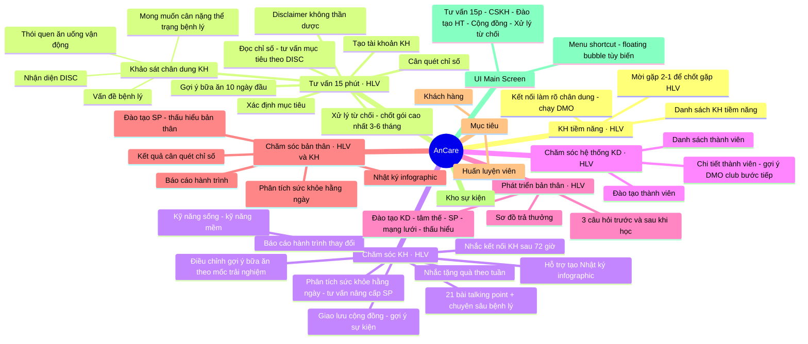

# Cây chức năng AnCare

> Nguồn: export từ mindmap, đã chuẩn hóa lại. Phần **sơ đồ mermaid** cho cái nhìn tổng quan; phần **danh sách chi tiết** giữ đầy đủ yêu cầu gốc (gồm cả ghi chú nghiệp vụ). Mục **Todo** (phân công) và **UI** được tách riêng vì không phải node chức năng.

## 1. Sơ đồ cây chức năng (mermaid)

---

## 2. Danh sách chi tiết (đầy đủ yêu cầu gốc)

### 2.1. Danh sách KH tiềm năng — *role: HLV*
- Danh sách khách hàng tiềm năng.
- Kết nối với khách hàng để làm rõ chân dung khách hàng — chạy các DMO.
- Đưa lời mời tới cuộc gặp 2-1 để ra quyết định gặp HLV.

### 2.2. Tư vấn 15 phút bởi HLV — *role: HLV*
- Cân, quét chỉ số.
- Khảo sát chân dung khách hàng (câu hỏi đơn giản, KH trả lời ngắn gọn — vd "tôi bị mất ngủ, còn lại không"):
  - Vấn đề bệnh lý.
  - Thói quen ăn.
  - Thói quen uống.
  - Thói quen vận động.
  - Xác định tính cách khách thuộc DISC nào.
  - Mong muốn: cân nặng · thể trạng (vòng bụng) · bệnh lý…
- Kết quả cân, quét chỉ số:
  - Đọc chỉ số, tư vấn mục tiêu kết hợp tính cách DISC và chỉ số.
  - Xác định mục tiêu.
  - Xử lý từ chối, chốt gói dịch vụ (tư vấn gói cao nhất trước, thời gian 3–6 tháng trở lên). Các phản đối thường gặp:
    - Đắt – rẻ.
    - Không muốn phụ thuộc sản phẩm.
    - Tái béo.
    - Đa cấp, thực phẩm chức năng, biến đổi gen.
    - Đói.
  - Gợi ý bữa ăn (10 ngày đầu) — tham khảo của anh Hoàng.
  - Tạo tài khoản khách hàng.
  - Nhắc (disclaimer): *Không có gì là thần dược; để có kết quả cần kiến thức dinh dưỡng, kỷ luật bản thân, hiểu nguyên lý để không phụ thuộc vào HLV hoặc sản phẩm.*

### 2.3. Chăm sóc KH — *role: HLV*
- 21 bài kiến thức cơ bản về dinh dưỡng (Talking points) + các chủ đề chuyên sâu về bệnh lý:
  - Talking point đi kèm kiến thức, giới thiệu sản phẩm.
  - Kiểm tra kiến thức, trả lời 2 câu hỏi: *hôm nay bạn ấn tượng nhất điều gì? bạn sẽ chia sẻ cho ai?*
- Kỹ năng sống, kỹ năng mềm.
- Điều chỉnh gợi ý bữa ăn theo các mốc trải nghiệm.
- Nhắc tặng quà cho KH theo tuần (quà theo nhu cầu: HOM dinh dưỡng, coaching, tư vấn nuôi dạy con, jumping…).
- Phân tích kết quả sức khỏe hằng ngày, tư vấn hành động cần thay đổi, tư vấn nâng cấp sản phẩm dùng thêm (nếu cần).
- Giao lưu với cộng đồng (chat nhóm), gợi ý sự kiện, giao lưu các nhóm dinh dưỡng khác phù hợp.
- Báo cáo:
  - Hành trình thay đổi thể chất, tinh thần của KH (đo lường được).
  - Hành trình thay đổi về thói quen, kiến thức, sự lan tỏa sang người khác.
- Hỗ trợ KH tạo nội dung Nhật ký (Infographic) để chia sẻ:
  - Nội dung kiến thức (tóm lược bài học hôm nay).
  - Hành trình trải nghiệm: bữa ăn, thể chất.
  - Ảnh bản thân, ảnh giao lưu.
- Nhắc HLV kết nối KH sau 72 giờ, có hoạt động tiếp theo (rủ/chia sẻ thêm người khác → xử lý từ chối tiềm ẩn).

### 2.4. Chăm sóc Hệ thống kinh doanh — *role: HLV*
- Danh sách thành viên:
  - Quản lý danh sách.
  - Xem chi tiết thành viên: gợi ý DMO phù hợp · gợi ý nhóm Dinh dưỡng/Fit club phù hợp · gợi ý bước tiếp theo trong Vòng tròn thành công.
  - Đào tạo thành viên: kiểm tra, đánh giá · tài liệu.

### 2.5. Phát triển bản thân — *role: HLV*
- Sơ đồ trả thưởng.
- Đào tạo: Kỹ năng kinh doanh · Tâm thế, thái độ · Kiến thức sản phẩm · Kỹ năng phát triển mạng lưới · Thấu hiểu bản thân, thấu hiểu người khác.
- Thông báo trước khi học + trả lời 3 câu hỏi: *bạn ấn tượng nhất điều gì · hành động của bạn là gì · bạn sẽ chia sẻ kiến thức này với ai.*

### 2.6. Chăm sóc Bản thân — *role: HLV, KH*
- Kết quả cân, quét chỉ số.
- Phân tích kết quả sức khỏe hằng ngày, tư vấn hành động cần thay đổi, tư vấn nâng cấp sản phẩm (nếu cần).
- Báo cáo: hành trình thay đổi thể chất/tinh thần (đo lường được) · hành trình thay đổi thói quen, kiến thức, lan tỏa.
- Hỗ trợ tạo Nhật ký (Infographic): kiến thức (tóm lược bài học) · hành trình trải nghiệm (bữa ăn, thể chất) · ảnh bản thân, ảnh giao lưu.
- Đào tạo: kiến thức sản phẩm · thấu hiểu bản thân, thấu hiểu người khác.

### 2.7. Mục tiêu
- Khách hàng.
- Huấn luyện viên.

### 2.8. Kho sự kiện

---

## 3. Ghi chú UI (UI Main Screen)
- Danh sách các Menu shortcut; cân nhắc làm một **floating-bubble** có thể tùy biến chức năng:
  - Tư vấn 15 phút.
  - Chăm sóc khách hàng.
  - Đào tạo hệ thống.
  - Kết nối cộng đồng.
  - Xử lý từ chối.

---

## 4. Todo / phân công (không phải node chức năng)
- Chị Mai phụ trách tài liệu kinh doanh.
- Chị Hương phụ trách tài liệu dinh dưỡng.
- Anh Đức phụ trách xử lý từ chối, bộ câu hỏi xử lý từ chối.
- Kho tài liệu: talking point (chị Mai, chị Hương, anh Đức).
- Nhắc HLV tặng quà KH.
- Câu hỏi cuối buổi tư vấn/chăm sóc:
  1. KH có hiểu không?
  2. KH có thích nói chuyện với mình không?
  3. KH có thích chia sẻ không?
  - → Biến kết quả khảo sát thành **chấm điểm cho HLV** và **gợi ý hành động** (đưa đến bảo trợ khác, cần gặp ai khác…).
