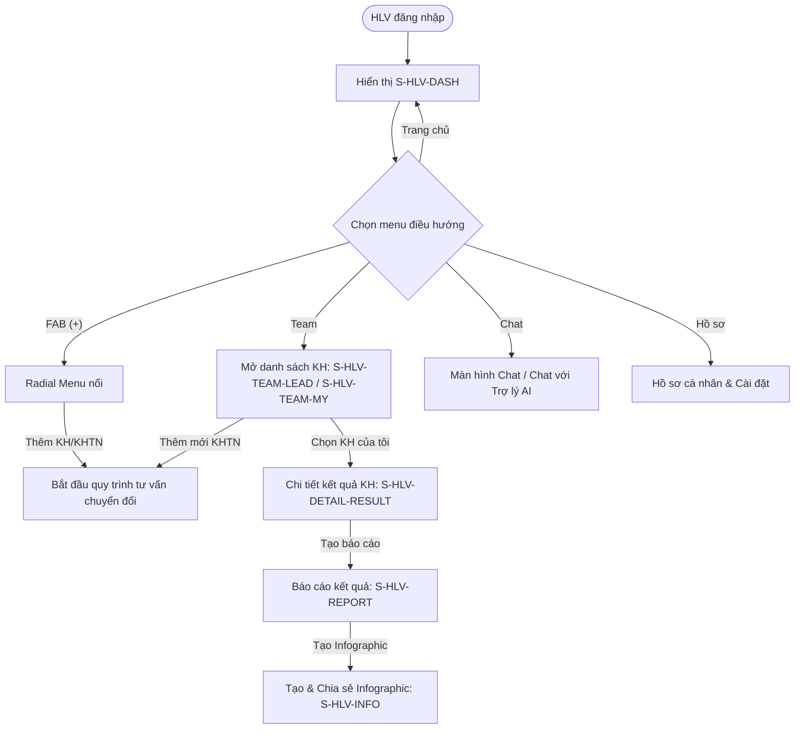
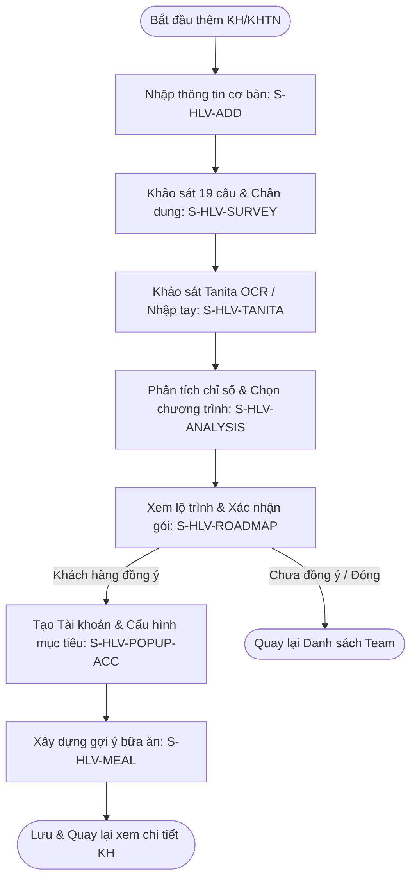

# SRS Sub-document — Đặc tả Luồng Nghiệp Vụ HLV (Huấn luyện viên)

**Thuộc:** `docs/srs-hlv.md` · **Module:** `FR-DASHBOARD`, `FR-TEAM`, `FR-CONSULT`, `FR-REPORT` · **Vai trò:** HLV (Huấn luyện viên)
**Phiên bản:** v1.0 (draft) · **Cập nhật:** 2026-07-05
**Tuân thủ:** `docs/02-design-system/README.md` (Khuôn màn: T1 - Nhập liệu, T2 - Danh sách, T3 - Bảng điều khiển / Dashboard)
**Liên quan:** [draft-requirements-hlv.md](./../03-mockups/draft-requirements-hlv.md)

> **Mục tiêu màn:** Giúp HLV quản lý và vận hành hoạt động hàng ngày, thực hiện quy trình tư vấn 15 phút chuyển đổi KH tiềm năng thành KH chính thức, thiết lập mục tiêu dinh dưỡng, xây dựng thực đơn gợi ý và theo dõi báo cáo kết quả sức khỏe của KH.

---

## 1. Phạm vi cụm màn

| Mã | Màn / Trạng thái | Mô tả |
|---|---|---|
| **S-HLV-DASH** | Trang chủ HLV (Dashboard) | Màn hình chính (T3) sau đăng nhập hiển thị KPI, Action center, Task list & FAB radial menu. |
| **S-HLV-TEAM-LEAD** | Tab "KH tiềm năng" | Danh sách KH tiềm năng (T2), nút thêm mới, lọc nhanh và xem thông tin cơ bản. |
| **S-HLV-TEAM-MY** | Tab "Khách hàng của tôi" | Danh sách KH chính thức (T2), bộ lọc trạng thái RFM (Tích cực/Nguy cơ/Kém quan tâm). |
| **S-HLV-ADD** | Thêm mới KH/KHTN | Màn hình nhập thông tin cơ bản của KH/KHTN mới (T1). |
| **S-HLV-SURVEY** | Khảo sát & Chân dung | Màn hình khảo sát mục tiêu (19 câu hỏi) và đặc điểm chân dung khách hàng. |
| **S-HLV-TANITA** | Khảo sát Tanita | Thu thập chỉ số cơ thể qua OCR ảnh phiếu đo hoặc nhập thủ công (9 chỉ số). |
| **S-HLV-ANALYSIS** | Phân tích kết quả | So sánh chỉ số thực tế vs tiêu chuẩn, cảnh báo màu sắc và tự động gợi ý chương trình. |
| **S-HLV-ROADMAP** | Xem lộ trình | Hiển thị lộ trình điều trị, lợi ích chương trình, cấu hình thời gian và số buổi. |
| **S-HLV-POPUP-ACC** | Pop-up Tạo Tài khoản KH | Thiết lập tài khoản, chỉnh sửa mục tiêu chi số, tính calo thâm hụt và đăng ảnh check-in. |
| **S-HLV-MEAL** | Xây dựng gợi ý bữa ăn | Thiết lập cơ cấu calo, dinh dưỡng vĩ lượng (Đạm/Bột/Béo) và gợi ý 5 bữa ăn chi tiết. |
| **S-HLV-DETAIL-RESULT** | Chi tiết Kết quả KH | Xem chi tiết tiến trình kết quả chỉ số sức khỏe của một khách hàng cụ thể. |
| **S-HLV-REPORT** | Báo cáo kết quả KH | Màn hình hiển thị các biểu đồ phân tích tự động từ hệ thống về tiến trình của KH. |
| **S-HLV-INFO** | Tạo Infographic | Cho phép upload ảnh thực tế và tạo ảnh infographic chia sẻ mạng xã hội. |

---

## 2. Activity Diagram

### 2.1 Sơ đồ tổng quát hoạt động của HLV


### 2.2 Sơ đồ luồng tư vấn chuyển đổi 15 phút (Consultation Flow)


---

## 3. Mô tả luồng xử lý

### 3.1 Luồng Trang chủ HLV & FAB Radial Menu
- **Luồng chính (Happy Path):**
  1. HLV đăng nhập thành công → hệ thống chuyển đến màn hình Trang chủ (`S-HLV-DASH`).
  2. Hiển thị Dashboard gồm 3 phần:
     - **KPI:** Doanh thu, số lượng KH đang hoạt động, tiến độ mục tiêu của HLV.
     - **Action Center:** Các hành động cần chú ý ngay (ví dụ: KH đến hạn đo lại, tin nhắn chưa đọc).
     - **Task List:** Danh sách công việc cần làm trong ngày của HLV.
  3. Khi HLV bấm nút FAB (Floating Action Button) có icon `+`:
     - Radial menu nổi lên dạng vòng tròn bao gồm các shortcut thao tác nhanh: *Thêm mới KH*, *Thêm mới KH tiềm năng*, *Tạo bản tư vấn*.
     - HLV chọn một hành động → Hệ thống chuyển hướng tương ứng.

### 3.2 Luồng Quản lý danh sách KH (Team)
- **Luồng chính (Happy Path):**
  1. HLV bấm nút "Team" trên Bottom Navigation.
  2. Hệ thống tải mặc định tab "KH tiềm năng" (`S-HLV-TEAM-LEAD`). Hiển thị danh sách khách hàng chưa mua gói giải pháp.
  3. HLV bấm tab "Khách hàng của tôi" (`S-HLV-TEAM-MY`) → Hệ thống tải danh sách khách hàng chính thức:
     - Card **Summary (Tóm lược):** Bộ lọc theo Tên KH, Trạng thái KH (Tích cực - xanh lá, Có nguy cơ - vàng, Kém quan tâm - đỏ) và thống kê số lượng theo từng trạng thái.
     - Card **Danh sách KH:** Hiển thị Tên KH, Gói dịch vụ đang dùng, tiến độ hoàn thành mục tiêu, thời gian còn lại, nhóm KH (phân biệt màu).
  4. HLV bấm vào một KH bất kỳ trên danh sách → chuyển sang màn hình Chi tiết kết quả KH (`S-HLV-DETAIL-RESULT`).

### 3.3 Luồng tư vấn chuyển đổi 15 phút (Consultation Flow)
#### Bước 1: Thêm mới KH/KHTN & Khảo sát Chân dung (`S-HLV-ADD` & `S-HLV-SURVEY`)
- **Nhập cơ bản:** HLV điền Họ tên (bắt buộc) và các thông tin tùy chọn (SĐT, Ngày sinh, Chiều cao, Email, Địa chỉ, Giới tính, Mã giới thiệu). Mặc định nếu điền từ nút thêm KHTN sẽ là vai trò KHTN, từ nút thêm KH sẽ là KH.
- **Khảo sát mục tiêu:** Chứa 19 câu hỏi khảo sát nhanh về lối sống, bệnh lý nền. HLV chỉ cần đọc câu hỏi cho khách hàng và nhập câu trả lời tổng hợp vào ô nhập liệu không giới hạn ký tự.
- **Chân dung khách hàng:** Nhập các thông tin phân tích sâu bao gồm đặc điểm tính cách (DISC), mong muốn cải thiện, việc cần làm ngay (ví dụ: chăm sóc 10 ngày vàng), việc cần làm tiếp theo. Tất cả được lưu trong 1 ô nhập liệu lớn.
- Bấm "Tiếp tục" → hệ thống chuyển sang màn hình Khảo sát Tanita.

#### Bước 2: Khảo sát Tanita (`S-HLV-TANITA`)
- **OCR Phiếu đo:** HLV bấm nút "Chụp ảnh" hoặc "Chọn ảnh" để tải lên phiếu ghi chỉ số Tanita. Hệ thống xử lý hình ảnh và tự động điền các trường chỉ số. HLV có thể xem, chỉnh sửa trước khi xác nhận.
- **Nhập thủ công:** Nếu không dùng OCR, HLV nhập trực tiếp 9 chỉ số: Cân nặng, Tỷ lệ mỡ, Khối lượng xương, Tỷ lệ nước, Khối lượng cơ, Vóc dáng, Tuổi sinh học, Năng lượng nghỉ ngơi (RMR), Tỷ lệ mỡ nội tạng.
- Bấm "Tạo bản tư vấn" → hệ thống tính toán chuyển sang Phân tích kết quả.

#### Bước 3: Phân tích kết quả & Xem lộ trình (`S-HLV-ANALYSIS` & `S-HLV-ROADMAP`)
- **Phân tích:** Hệ thống hiển thị bảng so sánh 9 chỉ số hiện tại của KH với chỉ số tiêu chuẩn (WHO/Tanita) kèm cột đánh giá (thừa/thiếu bao nhiêu). 
  - Tự động tô màu dòng dựa trên độ nguy hiểm: Xanh lá (Tốt), Vàng (Trung bình), Đỏ (Nguy hiểm).
  - Cho phép click vào từng dòng để mở rộng (drop-down) giải thích ý nghĩa chỉ số và rủi ro bệnh lý liên quan.
- **Xem giải pháp & lộ trình:** Khi bấm "Xem lộ trình", hệ thống hiển thị màn hình Giải pháp sức khỏe (`S-HLV-ROADMAP`):
  - **Tên chương trình:** Đề xuất chương trình theo phân cấp gói dịch vụ: **Cơ bản**, **Nâng cao**, và **Tối ưu**.
  - **Lợi ích chương trình:** Hiển thị lợi ích dưới dạng gạch đầu dòng:
    - *Tăng cơ, tăng sức khỏe, điều chỉnh các thói quen.*
    - *Tối ưu vóc dáng, trẻ hóa, xây thói quen bền vững.*
  - **Kết quả đạt được:** Dự kiến chỉ số thay đổi cụ thể dựa trên phân tích chỉ số trước đó.
  - **Lộ trình 3 tháng cố định:** Hiển thị lộ trình cố định (không cho phép chọn thời gian khác hoặc trọn đời):
    - *Tháng 1:* Điều chỉnh cân nặng, trang bị kiến thức cơ bản thay đổi tư duy dinh dưỡng & thể chất.
    - *Tháng 2:* Tăng cơ, tăng cường sức khỏe, điều chỉnh thói quen không lành mạnh.
    - *Tháng 3:* Tối ưu hóa vóc dáng, trẻ hóa, duy trì năng lượng và xây dựng thói quen lành mạnh bền vững.
  - **Cam kết & Disclaimer:** Hiển thị cam kết trách nhiệm và tuyên bố từ chối trách nhiệm y tế inline.

#### Bước 4: Tạo tài khoản KH & Gợi ý bữa ăn (`S-HLV-POPUP-ACC` & `S-HLV-MEAL`)
- **Tạo tài khoản:** Khi khách hàng đồng ý tham gia, HLV bấm "Tạo tài khoản" trên màn hình Giải pháp. Pop-up/màn hình Tạo tài khoản (`S-HLV-POPUP-ACC`) hiển thị:
  - **Thông tin đăng nhập:** Số điện thoại hoặc Email (được điền sẵn), mật khẩu mặc định là `1` (có thể chỉnh sửa).
  - **Danh sách mục tiêu hướng đến:**
    - *Mục tiêu sức khỏe:* Thiết lập các mục tiêu cụ thể gồm: Cân nặng (kg), Khối lượng cơ (kg), Tỷ lệ mỡ (%), Chỉ số mỡ nội tạng (1 - 50), các giá trị này mặc định lấy từ chỉ số tiêu chuẩn bước phân tích, HLV có thể tinh chỉnh lại. Các chỉ số khác không cần thiết lập, không cần hiển thị.
    - *Mục tiêu vận động:* Được cấu hình lựa chọn theo các block 15 phút, trải dài từ **15 phút đến 2 giờ** (ví dụ: 15m, 30m, 45m, 1h, 1h15m, 1h30m, 1h45m, 2h).
  - **Cấu hình dinh dưỡng:** Số bữa ăn/ngày (mặc định 5 bữa, sửa được). Hệ thống tự động tính Calo thâm hụt dựa trên mục tiêu: lấy TMR (RMR + AMR + EX) giảm từ 300 - 500 kcal, cho phép chọn calo thực tế trong khoảng **1100 - 1800 kcal**. Trong trường hợp KH có bệnh lý nền, hệ thống tự động giảm calo xuống mức an toàn. Màn hình không hiển thị các con số calo, TMR, AMR, EX, ..., mà chỉ hiển thị calo mục tiêu (calo kỳ diệu).
  - **Ảnh check-in ban đầu:** Cho phép HLV chọn và tải lên nhiều ảnh chụp thực tế của KH (toàn thân, chân dung, vòng eo) làm mốc đối chiếu tiến trình.
  - Bấm "Tạo tài khoản" → Hệ thống lưu thông tin, gửi email kích hoạt tài khoản kèm thông tin đăng nhập cho KH & HLV, đồng thời chuyển sang màn gợi ý bữa ăn.
- **Xây dựng gợi ý bữa ăn:** Màn hình gợi ý bữa ăn (`S-HLV-MEAL`) hiển thị cấu trúc thực đơn:
  - **Cấu trúc dinh dưỡng:** Tổng Calo kỳ diệu, tỷ lệ năng lượng cố định (**30% Đạm - Protein, 30% Chất béo tốt - Fat, 40% Đường bột - Carbohydrate**), lượng nước uống tối thiểu khuyến nghị trong ngày (tính theo công thức `0.4 x cân nặng / 10`).
  - **Gợi ý thực đơn chi tiết 5 bữa:** Hiển thị thực đơn mẫu cụ thể của 5 bữa/ngày (Sáng, Phụ sáng lúc 9h, Trưa, Phụ chiều lúc 16h, Tối) với danh sách khẩu phần ăn (không tính theo món như gà luộc, thịt bò xào, mà tính theo khẩu phần ăn như: 1 Phần thúc ăn (Gà/Cá, ...), 1/2 bát cơm, 1/2 bát rau, 1 quả táo/ổi, ...) và lượng calo chi tiết.
  - **Khuyến nghị & Lưu ý sinh hoạt:** Các chỉ dẫn về thói quen ăn uống (hạn chế thịt đỏ, đồ chiên xào nướng), thời gian ngủ nghỉ và vận động thể chất.
  - HLV có chức năng xuất gợi ý thực đơn bữa ăn này dưới dạng file PDF để in hoặc gửi nhanh cho KH.
  - Bấm "Lưu" → Lưu gợi ý thực đơn hiện tại và quay về màn hình Chi tiết KH (với vai trò HLV).
  - Bấm "Tải về" để tải về PDF.

### 3.4 Luồng tạo Báo cáo & Infographic (`S-HLV-REPORT` & `S-HLV-INFO`)
- **Luồng chính (Happy Path):**
  1. HLV mở màn hình kết quả KH, bấm nút "Tạo báo cáo".
  2. Màn hình báo cáo (`S-HLV-REPORT`) hiển thị các biểu đồ tiến trình chỉ số sức khỏe của KH được tổng hợp tự động bởi các Job định kỳ.
  3. HLV bấm nút "Tạo Infographic".
  4. Màn hình tạo Infographic (`S-HLV-INFO`) cho phép HLV:
     - Tải lên ảnh chân dung/avatar mới của khách hàng, ảnh các hoạt động thực tế của họ trong ngày.
     - Hệ thống tự động tổng hợp thông tin kiến thức đã học trong ngày, hành trình trải nghiệm ăn uống & vận động để xuất ra file ảnh Infographic dạng dọc (social format).
  5. HLV có thể bấm "Tải xuống Infographic" hoặc "Chia sẻ" trực tiếp cho KH qua mạng xã hội (Zalo, Facebook...).

---

## 4. Wireframe (Khuôn thiết kế hệ thống)

### S-HLV-DASH — Trang chủ HLV & FAB Radial Menu
```
┌───────────────────────────────────────────┐
│ [≡] AnCare Coach                     [🔔]  │ ← AppBar: Hamburger + Tiêu đề + Chuông thông báo
├───────────────────────────────────────────┤
│ KPI THÁNG NÀY                             │
│ ┌───────────────────────────────────────┐ │
│ │  • Doanh số: 12,500 VP   • KH mới: 5  │ │
│ │  • Tỷ lệ kích hoạt gói: 85%           │ │
│ └───────────────────────────────────────┘ │
│ ACTION CENTER (Cần chú ý)                 │
│ ┌───────────────────────────────────────┐ │
│ │ [!] Chị Lan đến hạn đo chỉ số Tanita   │ │ ← Cảnh báo hệ thống
│ │ [!] Anh Minh nhắn tin hỏi thực đơn    │ │
│ └───────────────────────────────────────┘ │
│ VIỆC CẦN LÀM HÔM NAY                      │
│ [ ] Gọi điện chúc mừng sinh nhật cô Hạnh  │ ← Checkbox task hàng ngày
│ [ ] Gửi gợi ý bữa ăn mới cho anh Tiến     │
│                                           │
│                 ( + )                     │ ← FAB: Khi click hiển thị Radial Menu bên dưới
├───────────────────────────────────────────┤
│       (Thêm KHTN)   (Thêm KH)             │
│            \             /                │ ← Radial Menu nổi lên khi bấm FAB
│             \           /                 │
│               [   X   ]                   │ ← FAB chuyển thành nút đóng
├───────────────────────────────────────────┤
│ [Trang chủ•] [Team] [Chat] [Hồ sơ]        │ ← Bottom Navigation
└───────────────────────────────────────────┘
```

### S-HLV-TEAM-MY — Danh sách Khách hàng của tôi (Tab "KH của tôi")
```
┌───────────────────────────────────────────┐
│ Team của tôi                              │
├───────────────────────────────────────────┤
│  [ KH tiềm năng ]  | [ Khách hàng của tôi•] │ ← Tab điều hướng
├───────────────────────────────────────────┤
│ TÓM LƯỢC TÌNH HÌNH                        │
│ [ Tìm kiếm theo tên khách hàng...       ] │ ← Tìm kiếm realtime
│ Lọc trạng thái: (Tất cả) (•Tích cực)      │
│                 (Nguy cơ) (Kém quan tâm)   │ ← Chip lọc trạng thái RFM
│ Thống kê: [30 Tích cực] [5 Nguy cơ] [2 Kém]│
├───────────────────────────────────────────┤
│ DANH SÁCH KHÁCH HÀNG                      │
│ ┌───────────────────────────────────────┐ │
│ │ (L) Nguyễn Thị Lan          [Tích cực]│ │ ← Tên KH + Trạng thái RFM màu xanh
│ │ Gói: Giảm mỡ nâng cao - Cân nặng: -2kg│ │ ← Tên gói + Tiến độ
│ │ Hạn dùng: Còn 15 ngày  [Nhóm Dinh Dưỡng]│ │ ← Hạn dùng + Nhóm (màu sắc phân biệt)
│ │                                     › │ │
│ └───────────────────────────────────────┘ │
│ ┌───────────────────────────────────────┐ │
│ │ (M) Trần Văn Minh            [Nguy cơ]│ │ ← Màu vàng cảnh báo sắp hết hạn
│ │ Gói: Tăng cơ cơ bản - Cân nặng: +1.5kg│ │
│ │ Hạn dùng: Còn 2 ngày   [Nhóm Vận Động]│ │
│ │                                     › │ │
│ └───────────────────────────────────────┘ │
│                                   ┌─────┐ │
│                                   │  +  │ │ ← Nút thêm mới KH nhanh
│                                   └─────┘ │
└───────────────────────────────────────────┘
```

### S-HLV-TANITA — Khảo sát Tanita (Nhập chỉ số)
```
┌───────────────────────────────────────────┐
│ [‹] Khảo sát chỉ số Tanita                │ ← Nút back + Tiêu đề
├───────────────────────────────────────────┤
│ CHỤP ẢNH PHIẾU GHI CHỈ SỐ                 │
│ [ Chụp ảnh phiếu đo ]  [ Chọn từ máy ]    │ ← Nút kích hoạt OCR camera/thư viện
├───────────────────────────────────────────┤
│ NHẬP CHỈ SỐ THỦ CÔNG                      │
│ Cân nặng (kg):        [ 65.5      ]       │
│ Tỷ lệ mỡ (%):         [ 28.2      ]       │
│ Khối lượng xương (kg):[ 2.5       ]       │
│ Tỷ lệ nước (%):       [ 52.5      ]       │
│ Khối lượng cơ (kg):   [ 43.1      ]       │
│ Vóc dáng (1-9):       [ 5         ]       │
│ Tuổi sinh học (tuổi): [ 38        ]       │
│ Năng lượng nghỉ (kcal):[ 1350      ]       │
│ Mỡ nội tạng (1-50):   [ 8         ]       │
├───────────────────────────────────────────┤
│ [ Tiếp tục: Tạo bản tư vấn ]              │ ← Button CTA chuyển màn hình phân tích
└───────────────────────────────────────────┘
```

### S-HLV-ANALYSIS — Phân tích kết quả & Đề xuất
```
┌───────────────────────────────────────────┐
│ [‹] Phân tích kết quả                     │
├───────────────────────────────────────────┤
│ BẢNG PHÂN TÍCH CHỈ SỐ CHI TIẾT            │
│ Chỉ số   | Hiện tại | Tiêu chuẩn | Đánh giá │
│ ───────────────────────────────────────── │
│ Cân nặng | 65.5 kg  | 55.0 kg    | Thừa 10.5│ [Đỏ]
│ Tỷ lệ mỡ | 28.2 %   | 22.0 %     | Thừa 6.2 │ [Đỏ]
│ Mỡ nội tạ| 8        | 5          | Thừa 3   │ [Vàng]
│ Tuổi SH  | 38 tuổi  | 30 tuổi    | Thừa 8   │ [Vàng]
│ Năng lượn| 1350 kcal| 1400 kcal  | Thiếu 50 │ [Xanh]
│ [ v Xem thêm chỉ số ]                     │
├───────────────────────────────────────────┤
│ CHI TIẾT CHỈ SỐ ĐƯỢC CHỌN (Ví dụ: Mỡ nội tạng) │
│ - Ý nghĩa: Lượng mỡ bao quanh các cơ quan nội tạng.│
│ - Nguy cơ bệnh lý: Tăng khả năng mắc bệnh tim mạch,│
│   tiểu đường type 2, cao huyết áp.        │
├───────────────────────────────────────────┤
│ CHỌN MỤC TIÊU & CHƯƠNG TRÌNH              │
│ ( ) Tăng cân (•) Giảm cân ( ) Giữ cân     │ ← Radio chọn mục tiêu
│ Đề xuất: Chương trình Cơ Nước Mỡ          │ ← Auto map theo mục tiêu
├───────────────────────────────────────────┤
│ [ Đóng ]                  [ Xem lộ trình ] │ ← 2 CTA điều hướng tiếp theo
└───────────────────────────────────────────┘
```

### S-HLV-ROADMAP — Giải pháp sức khỏe & Lộ trình
```
┌───────────────────────────────────────────┐
│ [‹] Lộ trình & Giải pháp                  │ ← AppBar: Nút quay lại + Tiêu đề
├───────────────────────────────────────────┤
│ CHƯƠNG TRÌNH ĐỀ XUẤT                      │
│ ┌───────────────────────────────────────┐ │
│ │ Chương trình: ( ) Cơ bản  (•) Nâng cao│ │
│ │            ( ) Tối ưu                 │ │ ← Lựa chọn phân cấp chương trình
│ └───────────────────────────────────────┘ │
│ LỢI ÍCH CHƯƠNG TRÌNH                      │
│ - Tăng cơ, tăng sức khỏe, điều chỉnh các  │
│   thói quen.                              │
│ - Tối ưu vóc dáng, trẻ hóa, xây thói quen │
│   bền vững.                               │
│                                           │
│ KẾT QUẢ ĐẠT ĐƯỢC                          │
│ - ................................        │
│ - ................................        │
├───────────────────────────────────────────┤
│ LỘ TRÌNH 3 THÁNG CỐ ĐỊNH                  │
│ • Tháng 1: Điều chỉnh cân nặng, trang bị  │
│   kiến thức cơ bản thay đổi tư duy DD.    │
│ • Tháng 2: Tăng cơ, tăng cường sức khỏe,  │
│   điều chỉnh thói quen không lành mạnh.   │
│ • Tháng 3: Tối ưu vóc dáng, duy trì năng  │
│   lượng & xây thói quen lành mạnh.        │
├───────────────────────────────────────────┤
│ CAM KẾT & TUYÊN BỐ MIỄN TRỪ TRÁCH NHIỆM   │
│ - Chương trình không phải là thuốc và     │
│   không có tác dụng thay thế thuốc chữa   │
│   bệnh.                                   │
├───────────────────────────────────────────┤
│ [ Đóng ]              [ Tạo tài khoản ]   │ ← CTA: Đóng hoặc chuyển sang Tạo TK
└───────────────────────────────────────────┘
```

### S-HLV-POPUP-ACC — Tạo tài khoản & Cấu hình mục tiêu
```
┌───────────────────────────────────────────┐
│ Tạo Tài Khoản Khách Hàng                  │ ← Tiêu đề màn hình
├───────────────────────────────────────────┤
│ THÔNG TIN ĐĂNG NHẬP                       │
│ Số điện thoại/Email:                      │
│ [ 0987654321                              ] │
│ Mật khẩu mặc định:                        │
│ [ 1                                       ] │
├───────────────────────────────────────────┤
│ THIẾT LẬP MỤC TIÊU SỨC KHỎE (Chỉ số chính)│
│ Cân nặng mục tiêu (kg):  [ 55.0       ]   │
│ Khối lượng cơ mục tiêu:  [ 45.0       ]   │
│ Tỷ lệ mỡ mục tiêu (%):   [ 22.0       ]   │
│ Mỡ nội tạng mục tiêu:    [ 5          ]   │ ← Chỉ thiết lập và hiển thị 4 chỉ số này
│                                           │
│ MỤC TIÊU VẬN ĐỘNG HÀNG NGÀY               │
│ Thời gian vận động:                      │
│ ( ) 15m  (•) 30m  ( ) 45m  ( ) 1h         │
│ ( ) 1h15m ( ) 1h30m ( ) 1h45m ( ) 2h       │ ← Block 15 phút đến 2 giờ
├───────────────────────────────────────────┤
│ CẤU HÌNH DINH DƯỠNG (Chỉ hiện calo kỳ diệu)│
│ Số bữa ăn/ngày:          [ 5          ]   │
│ Calo mục tiêu (Kcal):    [ 1250       ]   │ ← Chỉ hiển thị calo mục tiêu (kỳ diệu)
│ *(Hệ thống tự giảm xuống mức an toàn nếu  │
│   khách hàng có bệnh lý nền)*             │
├───────────────────────────────────────────┤
│ ẢNH CHECK-IN BAN ĐẦU                      │
│ [ + Tải ảnh check-in ]                    │
│ ┌───────┐  ┌───────┐                      │
│ │ Ảnh 1 │  │ Ảnh 2 │                      │
│ └───────┘  └───────┘                      │
├───────────────────────────────────────────┤
│               [ Tạo tài khoản ]           │
└───────────────────────────────────────────┘
```

### S-HLV-MEAL — Xây dựng gợi ý bữa ăn
```
┌───────────────────────────────────────────┐
│ [‹] Xây dựng gợi ý bữa ăn                 │
├───────────────────────────────────────────┤
│ CẤU TRÚC DINH DƯỠNG GỢI Ý                 │
│ - Con số Calo kỳ diệu: 1250 Kcal/ngày     │
│ - Tỉ lệ dinh dưỡng vĩ lượng cố định:      │
│   [30% Đạm]  [30% Béo tốt]  [40% Đường bột]│
│ - Nước khuyến nghị tối thiểu: 2.6 Lít/ngày │
├───────────────────────────────────────────┤
│ THỰC ĐƠN CHI TIẾT 5 BỮA (Khẩu phần ăn)    │
│ ┌───────────────────────────────────────┐ │
│ │ BỮA SÁNG (7:00 AM)                    │ │
│ │ - 1 Phần Bữa ăn lành mạnh: 130 Kcal   │ │
│ │ - 3 lòng trắng trứng: 60 Kcal         │ │
│ ├───────────────────────────────────────┤ │
│ │ BỮA PHỤ SÁNG (9:00 AM)                │ │
│ │ - 1 Phần Hoa quả (táo/ổi...): 100 Kcal│ │
│ ├───────────────────────────────────────┤ │
│ │ BỮA TRƯA (12:00 PM)                   │ │
│ │ - 1 Phần Thức ăn đạm (Gà/Cá...): 300  │ │
│ │ - 1/2 bát rau: 100 Kcal               │ │
│ │ - 1/2 bát cơm: 100 Kcal               │ │
│ ├───────────────────────────────────────┤ │
│ │ BỮA PHỤ CHIỀU (4:00 PM)               │ │
│ │ - 1 Phần Bữa ăn lành mạnh: 90 Kcal    │ │
│ ├───────────────────────────────────────┤ │
│ │ BỮA TỐI (7:00 PM)                     │ │
│ │ - 1 Phần Thức ăn đạm: 150 Kcal        │ │
│ │ - 1/2 bát rau: 100 Kcal               │ │
│ │ - 1/2 bát cơm: 100 Kcal               │ │
│ └───────────────────────────────────────┘ │
├───────────────────────────────────────────┤
│ LƯU Ý SINH HOẠT                           │
│ - Uống nước rải đều trong ngày (8-10 cốc) │
│ - Hạn chế thịt đỏ, đồ chiên xào xối dầu   │
│ - Ngủ trước 11:00 PM                      │
├───────────────────────────────────────────┤
│ [ Tải về ]                      [ Lưu ]   │ ← CTA: Tải về PDF và Lưu thông tin
└───────────────────────────────────────────┘
```
```

---

## 5. Thành phần & dữ liệu (Component ↔ Data mapping)

| Thành phần UI | Nguồn dữ liệu (Database) | Ghi chú nghiệp vụ |
|---|---|---|
| Ô tìm kiếm KH | `users.full_name`, `users.phone` | Lọc danh sách không tải lại trang. |
| Phân loại RFM (Tóm lược) | `customer_status` (Recency, Frequency, Monetary) | Tính toán tự động từ hành vi check-in của KH. |
| Chỉ số cơ thể Tanita | `tanita_metrics` (cân nặng, mỡ, xương, nước, cơ, vóc dáng, tuổi SH, RMR, mỡ nội tạng) | Nhập từ OCR hoặc nhập tay. Lưu theo `prospect_id`/`customer_id`. |
| Phân cấp chương trình | `customer_packages.tier` | Phân cấp lựa chọn: Cơ bản, Nâng cao, Tối ưu. |
| Chương trình đề xuất | `consultation_programs.program_name` | Tăng cân → Dinh dưỡng tế bào; Giàm cân → Cơ Nước Mỡ; Giữ cân → Bữa sáng lành mạnh. |
| Mục tiêu sức khỏe hướng đến | `customer_goals` (target_weight, target_muscle, target_fat, target_visceral_fat) | Thiết lập trong pop-up tạo TK (mặc định lấy theo chuẩn WHO/Tanita). |
| Mục tiêu vận động hàng ngày | `customer_goals.exercise_duration_minutes` | Lựa chọn theo block 15 phút (từ 15 phút tới 120 phút). |
| Calo thâm hụt (Magic Calo) | `customer_goals.magic_calories` | Tự động tính toán: `TMR - (300 đến 500 kcal)`. Giới hạn trong khoảng `1100 - 1800 kcal`. |
| Cấu trúc thực đơn gợi ý 5 bữa | `meal_plans` (Protein 30%, Fat 30%, Carb 40%) | Phân chia thực đơn chi tiết thành 5 bữa ăn/ngày. |

---

## 6. Đặc tả API (đề xuất)

### 6.1 API Lưu chỉ số Tanita của KH/KHTN
- **Endpoint:** `POST /api/v1/coaches/consultation/tanita`
- **Headers:** `Authorization: Bearer <token_hlv>`
- **Request Body:**
```json
{
  "customerId": "uuid-khach-hang-or-prospect",
  "weight": 65.5,
  "bodyFatPercent": 28.2,
  "boneMass": 2.5,
  "waterPercent": 52.5,
  "muscleMass": 43.1,
  "physiqueRating": 5,
  "biologicalAge": 38,
  "rmr": 1350,
  "visceralFatRating": 8,
  "sourceType": "ocr"
}
```
- **Response (200 OK):**
```json
{
  "status": "success",
  "data": {
    "tanitaId": "uuid-ban-ghi-tanita",
    "bmi": 23.4,
    "analysis": {
      "weight": {"status": "danger", "diff": 10.5, "standard": 55.0},
      "bodyFatPercent": {"status": "danger", "diff": 6.2, "standard": 22.0},
      "visceralFatRating": {"status": "warning", "diff": 3, "standard": 5}
    }
  }
}
```

### 6.2 API Tạo tài khoản KH mới sau chốt gói
- **Endpoint:** `POST /api/v1/coaches/customers/convert`
- **Headers:** `Authorization: Bearer <token_hlv>`
- **Request Body:**
```json
{
  "prospectId": "uuid-khach-hang-tiem-nang",
  "username": "0987654321",
  "passwordDefault": "1",
  "packageTier": "advanced", // basic | advanced | premium
  "targetCalories": 1250,
  "targetWaterLiters": 2.6,
  "targetExerciseMinutes": 30, // Lựa chọn block 15 phút tới 120 phút
  "targetWeight": 55.0,
  "targetMuscle": 45.0,
  "targetFatPercent": 22.0,
  "targetVisceralFat": 5,
  "durationMonths": 3,
  "startDate": "2026-07-05",
  "initialCheckinPhotos": [
    "data:image/jpeg;base64,..."
  ]
}
```
- **Response (201 Created):**
```json
{
  "status": "success",
  "message": "Tài khoản khách hàng đã được khởi tạo thành công và gửi thông tin qua email.",
  "data": {
    "customerId": "uuid-khach-hang-chinh-thuc",
    "endDate": "2026-10-05",
    "totalSessions": 90
  }
}
```

---

## 7. Acceptance Criteria

- **AC-HLV-DASH-01:** Khi HLV nhấn nút FAB `+`, menu radial hiển thị đúng 3 lựa chọn (Thêm KHTN, Thêm KH, Tạo bản tư vấn). Nhấn nút đóng `X` để ẩn menu quay lại màn hình chính.
- **AC-HLV-TEAM-01:** Trong danh sách "Khách hàng của tôi", việc phân loại màu sắc cho trạng thái RFM phải tuân thủ: Tích cực (Xanh lá), Có nguy cơ (Vàng), Kém quan tâm (Đỏ).
- **AC-HLV-TANITA-01:** Khi tải lên ảnh chụp phiếu chỉ số Tanita hợp lệ, hệ thống phải trích xuất chính xác tối thiểu 7/9 chỉ số và hiển thị lên form nhập liệu để HLV kiểm tra/sửa đổi.
- **AC-HLV-ROADMAP-01:** Màn hình lộ trình hiển thị đúng chương trình đề xuất theo 3 phân cấp: "Cơ bản", "Nâng cao", "Tối ưu". 
- **AC-HLV-ROADMAP-02:** Lộ trình phải hiển thị chính xác lợi ích: "Tăng cơ, tăng sức khỏe, điều chỉnh các thói quen; Tối ưu vóc dáng, trẻ hóa, xây thói quen bền vững" và kế hoạch 3 tháng cố định theo đúng thứ tự các tháng 1, 2, 3.
- **AC-HLV-CREATE-ACCOUNT-01:** Tại pop-up tạo tài khoản, HLV có thể thiết lập các chỉ số mục tiêu sức khỏe hướng đến gồm Cân nặng, Cơ, Mỡ, Mỡ nội tạng, và cấu hình mục tiêu vận động theo các block 15 phút (từ 15m, 30m, ..., tối đa 120m).
- **AC-HLV-MEAL-01:** Hệ thống gợi ý thực đơn phải tạo thực đơn 5 bữa ăn/ngày (Sáng, Phụ sáng, Trưa, Phụ chiều, Tối) đáp ứng con số Calo kỳ diệu và cơ cấu dinh dưỡng vĩ lượng: 30% Đạm (Protein), 30% Chất béo tốt (Fat), 40% Đường bột (Carb). Lượng nước tối thiểu đạt `0.4 x (cân nặng của KH / 10)`.
