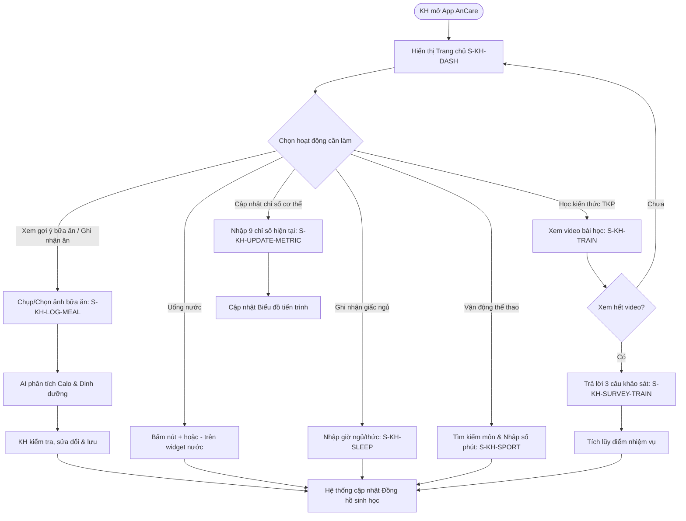

# SRS Sub-document — Đặc tả Luồng Nghiệp Vụ KH (Khách hàng)

**Thuộc:** `docs/srs-kh.md` · **Module:** `FR-HEALTH`, `FR-MEAL`, `FR-TRAIN` · **Vai trò:** KH (Khách hàng)
**Phiên bản:** v1.0 (draft) · **Cập nhật:** 2026-07-05
**Tuân thủ:** `docs/02-design-system/README.md` (Khuôn màn: T1 - Nhập liệu, T2 - Danh sách, T3 - Bảng điều khiển / Dashboard)
**Liên quan:** [draft-requirements-kh.md](./../03-mockups/draft-requirements-kh.md)

> **Mục tiêu màn:** Giúp Khách hàng dễ dàng tự theo dõi chỉ số cơ thể, thực hiện và ghi nhận các nhiệm vụ dinh dưỡng, thể chất, giấc ngủ và học tập hàng ngày một cách trực quan thông qua công cụ Đồng hồ sinh học và trợ giúp từ AI.

---

## 1. Phạm vi cụm màn

| Mã | Màn / Trạng thái | Mô tả |
|---|---|---|
| **S-KH-DASH** | Trang chủ KH (Dashboard) | Màn hình chính (T3) hiển thị Đồng hồ sinh học, tiến trình mục tiêu, phân tích chuyên sâu và nhiệm vụ trong ngày. |
| **S-KH-UPDATE-METRIC** | Cập nhật chỉ số cơ thể | Màn hình cho phép khách hàng tự điền các chỉ số cơ thể hiện tại (T1). |
| **S-KH-LOG-MEAL** | Ghi nhận bữa ăn (AI Camera) | Màn hình chụp ảnh món ăn, AI bóc tách calo/macro, người dùng chỉnh sửa và ghi nhận thêm sản phẩm hỗ trợ (T1). |
| **S-KH-SPORT** | Thêm hoạt động thể thao | Tìm kiếm môn thể thao, hiển thị ước tính calo tiêu hao, nhập thời gian và xác nhận lưu. |
| **S-KH-SLEEP** | Theo dõi giấc ngủ | Nhập giờ bắt đầu ngủ và giờ thức dậy, hệ thống tự tính toán tổng thời gian ngủ. |
| **S-KH-TRAIN** | Đào tạo & Bài học | Xem danh sách bài học video theo chuyên đề dinh dưỡng/lối sống. |
| **S-KH-SURVEY-TRAIN** | Khảo sát sau bài học | Biểu mẫu 3 câu hỏi thu hoạch sau khi xem hết video để tích điểm nhiệm vụ. |

---

## 2. Activity Diagram

### 2.1 Sơ đồ luồng check-in hoạt động hàng ngày của KH


---

## 3. Mô tả luồng xử lý

### 3.1 Luồng Trang chủ KH & Tiện ích Đồng hồ Sinh học
- **Luồng chính (Happy Path):**
  1. KH đăng nhập → hiển thị màn hình trang chủ (`S-KH-DASH`).
  2. **Thông tin cơ bản:** Hiển thị Avatar (bấm vào mở kho ảnh bữa ăn cá nhân), tên gói chăm sóc, chuông thông báo (bật/tắt).
  3. **Card 1: Tổng quan:**
     - **Đồng hồ sinh học:** Biểu đồ hình tròn chia theo múi giờ, hiển thị trực quan trạng thái 3 nhóm nhiệm vụ: Dinh dưỡng, Vận động, Kiến thức (TKP). Mỗi nhiệm vụ hoàn thành được cộng điểm, hiển thị kèm biểu tượng bó đuốc.
     - **Mục tiêu của bạn:** Số buổi đã tham gia / tổng số buổi của gói, mục tiêu vận động, cân nặng và thời hạn hoàn thành.
     - **Biểu đồ tiến trình:** Biểu đồ line-chart thể hiện sự thay đổi các chỉ số trong 2 ngày gần nhất. Tự động tìm và hiển thị tối đa 4 chỉ số có sự biến động nhiều nhất.
     - **Phân tích chuyên sâu & Lời khuyên:** Đánh giá tiến trình chuyển hóa trong ngày (phân tích chỉ số ăn uống, giấc ngủ, vận động kèm nguyên nhân). Nếu có chỉ số xấu/đứng yên, hệ thống sẽ đề xuất liên hệ HLV kèm nút bấm mở nhanh chat.

### 3.2 Luồng Nhiệm vụ 1 ngày & Gợi ý thực đơn
- **Luồng chính (Happy Path):**
  1. KH cuộn xuống **Card 2: Nhiệm vụ 1 ngày**.
  2. **Chỉ số cơ thể:** Hiển thị bảng so sánh 9 chỉ số (Mục tiêu, Ngày hiện tại, Đánh giá chênh lệch). 
     - Màu sắc hiển thị theo trạng thái sức khỏe: Xanh lá (Tốt), Vàng (Trung bình), Đỏ (Cần cải thiện gấp).
     - Cho phép bấm "Cập nhật chỉ số" → Chuyển tới màn hình `S-KH-UPDATE-METRIC` để nhập tay chỉ số mới.
  3. **Gợi ý bữa ăn:** Hiển thị cấu trúc calo kỳ diệu và tỷ lệ đạm/bột/béo (30% Protein, 40% Carb, 30% Fat) cùng lượng nước tối thiểu khuyến nghị.
     - Hiển thị danh sách bữa ăn chi tiết (Sáng, 9h, Trưa, 16h, Tối) tùy theo gói dịch vụ đã đăng ký.
     - HLV/KH có thể bấm nút xuất file gợi ý bữa ăn dạng PDF.
  4. **Nút chụp ảnh món ăn (icon máy ảnh):** Bấm chụp ảnh món ăn → chuyển đến màn hình Ghi nhận bữa ăn (`S-KH-LOG-MEAL`). Bên cạnh có icon check hoàn thành (màu xanh lá nếu đã lưu ảnh check-in, màu xám nếu chưa).

### 3.3 Luồng Ghi nhận bữa ăn qua AI Camera (`S-KH-LOG-MEAL`)
- **Luồng chính (Happy Path):**
  1. KH chụp ảnh món ăn trực tiếp hoặc chọn ảnh từ thư viện.
  2. Hệ thống gửi ảnh lên API AI phân tích món ăn.
  3. AI phản hồi kết quả ước lượng: tổng năng lượng (Calo), khối lượng đạm (gam) và tỷ lệ phần trăm Đạm/Đường bột/Chất béo.
  4. Hiển thị so sánh đối chiếu với tiêu chuẩn bữa ăn đó (thừa/thiếu bao nhiêu calo/đạm) kèm 1 câu nhận xét ngắn gọn của AI.
  5. KH có thể tự chỉnh sửa các con số ước tính này nếu thấy chưa chính xác.
  6. Nếu KH có sử dụng sản phẩm hỗ trợ (như Herbalife F1, trà...), tích chọn và điền thông tin sử dụng (số viên, số ml...).
  7. Bấm "Lưu" → Lưu thông tin vào nhật ký ăn uống và cập nhật trạng thái Đồng hồ sinh học sang màu hoàn thành (Xanh lá).

### 3.4 Luồng ghi nhận Hoạt động sinh hoạt (Nước, Giấc ngủ, Thể thao)
- **Uống nước:** Widget hiển thị số cốc nước đã uống (mỗi cốc mặc định 200ml). KH bấm nút `+` để tăng 1 cốc hoặc `-` để giảm 1 cốc.
- **Giấc ngủ:** KH bấm nút cập nhật giấc ngủ → Nhập giờ đi ngủ và giờ thức dậy (định dạng HH:mm). Hệ thống tự động tính số tiếng ngủ và hiển thị đánh giá chất lượng ngủ.
- **Thể thao/Vận động:** 
  1. KH bấm nút thêm hoạt động vận động → Mở màn hình `S-KH-SPORT`.
  2. Nhập từ khóa tìm kiếm tên môn thể thao → hiển thị danh sách kết quả phù hợp từ cơ sở dữ liệu kèm lượng calo tiêu hao ước tính cho 30 phút hoạt động.
  3. KH chọn môn thể thao, nhập số phút tập luyện thực tế.
  4. Bấm "Thêm" → hệ thống tự động tính calo tiêu hao, cộng điểm vận động và cập nhật trạng thái Đồng hồ sinh học.

### 3.5 Luồng học tập kiến thức TKP (`S-KH-TRAIN` & `S-KH-SURVEY-TRAIN`)
- **Luồng chính (Happy Path):**
  1. Tại widget "Kiến thức TKP" ở trang chủ, KH bấm chọn bài học cần thực hiện (hiển thị tiêu đề kèm icon video).
  2. Hệ thống hiển thị hộp thoại cảnh báo: *Bạn cần xem hết video để được tính điểm nhiệm vụ*.
  3. KH xác nhận "Xem bài học" → Hệ thống mở video bài học toàn màn hình.
  4. Khi video kết thúc hoàn toàn (hoặc đạt tiến trình 100%):
     - Tự động hiển thị màn hình khảo sát 3 câu hỏi:
       - *1. Bạn ấn tượng gì về bài học hôm nay?*
       - *2. Bạn sẽ áp dụng kiến thức này như thế nào vào cuộc sống?*
       - *3. Bạn sẽ giới thiệu, chia sẻ bài học này với ai không?*
  5. Khi KH trả lời đủ cả 3 câu khảo sát → Nút "Gửi khảo sát" sẽ sáng đèn và cho phép nhấn.
  6. Bấm "Gửi khảo sát" → Hệ thống ghi nhận hoàn thành nhiệm vụ học tập, cộng điểm và cập nhật widget Đồng hồ sinh học.

---

## 4. Wireframe (Khuôn thiết kế hệ thống)

### S-KH-DASH — Trang chủ KH (Dashboard)
```
┌───────────────────────────────────────────┐
│ (Avatar) Chào Lan!                   [🔔]  │ ← Avatar (Click mở kho ảnh bữa ăn) + Chuông
│ Gói: Cơ Nước Mỡ cơ bản                    │ ← Tên gói dịch vụ đang hoạt động
├───────────────────────────────────────────┤
│ ĐỒNG HỒ SINH HỌC & ĐIỂM                    │
│      _.._                                 │
│    .'    '.    Bó đuốc: [ 85/100 Điểm ]    │ ← Thể hiện trực quan 3 nhóm:
│   /  Dinh  \                               │   Dinh dưỡng, Vận động, Kiến thức
│  |  dưỡng   |                              │
│   \  TKP   /   Mục tiêu: Giảm 3kg          │
│    '.____.'    Tiến trình gói: 12/30 buổi  │ ← Số buổi đã trải nghiệm
├───────────────────────────────────────────┤
│ BIỂU ĐỒ TIẾN TRÌNH (2 ngày qua)            │
│  Weight (kg)  | 65.5  ----> 64.8 (-0.7)    │ ← Line chart text đơn giản,
│  Body Fat (%) | 28.2  ----> 27.9 (-0.3)    │   tự động chọn 4 chỉ số biến động nhất
├───────────────────────────────────────────┤
│ PHÂN TÍCH CHUYÊN SÂU                       │
│ - Chuyển hóa: Lượng nước uống chưa đủ làm │
│   giảm tốc độ đào thải mỡ thừa.            │ ← Đánh giá hành vi + nguyên nhân
│ - Giải pháp: Tăng nước thêm 2 cốc. Hãy liên│
│   hệ HLV Lan để nhận tư vấn cụ thể.        │
│                [ Chat với HLV ]           │
├───────────────────────────────────────────┤
│ [Trang chủ•] [Báo cáo] [Đào tạo] [Hồ sơ]  │ ← Bottom Navigation
└───────────────────────────────────────────┘
```

### S-KH-LOG-MEAL — Ghi nhận bữa ăn (AI Camera)
```
┌───────────────────────────────────────────┐
│ [‹] Ghi nhận bữa ăn                       │
├───────────────────────────────────────────┤
│ ┌───────────────────────────────────────┐ │
│ │               [ Ảnh ]                 │ │ ← Hiển thị ảnh món ăn đã chụp/upload
│ └───────────────────────────────────────┘ │
│ AI ĐÁNH GIÁ (Ước tính)                    │
│ Tổng năng lượng: [ 350 kcal ]             │
│ Lượng đạm (Protein): [ 25 g ]             │
│ Tỷ lệ:  [30% Đạm]  [50% Bột]  [20% Béo]   │ ← Thanh trượt/text cho phép chỉnh sửa
│ ───────────────────────────────────────── │
│ Đối chiếu tiêu chuẩn bữa Trưa:            │
│ - Năng lượng: Thiếu 50 kcal               │
│ - Lượng đạm: Thừa 5 g                     │
│ Nhận xét AI: Bữa ăn khá cân đối, nên bổ   │
│ sung thêm rau xanh.                       │
├───────────────────────────────────────────┤
│ SẢN PHẨM HỖ TRỢ                           │
│ [x] Dùng Herbalife F1 (Bột dinh dưỡng)    │
│     Số lượng: [ 2 muỗng (90 kcal) ]       │
├───────────────────────────────────────────┤
│                   [ Lưu ]                 │ ← Nút lưu kết quả
└───────────────────────────────────────────┘
```

### S-KH-SURVEY-TRAIN — Khảo sát thu hoạch bài học
```
┌───────────────────────────────────────────┐
│ Bài học: Dinh dưỡng lành mạnh             │
├───────────────────────────────────────────┤
│ CHÚC MỪNG BẠN ĐÃ XEM HẾT VIDEO!           │
│ Hãy hoàn thành 3 câu hỏi khảo sát ngắn    │
│ để nhận điểm tích lũy:                    │
├───────────────────────────────────────────┤
│ 1. Bạn ấn tượng nhất điều gì từ bài học?   │
│ [ Nhập câu trả lời...                   ] │
│                                           │
│ 2. Bạn sẽ áp dụng kiến thức này như thế   │
│ nào vào thực tế cuộc sống hàng ngày?      │
│ [ Nhập câu trả lời...                   ] │
│                                           │
│ 3. Bạn sẽ chia sẻ kiến thức này với ai?   │
│ [ Nhập tên hoặc mối quan hệ...          ] │
├───────────────────────────────────────────┤
│            [ Gửi khảo sát ]               │ ← Chỉ sáng khi điền đủ 3 câu trả lời
└───────────────────────────────────────────┘
```

---

## 5. Thành phần & dữ liệu (Component ↔ Data mapping)

| Thành phần UI | Nguồn dữ liệu (Database) | Ghi chú nghiệp vụ |
|---|---|---|
| Đồng hồ sinh học | `daily_tasks.status`, `task_categories` | Tính toán tỷ lệ hoàn thành theo 3 nhóm hoạt động trong ngày. |
| Điểm tích lũy (Bó đuốc) | `user_points.score` | Cộng điểm khi hoàn thành check-in, uống nước, thể dục, học bài. |
| Chỉ số thay đổi (Biểu đồ) | `tanita_metrics` / `customer_metrics` | Lấy dữ liệu 2 ngày gần nhất, thực hiện phép trừ để tìm 4 chỉ số đổi nhiều nhất. |
| AI đánh giá món ăn | `ai_meal_logs.parsed_macro_json` | Nhận kết quả JSON gồm calo, protein, carb, fat từ API phân tích ảnh món ăn. |
| Hoạt động thể thao | `sports_catalog` | Gợi ý môn thể thao kèm chỉ số calo tiêu hao định mức mỗi 30 phút. |
| Trả lời khảo sát TKP | `lesson_surveys.answers_json` | Lưu trữ câu trả lời của 3 câu hỏi khảo sát bài học trước khi ghi nhận hoàn thành bài học. |

---

## 6. Đặc tả API (đề xuất)

### 6.1 API Phân tích ảnh bữa ăn (AI Camera)
- **Endpoint:** `POST /api/v1/customers/meals/analyze-photo`
- **Headers:** `Authorization: Bearer <token_kh>`
- **Request Body:**
```json
{
  "photoBase64": "data:image/jpeg;base64,..."
}
```
- **Response (200 OK):**
```json
{
  "status": "success",
  "data": {
    "estimatedCalories": 350,
    "estimatedProteinGrams": 25,
    "ratios": {
      "proteinPercent": 30,
      "carbPercent": 50,
      "fatPercent": 20
    },
    "aiComment": "Bữa ăn đầy đủ protein từ trứng, khuyên bổ sung thêm chất xơ từ rau xanh.",
    "comparison": {
      "calorieDiff": -50,
      "proteinDiff": 5
    }
  }
}
```

### 6.2 API Ghi nhận kết quả khảo sát bài học video
- **Endpoint:** `POST /api/v1/customers/lessons/survey`
- **Headers:** `Authorization: Bearer <token_kh>`
- **Request Body:**
```json
{
  "lessonId": "uuid-bai-hoc",
  "answers": {
    "impression": "Cách phân biệt chất béo tốt và xấu.",
    "application": "Sử dụng dầu ô-liu thay cho mỡ động vật khi nấu nướng.",
    "shareWith": "Mẹ của tôi."
  }
}
```
- **Response (200 OK):**
```json
{
  "status": "success",
  "message": "Đã gửi khảo sát thành công. Bạn được cộng 10 điểm tích lũy nhiệm vụ học tập.",
  "data": {
    "pointsEarned": 10,
    "currentTotalPoints": 85
  }
}
```

---

## 7. Acceptance Criteria

- **AC-KH-DASH-01:** Biểu đồ tiến trình (line-chart) trên trang chủ chỉ hiển thị tối đa 4 chỉ số có mức độ thay đổi lớn nhất dựa trên dữ liệu so sánh giữa ngày hiện tại và ngày gần nhất trước đó.
- **AC-KH-MEAL-01:** Icon check hoàn thành bữa ăn kế bên nút chụp ảnh phải chuyển sang màu Xanh lá cây ngay lập tức sau khi người dùng thực hiện thao tác bấm "Lưu" thông tin ghi nhận bữa ăn thành công.
- **AC-KH-WATER-01:** Bấm nút `+` trên widget nước tăng 1 cốc (200ml), bấm `-` giảm 1 cốc (200ml). Số lượng cốc nước không được phép nhỏ hơn 0.
- **AC-KH-SLEEP-01:** Khi người dùng nhập giờ đi ngủ (ví dụ: 22:00) và giờ thức dậy (ví dụ: 06:00 ngày hôm sau), hệ thống phải tính toán chính xác tổng thời gian ngủ là 8 tiếng 0 phút.
- **AC-KH-SPORT-01:** Khi người dùng chọn môn chạy bộ (ví dụ: định mức 300 kcal/30 phút) và nhập thời gian vận động là 15 phút, hệ thống phải tự động tính toán chính xác calo tiêu hao là 150 kcal.
- **AC-KH-TRAIN-01:** Hệ thống không được phép cho bấm nút "Gửi khảo sát" thu hoạch bài học video nếu một trong ba ô trả lời khảo sát bị để trống hoặc có độ dài nhỏ hơn 5 ký tự.
