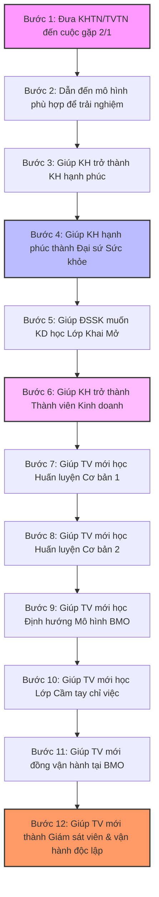

# CÁC NỘI DUNG CHI TIẾT TỪNG BƯỚC CỦA 12 BƯỚC TRONG QUY TRÌNH KINH DOANH THỨ NHẤT

*(Dành cho các thành viên chưa phải nhóm TAB)* 

## YÊU CẦU KHI THỰC HIỆN TỪNG BƯỚC CỦA QUY TRÌNH

1. Các thành viên phải đọc kỹ, đọc nhiều lần để thấu hiểu nội dung chi tiết của từng bước mà mình cùng với khách hàng (KH) hay thành viên (TV) tuyến dưới của mình cần phải làm. Từ đó thực hiện từng bước đó nghiêm túc trong hoạt động kinh doanh.

2. Sau khi đánh giá đã hoàn thành bước 1 rồi mới bắt đầu chuyển sang bước 2 và cứ thứ tự như thế, không nóng vội.

3. Chỉ tập trung làm thật tốt, hoàn thành xuất sắc các nội dung của từng bước mà mình đang ở đó, chưa cần quan tâm để ý đến nội dung của các bước khác không phù hợp với mình.

4. Các TV từ Giám sát viên đến AWT cần đồng hành, sâu sát cùng với KH và TV mới của mình trong từng bước để có kết quả tốt nhất.

5. Quan trọng vẫn là sự tuân thủ để làm theo đúng những gì mình được học, không tự sáng tạo làm theo cách của mình. Tần suất là yếu tố quyết định! Đừng làm nội dung nào một lần, phải làm đi làm lại nhiều lần với sự tập trung cao nhất.

6. Trong quá trình hoạt động KD, có bước nào chưa rõ, bước nào mình chưa làm tốt, bước nào mình còn yếu kém hãy trao đổi với TAB đầu nhánh của mình để được các TAB hỗ trợ và giúp đỡ.

7. Tuyệt đối không “ngồi nhầm lớp”, không nhảy cóc, không nóng vội mà hãy tuân thủ đi theo trình tự từng bước vì bản chất quy trình KD là quá trình đào tạo, huấn luyện theo trình tự! 

8. Tập trung, kỷ luật để sử dụng thành thạo, hiệu quả 3 công cụ kinh doanh cơ bản nhưng rất quan trọng hàng ngày, tránh thực hiện được một giai đoạn rồi lại bỏ. Luôn duy trì năng lượng và cảm xúc tích cực để làm việc nhằm tránh sự nhàm chán! 

9. Thời gian để hoàn thành 12 bước tuỳ theo mỗi người (dao động từ 3 tháng đến 1 năm) phụ thuộc vào việc bạn dành bao nhiêu giờ mỗi ngày cho HBL và mức độ tập trung của bạn với công việc.

10. Vừa thực hiện vừa tự đánh giá để biết được sự trưởng thành của bản thân (về tâm thế thái độ; kiến thức; kỹ năng) theo từng bước của quy trình. Bảo trợ và TAB đầu nhánh cùng đo lường, đánh giá để biết hỗ trợ TV mới! 

---

## SƠ ĐỒ TỔNG QUAN LỘ TRÌNH 12 BƯỚC KINH DOANH

---

## CHI TIẾT NỘI DUNG 12 BƯỚC

### Bước 1: ĐƯA KHÁCH HÀNG TIỀM NĂNG HOẶC THÀNH VIÊN TIỀM NĂNG ĐẾN CUỘC GẶP $2/1$ 

Bạn đưa KHTN hoặc TVTN đến cuộc gặp $2/1$ để gặp các TV nhóm TAB, nhằm giúp họ ra quyết định trải nghiệm chương trình CSSK hoặc kinh doanh.

#### 1. Những việc bảo trợ hướng dẫn và thành viên cần phải làm: 

* Để có KH hay TV tiềm năng đưa đến cuộc gặp $2/1$, bảo trợ phải hướng dẫn được cho thành viên của mình làm những việc sau: 

* *Với thị trường nóng, ấm:* Lập danh sách khách hàng tiềm năng, theo 3 bước: Bước 1 (lập danh sách theo hướng dẫn); Bước 2 (kết nối làm ấm quan hệ và tìm hiểu nhu cầu, “nỗi đau” của khách hàng tiềm năng); Bước 3 (đưa lời mời để đưa KH tiềm năng tới cuộc gặp $2/1$).

* *Với thị trường lạnh:* Thông qua các hoạt động “phễu” (ví dụ gửi thư mời, tờ rơi; mạng xã hội; từ những hội nhóm cộng đồng riêng...) để tìm được những người quan tâm đến sức khoẻ hay kinh doanh, từ đó đưa ra lời mời phù hợp, đưa họ tới cuộc gặp $2/1$.

* *Bảo trợ luôn nhớ để nhắc nhở TV của mình:* 

* TV chỉ đóng vai trò kết nối, là người đưa KH tiềm năng đến cuộc gặp $2/1$.

* TV không phải là người chia sẻ giải pháp CSSKCĐ hay cơ hội kinh doanh, việc đó các TAB sẽ hỗ trợ. Kể cả khi KH cố gặng hỏi rõ, cũng không được chia sẻ về sản phẩm hay công việc kinh doanh. Giữ đúng lập trường: *“Tôi chưa thể giúp bạn được, nếu làm được tôi đã không phải mời bạn tới gặp người đã giúp tôi, vì vậy nếu bạn muốn bạn phải đi cùng tôi đến gặp người đó”*.

* Kết quả thành viên có ít hay nhiều khách hàng đến cuộc gặp $2/1$ phụ thuộc chủ yếu vào 2 yếu tố:* 

  * Số lượng, tần suất khách hàng bạn kết nối và trao lời mời ít hay nhiều (bạn càng đưa lời mời nhiều, số lượng KH đến cuộc gặp $2/1$ càng lớn).
  * Việc bạn có tuân thủ làm đúng quy trình 3 bước với thị trường ấm nóng và cách thức bạn hoạt động phễu với thị trường lạnh thế nào.

#### 2. Đánh giá: Khi nào khách hàng đồng ý đến trải nghiệm ở một mô hình BMO phù hợp thì sẽ kết thúc bước 1.

#### 3. Phân công người nói chuyện ở cuộc gặp $2/1$: Thành viên nhóm TAB. Nếu TAB của bạn ở xa có thể gặp $2/1$ qua zoom.

#### 4. Lưu ý: 

* Cuộc gặp $2/1$ có thể thực hiện tại nơi bạn triển khai BMO (NDD, CLB Fit, CLB Yoga...) hoặc nơi khác.

* TV phải đi cùng khách hàng tiềm năng của mình đến cuộc gặp $2/1$ và ngồi cùng nghe với khách của mình để học hỏi và biết cách đồng hành cùng khách hàng.

* Thời gian cuộc gặp $2/1$ tuỳ theo, nhưng chỉ nên trong vòng 60 phút.

---

### Bước 2: DẪN KHÁCH HÀNG TIỀM NĂNG ĐẾN MỘT MÔ HÌNH PHÙ HỢP ĐỂ TRẢI NGHIỆM CHƯƠNG TRÌNH CHĂM SÓC SỨC KHOẺ 

Sau cuộc gặp 2-1, bạn đưa KH tiềm năng hoặc TV tiềm năng đến một mô hình CSSK phù hợp với người đó (nhóm dinh dưỡng; CLB Fit Nutrition; Yoga Nutrition...) để giúp họ trải nghiệm chương trình CSSK được cá nhân hoá.

#### 1. Các nội dung Chủ vận hành NDD, CLB... cần làm trong buổi đầu tiên với KH mới: 

* Chủ vận hành chào đón KH, hỏi thăm tên tuổi, KH đến từ đâu, ai là người giới thiệu? 

* Hỏi KH có mong muốn gì về sức khoẻ khi họ đến với NDD, CLB Fits Nutrition; CLB Yoga Nutrition...? 

* Chủ vận hành nói cho KH biết Nhóm dinh dưỡng; CLB Fit Nutrition; Yoga Nutrition... là gì? 

* Cho KH biết đến đây họ có thể nhận được những giá trị gì? Và cam kết có thể mang lại những giá trị đó cho KH! 

* Cho KH biết nội quy hoạt động của CLB, những điều mà KH cần phải thực hiện và tuân thủ.

* Nói cho KH biết khi đến CLB họ sẽ được sử dụng shake; trà; lô hội..., nói rõ đặc điểm và lợi ích của những sản phẩm đó cho KH biết. Hướng dẫn KH cách chế biến các sản phẩm đó tại CLB và ở nhà.

* Giúp KH kiểm tra một số chỉ số về cấu trúc cơ thể; hỏi đặc điểm thói quen ăn uống của KH.

* Dựa trên đặc điểm, thói quen ăn uống của KH kết hợp với tham khảo các chỉ số cơ thể của KH, chủ vận hành giúp KH gợi ý chế độ ăn uống phù hợp và được cá nhân hoá để có thể đạt được các mục tiêu sức khoẻ mà KH mong muốn.

* Nói cho KH rõ muốn đạt được các mục tiêu thay đổi SK cần phải kết hợp 3 trụ cột chính: Dinh dưỡng lành mạnh (ăn uống lành mạnh, uống đủ và đúng nước, sử dụng sản phẩm đúng, đủ, đều); Vận động tích cực và Thay đổi từng bước thói quen, lối sống.

* Rung chuông chúc mừng hội viên mới, giới thiệu hội viên mới với các hội viên cũ.

#### 2. Thành viên gửi khách và khách hàng của mình nên làm những gì ở bước 2? 

* Đến NDD hoặc CLB Fit Nutrition, Yoga Nutrition... đều đặn để trải nghiệm chương trình.

* Thực hiện nghiêm túc những điều mà chuyên gia, HLVSK hoặc người vận hành NDD đã tư vấn: Ăn sản phẩm đúng, đủ, đều ở NDD và ở nhà; chăm chỉ học Talking points; tuân thủ thực đơn ăn uống đã được gợi ý.

* Bắt đầu cam kết thực hiện thay đổi một số thói quen lối sống theo sự tư vấn: Tập uống nước đủ và đúng; mỗi ngày dành 60 phút để vận động, luyện tập tích cực... 

* Dự thêm các sự kiện phù hợp ở mục 4 sau đây.

* Đọc, xem, nghe một số tài liệu, sách, video về chăm sóc sức khoẻ và dinh dưỡng ở mục 5 sau đây.

* Trong thời gian trải nghiệm ở NDD hoặc CLB Fit Nutrition; Yoga Nutrition... Thành viên nên đưa khách hàng của mình đi thăm quan các NDD khác và các CLB khác để KH được nghe thêm các câu chuyện thành công, được truyền thêm động lực và cảm hứng trong quá trình trải nghiệm.

* Đưa hội viên đến gặp các nhà vận hành có kinh nghiệm hoặc các TAB để giúp hội viên giải toả được những băn khoăn, thắc mắc hay một số vấn đề phát sinh trong thời gian đầu trải nghiệm.

* *Lưu ý:* Đối với khách hàng ở xa, các TV cần liên hệ với TAB đầu nhánh của mình để tìm địa chỉ và tên nhà vận hành mô hình CSSK gần nhất và phù hợp để bạn gửi khách (Plug in) đến đó. Ngày gửi khách cần có sự chứng kiến của bạn và TAB đầu nhánh của bạn để cảm ơn nhà vận hành cũng như cam kết đồng hành cùng KH trong quá trình KH trải nghiệm tại đó.

* Thường xuyên kết nối, giữ liên hệ với TAB đầu nhánh và người giới thiệu và giúp đỡ mình.

#### 3. Thành viên gửi khách và khách hàng của mình đang ở bước 2 nên gặp những ai? 

* Gặp những chuyên gia hoặc HLVSK, TAB có kinh nghiệm để được củng cố thêm niềm tin và được chia sẻ thêm những kinh nghiệm về chăm sóc sức khoẻ.

* Gặp những thành viên và khách hàng đã trải nghiệm chương trình CSSKCĐ có kết quả để được nghe những câu chuyện truyền cảm hứng của họ.

* Không nghe và không gặp những thành viên tiêu cực, kinh doanh không có kết quả, đang làm sai. Không nghe, không gặp các KH tiêu cực, trải nghiệm chương trình không nghiêm túc và không có kết quả.

#### 4. Khách hàng đang ở bước 2 nên dự những sự kiện nào? 

* Buổi nói chuyện về CSSK chủ động (HOM dinh dưỡng).

* Buổi nói chuyện về một chuyên đề sức khoẻ (chuyên đề dinh dưỡng cho người bị bệnh tim mạch; chuyên đề dinh dưỡng cho người tiểu đường; chuyên đề về giảm cân; chuyên đề về chăm sóc da...). Tuỳ theo đặc điểm của bạn (hay KH của bạn) mà dự chuyên đề nào phù hợp.

* Tham gia “Ngôi nhà SK 3 miền”; “Cuộc thi thử thách bản thân"... 

#### 5. Khách hàng ở bước 2 nên đọc gì? xem gì? nghe gì? 

* Sách "Dinh dưỡng cơ bản và ứng dụng" (sách nghe, sách đọc).

* Sách “Chiến lược kiềng 3 chân cho bệnh nhân tiểu đường” và “Cẩm nang ăn uống sinh hoạt cho người bị bệnh gút”.

* Talking point (mới) huấn luyện khách hàng về dinh dưỡng.

* Xem các video về chăm sóc sức khoẻ chủ động... 

#### 6. Thế nào để được đánh giá hoàn thành bước 2 xuất sắc? 

* Đến NDD, CLB... để trải nghiệm nghiêm túc, đều đặn.

* Luôn lắng nghe, thấu hiểu những tư vấn của chuyên gia hoặc HLVSK, mạnh dạn nêu ra những băn khoăn, thắc mắc nếu có để được giải đáp.

* Tích cực gặp gỡ các TV và KH tích cực có kết quả tốt để nghe họ chia sẻ kinh nghiệm và cảm nhận.

* Nghiêm túc học Talking points, đọc, xem, nghe các tài liệu, sách, video về sức khoẻ và dinh dưỡng ở mục 5 nói trên.

* Nắm được trên 70% nội dung kiến thức trong 10 bài huấn luyện kiến thức dinh dưỡng đầu tiên.

* Có kết quả thay đổi sức khoẻ trong 10 ngày trải nghiệm đầu tiên.

* Sau khi đánh giá khách hàng hoàn thành bước 2 mới dẫn họ chuyển lên bước 3.

#### 7. Phân công người giúp KH trải nghiệm ở bước 2:** Thành viên gửi khách; TAB đầu nhánh và nhà vận hành BMO mà thành viên gửi khách ở đó.

### Bước 3: GIÚP KHÁCH HÀNG TRỞ THÀNH KHÁCH HÀNG HẠNH PHÚC, TRONG THỜI GIAN TRẢI NGHIỆM TẠI MỘT BMO 

#### 1. Những nội dung nhà vận hành NDD, CLB ...cần làm ở bước 3: 

* Giúp hội viên trải nghiệm tại NDD hoặc CLB... của mình một cách nghiêm túc, chân thành, nhiệt tình để họ có kết quả thay đổi về sức khoẻ, yêu chương trình, yêu mô hình và trở thành KH hạnh phúc.

* Nắm rõ 10 vai trò chức năng của NDD, CLB... và vai trò điều phối hoạt động của mình ở đó để không quên, không bỏ sót nội dung, nhằm mang lại cho KH nhiều giá trị nhất trong quá trình trải nghiệm.

* Cùng với Khách hàng xây dựng gợi ý bữa ăn và chế độ vận động sinh hoạt phù hợp với KH đó nhằm giúp họ có kết quả tốt nhất.

* Huấn luyện cho KH kiến thức về dinh dưỡng, ăn uống, vận động (thông qua các bài huấn luyện đơn giản- Talking Points) bằng cách yêu cầu KH tự đọc, tự học các bài huấn luyện của mình và nhà điều hành sẽ hỏi để đánh giá kiểm tra kết quả nhận thức của KH. Mỗi ngày sẽ huấn luyện một nội dung theo thứ tự.

* Tổ chức giao lưu, kết nối với các TV và KH tích cực khác, để họ được nghe các câu chuyện truyền cảm hứng nhằm khai thác mối quan hệ của KH giúp KH sớm trở thành Đại sứ sức khoẻ.

* Động viên, khen ngợi, truyền cảm hứng, tạo động lực, tuyên dương, khen thưởng cho KH khi họ đạt kết quả, trong quá trình KH trải nghiệm ở NDD, CLB của mình (tặng họ các tài liệu, sách, video...về dinh dưỡng và sức khoẻ).

* Huấn luyện KH bắt đầu biết làm những việc đơn giản: Xay Shake, pha trà, kể câu chuyện của mình ngắn gọn, cảm xúc... 

* Từng bước giúp KH thay đổi thói quen lối sống (Vận động tích cực, uống đủ và đúng nước, đi ngủ và thức dậy đúng giờ, không bỏ bữa, bỏ thuốc lá, giảm rượu bia, nước ngọt, hạn chế dùng điện thoại, xem tivi...) để họ bắt đầu có sự thay đổi tích cực về SK.

#### 2. Thành viên gửi khách và khách hàng của mình cần làm những gì ở bước 3? 

* Thực hiện nghiêm túc những điều mà chuyên gia, HLVSK hoặc người vận hành NDD đã tư vấn. Đến NDD, CLB trải nghiệm đều đặn, nghiêm túc. Sử dụng sản phẩm đúng, đủ, đều ở NDD, CLB và ở nhà. Tuân thủ chế độ ăn uống mà nhà vận hành đã gợi ý và tư vấn.

* Bắt đầu cam kết thực hiện thay đổi một số thói quen lối sống theo sự tư vấn như: Uống đủ và đúng nước, giành mỗi ngày 60 phút để vận động luyện tập tích cực, đi ngủ và thức dậy đúng giờ... 

* Tích cực học các Talking points; đọc, xem, nghe các tài liệu, sách video đã được gợi ý ở mục 5 dưới đây.

* Tham dự các sự kiện phù hợp được gợi ý ở mục 4 dưới đây; Gặp gỡ, giao lưu với những người được gợi ý ở mục 3 dưới đây. Thường xuyên kết nối, giữ liên hệ với người giới thiệu và giúp đỡ mình.

* Thành viên ngoài việc gửi khách đến các NDD, các CLB...trải nghiệm thì bạn phải luôn động viên nhắc nhở KH của mình sử dụng bữa shake tại nhà vào 4-5h chiều, duy trì tập thể dục, thể thao, uống đủ và đúng nước hàng ngày, thay đổi dần các thói quen không tốt cho SK, có như vậy KH mới có kết quả tốt nhất. *Lưu ý:* Không phó mặc KH của mình cho NDD hay CLB... rồi ngồi chờ kết quả! 

* Nếu bạn hàng ngày cùng đồng hành với KH tại mô hình trải nghiệm chương trình là tốt nhất. Trong trường hợp không thể thì buổi đầu tiên và định kỳ hàng tuần, bạn phải đi cùng KH đến nơi trải nghiệm. Ngoài ra bạn phải giữ liên lạc thường xuyên với chủ vận hành, tránh gửi xong khách là bỏ quên, phó mặc cho chủ vận hành. Hãy luôn nhớ đó là KH của bạn chứ không phải của chủ vận hành. Với khách hàng ở xa thì bạn càng phải sâu sát hơn.

#### 3. Thành viên gửi khách và khách hàng của mình đang ở bước 3 nên gặp những ai? 

* Nên gặp những chuyên gia hoặc HLVSK có kinh nghiệm, các thành viên nhóm TAB để được củng cố thêm niềm tin và được chia sẻ thêm những kinh nghiệm.

* Nên gặp những khách hàng và đại sứ sức khoẻ đã trải nghiệm chương trình CSSKCĐ có kết quả để được nghe những câu chuyện truyền cảm hứng của họ, củng cố thêm niềm tin.

* Không nghe và không gặp những TV và KH tiêu cực, trải nghiệm chương trình không nghiêm túc và không có kết quả.

#### 4. Thành viên gửi khách và khách hàng của mình đang ở bước 3 nên dự những sự kiện nào? 

* Buổi nói chuyện về CSSK chủ động (HOM dinh dưỡng).

* Buổi nói chuyện về một chuyên đề sức khoẻ. Tuỳ theo đặc điểm của bạn (hay KH của bạn) mà dự chuyên đề nào phù hợp.

* Tham gia “Ngôi nhà SK 3 miền”; “Cuộc thi thử thách bản thân"...; Tiệc đại sứ sức khoẻ, tiệc tháng, quý của NDD, CLB... 

#### 5. Thành viên gửi khách, khách hàng ở bước 3 nên đọc gì? xem gì? nghe gì? 

* Sách "Dinh dưỡng cơ bản và ứng dụng" (sách đọc hoặc sách nghe).

* Liệu pháp NO với sức khoẻ (sách đọc hoặc sách nghe).

* Sách “Chiến lược kiềng 3 chân cho bệnh nhân tiểu đường” và “Cẩm nang ăn uống sinh hoạt cho người bị bệnh gút".

* Talking point (mới) huấn luyện khách hàng về dinh dưỡng; Xem các video về dinh dưỡng, sức khoẻ phù hợp.

#### 6. Thế nào để được đánh giá hoàn thành bước 3 xuất sắc? 

* Thật sự lắng nghe, thấu hiểu những tư vấn của chuyên gia hoặc HLVSK, mạnh dạn nêu ra những băn khoăn, thắc mắc nếu có để được giải đáp.

* Có kết quả tốt về sự thay đổi sức khoẻ, cân nặng, khi trải nghiệm tại NDD, CLB... 

* Bắt đầu yêu sản phẩm, yêu chương trình, đến nhóm sinh hoạt đều đặn.

* Cam kết và bắt đầu thực hiện những nội dung đã được tư vấn. Tham gia các sự kiện phù hợp. Đọc thêm những tài liệu phù hợp.

* Nắm được trên 80% nội dung kiến thức trong 10 bài huấn luyện kiến thức dinh dưỡng đầu tiên.

#### **7. Phân công người giúp KH trải nghiệm ở bước 3:** Thành viên gửi khách; TAB đầu nhánh và nhà vận hành BMO mà TV gửi khách ở đó.

### Bước 4: GIÚP KHÁCH HÀNG HẠNH PHÚC TRỞ THÀNH ĐẠI SỨ SỨC KHOẺ 

#### 1. Những việc mà nhà vận hành NDD, CLB phải làm với KH: 

* Tiếp tục giúp KH hạnh phúc trải nghiệm tại NDD, huấn luyện các kiến thức về dinh dưỡng cơ bản, về vận động và thay đổi thói quen lối sống để KH có kết quả thay đổi về sức khoẻ tốt nhất.

* Tổ chức giao lưu, cho KH gặp gỡ và nghe chia sẻ từ các ĐSSK khác, tổ chức tiệc đại sứ SK để cảm ơn và vinh danh các ĐSSK.

* Luôn truyền thông và chia sẻ cho KH về tính đạo đức, về trách nhiệm của mình, khi mình áp dụng có kết quả tốt thì nên chia sẻ cho người khác biết để giúp đỡ họ, vì đó là việc làm đạo đức và nhân văn.

* Giúp KH vượt qua e ngại và mặc cảm khi nói chuyện với người khác bằng cách đặt cho họ những câu hỏi *“Nếu như người đó là con mình, bố mẹ mình, người thân của mình... thì mình sẽ nghĩ gì khi mình không giúp đỡ họ?"* 

* Khai thác sâu các mối quan hệ của KH và cho KH thấy: Nếu muốn giúp đỡ người thân của mình thay đổi sức khoẻ thì nên đưa người thân tới cuộc gặp $2/1$ để được “khai mở” với các TAB giống như họ đã từng làm. Hướng dẫn họ cách đưa ra lời mời đúng để họ mời những người thân quen của họ đến cuộc gặp $2/1$ một cách hiệu quả.

* Với những KH không có ý định tham gia KD thì tiếp tục chăm sóc họ, động viên họ như một khách hàng để họ sử dụng sản phẩm lâu dài, làm ĐSSK lâu dài, kể cả họ có thẻ thành viên (ID) thì họ cũng chỉ là TV tiêu dùng, không nên tạo áp lực KD cho họ. Nhưng khi TV tiêu dùng thay đổi, muốn tham gia KD thì tiếp tục đưa họ gặp TAB để được promotion về lớp khai mở và giúp họ học lớp khai mở.

* Với những KH muốn tham gia kinh doanh, Promotion về cuộc gặp lần 4 với TAB đầu nhánh, về lớp học “khai mở” để KH sẵn sàng và muốn tham gia.

#### 2. Thành viên gửi khách và khách hàng đang ở bước 4 nên làm những gì? 

* Thành viên cùng với nhà vận hành động viên khách hàng thực hiện nghiêm túc những điều đã tư vấn để có kết quả vượt trội về thay đổi sức khoẻ.

* Cam kết và nghiêm túc thực hiện đúng chế độ ăn uống theo gợi ý, dùng sản phẩm đúng đủ đều; giành mỗi ngày 60 phút để vận động, luyện tập; bắt đầu cam kết thực hiện thay đổi một số thói quen lối sống theo sự tư vấn.

* Nghiêm túc tự học các talking points tại NDD, CLB và ở nhà. Tham dự đầy đủ các sự kiện phù hợp đã nói ở mục 4. Tự giác đọc, xem, nghe các tài liệu phù hợp gợi ý ở mục 5. Thường xuyên kết nối, giữ liên hệ với người giới thiệu và giúp đỡ mình.

#### 3. Thành viên gửi khách và khách hàng đang ở bước 4 nên gặp những ai? 

* Nên gặp những chuyên gia hoặc HLVSK có kinh nghiệm, các thành viên nhóm TAB để được củng cố thêm niềm tin và được chia sẻ thêm những kinh nghiệm.

* Nên gặp những đại sứ sức khoẻ đã đưa được nhiều người đến cuộc gặp $2/1$ và sau đó đến trải nghiệm ở NDD, CLB... để được nghe những câu chuyện truyền cảm hứng của họ.

* Nên gặp những TV đã có kết quả kinh doanh thành công để nghe những câu chuyện truyền cảm hứng của họ.

* Không nghe và không gặp những TV và KH tiêu cực, trải nghiệm chương trình không nghiêm túc và không có kết quả.

#### 4. Thành viên gửi khách và khách hàng đang ở bước 4 nên dự những sự kiện nào? 

* Buổi nói chuyện về CSSK chủ động (HOM dinh dưỡng); Buổi nói chuyện về một chuyên đề sức khoẻ phù hợp.

* Tham gia “Ngôi nhà SK 3 miền”; “Cuộc thi thử thách bản thân"...; Tiệc đại sứ sức khoẻ, tiệc tháng, quý của NDD, CLB... 

* Buổi giới thiệu cơ hội kinh doanh (HOM kinh doanh; cuộc gặp $2/1$ về kinh doanh...).

#### 5. Thành viên gửi khách và khách hàng ở bước 4 nên đọc gì? xem gì? nghe gì? 

* Sách "Dinh dưỡng cơ bản và ứng dụng"; Giảm cân ứng dụng; Liệu pháp NO với sức khoẻ.

* Sách “Chiến lược kiềng 3 chân cho bệnh nhân tiểu đường" và “Cẩm nang ăn uống sinh hoạt cho người bị bệnh gút".

* Talking point (mới) huấn luyện khách hàng về dinh dưỡng.

* Xem các video về dinh dưỡng, sức khoẻ phù hợp và video tìm hiểu về kinh doanh.

#### 6. Thế nào để được đánh giá hoàn thành bước 4 xuất sắc? 

* Khách hàng hạnh phúc trở thành đại sứ sức khoẻ: **Ít nhất đã đưa được 1 người khác đến cuộc gặp $2/1$** để tìm hiểu về sức khoẻ hay KD.

* Có kết quả vượt trội về thay đổi sức khoẻ, cân nặng. Yêu sản phẩm, yêu chương trình, yêu NDD, CLB và nhà vận hành.

* Cam kết, nghiêm túc thực hiện theo sự tư vấn của nhà vận hành và thành viên giới thiệu mình. Tích cực học hỏi mọi người, học talking points, đọc, nghe, xem tài liệu... về sức khoẻ, dinh dưỡng và kinh doanh.

* Nắm được trên 80% nội dung kiến thức trong 21 bài huấn luyện kiến thức dinh dưỡng đầu tiên.

#### 7. Phân công người giúp KH trải nghiệm ở bước 4: TV gửi khách; TAB đầu nhánh và nhà vận hành BMO mà thành viên gửi khách ở đó.

### Bước 5: GIÚP ĐẠI SỨ SỨC KHOẺ MUỐN THAM GIA KINH DOANH, HỌC LỚP KHAI MỞ 

Lớp khai mở chỉ dành cho những ĐSSK muốn tham gia cơ hội kinh doanh sau khi có kết quả thay đổi về sức khoẻ và giúp được một số người thay đổi sức khoẻ. Đối với những ĐSSK nào không muốn kinh doanh thì giúp họ tiếp tục trải nghiệm chương trình tại nhóm hoặc tại nhà; động viên họ tiếp tục duy trì vai trò ĐSSK lâu dài mà không gia tăng áp lực kinh doanh.

#### 1. Những việc mà TV gửi khách và nhà vận hành cần làm với khách hàng của mình: 

* Cho KH nghe một số câu chuyện thành công trong KD với Herbalife mà lúc đầu họ cũng là các ĐSSK.

* Promotion về lớp khai mở, nói cho KH biết lớp khai mở sẽ cho họ một tầm nhìn rõ ràng nhất, lớn nhất và trung thực nhất về cơ hội kinh doanh này. Cho KH thấy nếu muốn KD thành công thì cần phải tham gia lớp Khai mở đó.

* *Nói cho KH biết mục đích của lớp “Khai mở”:* 

  * Nhằm giúp KH có một tầm nhìn lớn hơn, niềm tin lớn hơn và hiểu biết đầy đủ hơn về cơ hội kinh doanh với Herbalife.

  * Đặc biệt giúp KH “tự khai mở” tư duy, giúp KH sẵn sàng thay đổi và tự tin về sự lựa chọn của mình.

  * Giúp KH xác định đúng thái độ và tâm thế ngay từ đầu nếu họ lựa chọn cơ hội kinh doanh này.

  * Giúp KH nhận ra lý do tại sao những thành viên đi trước họ đã thành công? Cho KH thấy sự LỰA CHỌN ĐÚNG và LÀM ĐÚNG! quan trọng như thế nào trong kinh doanh.

  * Giúp KH tự tin để khởi nghiệp và biết tận dụng tối đa hệ thống hỗ trợ để làm đúng và hiệu quả ngay từ đầu.

  * Sau khi KH của bạn học xong lớp khai mở, bạn cần phải gặp lại họ và dẫn họ đến gặp TAB đầu nhánh, sau cuộc gặp đó nếu họ đồng ý KD thì chúc mừng họ và dẫn họ đến bước 6 của quy trình.

#### 2. Thành viên gửi khách và khách hàng đang ở bước 5 nên làm những gì? 

* Thực hiện nghiêm túc những điều tư vấn để tiếp tục có kết quả vượt trội về thay đổi sức khoẻ. Tiếp tục thực hiện các nội dung ở bước 4.

* Làm những việc mà lớp khai mở hướng dẫn: Làm sổ DSKHTN để thực hiện trình tự 3 bước tìm kiếm KH; Thực hành giấy nhắc việc; Xem quy trình KD để thấy mình đang ở đâu trên quy trình và bước tiếp theo là gì? 

* Thành viên gửi khách, TAB đầu nhánh ngồi với khách hàng sau lớp khai mở để hướng dẫn, cầm tay chỉ việc cho khách hàng làm và thực hành 3 công cụ kinh doanh một cách đúng theo hướng dẫn từ những ngày đầu. Luôn sâu sát kiểm tra nhắc nhở và động viên KH làm tốt những điều đó.

#### 3. Thành viên gửi khách và khách hàng đang ở bước 5 nên gặp những ai? 

* Nên gặp những chuyên gia hoặc HLVSK có kinh nghiệm, các thành viên nhóm TAB để được củng cố thêm niềm tin và được chia sẻ thêm những kinh nghiệm.

* Nên gặp những đại sứ sức khoẻ đã học các lớp khai mở để được họ chia sẻ về giá trị của lớp khai mở và nghe những câu chuyện truyền cảm hứng của họ.

* Nên gặp những TV đã có kết quả kinh doanh thành công để nghe những câu chuyện truyền cảm hứng của họ.

* Không nghe và không gặp những thành viên tiêu cực kinh doanh không có kết quả vì thiếu nỗ lực và làm sai. Không nghe, không gặp các KH tiêu cực.

#### 4. Thành viên gửi khách và khách hàng đang ở bước 5 nên dự những sự kiện nào? 

* Các sự kiện tương tự bước 4 (HOM dinh dưỡng, chuyên đề sức khỏe, Ngôi nhà SK 3 miền, Cuộc thi thử thách bản thân, Tiệc đại sứ, HOM kinh doanh...).

* Tham gia lớp Khai mở và cuộc gặp với TAB sau khi học khai mở.

#### 5. Thành viên gửi khách và khách hàng ở bước 5 nên đọc gì? xem gì? nghe gì? 

* Các tài liệu như bước 4  + Đọc sách *“10 bài học trên chiếc khăn ăn”* và *“45 giây tạo nên sự thay đổi”*.

#### 6. Thế nào để được đánh giá hoàn thành bước 5 xuất sắc? 

* Thấy được tầm nhìn với cơ hội KD cùng Herbalife.

* Xây dựng được niềm tin bước đầu với sản phẩm, công ty đối tác, hệ thống hỗ trợ, với người sẽ bảo trợ mình và TAB đầu nhánh.

* Cam kết tiếp tục trải nghiệm tại BMO để đạt được kết quả tốt nhất về sức khoẻ và chủ động tích cực học tập.

* Nắm được trên 90% nội dung kiến thức trong 21 bài huấn luyện kiến thức dinh dưỡng đầu tiên.

* **Đưa được ít nhất 2 người khác đến cuộc gặp $2/1$**, sau đó đến NDD, CLB... trải nghiệm giống mình.

* Ra quyết định trở thành TV kinh doanh! 

#### **7. Phân công người giúp KH trải nghiệm ở bước 5:** Thành viên gửi khách và TAB đầu nhánh là người đồng hành cùng KH; MT 7500 hoặc PT đầu nhánh là người huấn luyện ở lớp khai mở.

### Bước 6: GIÚP KHÁCH HÀNG TRỞ THÀNH THÀNH VIÊN KINH DOANH 

#### 1. Những việc mà thành viên gửi khách phải làm cho khách hàng của mình ở bước 6: 

* Sau lớp học “khai mở” và sau khi KH đã đến cuộc gặp với TAB, bạn sẽ giúp KH thăm quan công ty, nghe giới thiệu về Công ty, làm các thủ tục đăng kí thành viên KD với công ty. Chúc mừng TV đã trở thành thành viên kinh doanh! 

* Nói cho TV mới biết được vai trò quan trọng của vị trí Giám sát viên (GSV) trong kế hoạch trả thưởng, yêu cầu TV mới đặt mục tiêu cũng như lộ trình hoàn thành Giám sát viên.

* Giúp TV mới học văn hoá đạo lý KD cũng như cách thức đặt hàng, mua hàng. Cung cấp cho KH các hồ sơ, tài liệu, công cụ phục vụ cho việc KD.

* *Giúp TV hiểu rõ muốn thành công phải “Làm đúng ngay từ đầu”:* 

* Các thành viên mới cần phải biết và tránh những sai lầm thường gặp khi mới tham gia: nóng vội, nhảy cóc, ngồi nhầm lớp huấn luyện; nói nhiều nhưng nói không đúng cách; bán hạ giá, phá giá cho khách hàng.

* Giúp TV mới sớm có khách hàng bằng cách hướng dẫn họ thực hiện 3 bước trong danh sách khách hàng tiềm năng.

* Luôn luôn nhắc TV mới tập trung, nỗ lực để có khoản thu nhập sớm nhất từ bán lẻ, sau đó là bán sỉ. Đây là 2 nguồn thu nhập quan trọng và duy nhất cho các TV mới trong giai đoạn 6 tháng - 1 năm đầu học việc. Nếu không có 2 nguồn thu nhập này thì sớm muộn các TV mới cũng sẽ bỏ cuộc! 

* Chỉ cho TV mới hiểu rõ công cụ để sao chép, nhân bản trong KD hệ thống chính là quy trình kinh doanh, trong đó nhấn mạnh tầm quan trọng của việc HỌC VÀ LÀM THEO TRÌNH TỰ của quy trình! 

* Giúp TV mới làm và sử dụng thành thạo 3 công cụ kinh doanh quan trọng đó là: **GNV (giấy nhắc việc) - DSKHTN (danh sách KH tiềm năng) - SĐD (sơ đồ dẫn)**. Đề nghị họ sử dụng đúng cách hàng ngày và lập group của đội nhóm để đưa hoạt động KD lên mạng hàng ngày nhằm tương tác động viên, giám sát.

* Chỉ cho các TV mới thấy được tầm quan trọng của việc TẬN DỤNG TỐT HỆ THỐNG HỖ TRỢ trong KD, trong đó chìa khoá là DẪN KHÁCH HÀNG ĐI ĐÚNG theo chỉ dẫn của sơ đồ dẫn. Phải bám theo hệ thống hỗ trợ, làm việc nhóm (team work), không làm một mình.

* Giúp TV mới có **đơn hàng đầu tiên tối thiểu nên 250 điểm** (để sử dụng và cho những KH đầu tiên của họ).

* Promotion cho TV mới về cuộc gặp với TAB đầu nhánh, về lớp “Huấn luyện cơ bản 1” để TV mới sẵn sàng tham gia. Dẫn TV mới đến gặp TAB đầu nhánh sau khi họ trở thành TV kinh doanh và có đơn hàng đầu tiên.

#### 2. Những TV mới đang ở bước 6 nên làm những gì? 

* Xác định mình đã là một thành viên kinh doanh, bắt đầu khởi nghiệp nghiêm túc, kỷ luật cao và sẵn sàng học hỏi. Tiếp tục trải nghiệm chương trình CSSK và thay đổi lối sống để làm gương.

* Nghiêm túc học tập: Nắm chắc 21 talking points và biết cách huấn luyện lại cho khách hàng; tự giác đọc, xem, nghe tài liệu gợi ý. Tích cực tham gia sự kiện và kết nối người tích cực.

* Tự mình học văn hoá đạo lý kinh doanh; học cách đặt hàng tại Công ty; tự tìm hiểu kỹ về công ty; tự đặt đơn hàng đầu tiên và lên kế hoạch để tiêu thụ đơn hàng đó.

* Thực hiện các hướng dẫn của lớp khai mở (DSKHTN, Giấy nhắc việc, xem Quy trình KD). Sử dụng DSKHTN với sự hỗ trợ của bảo trợ, TAB để đưa khách hàng đến cuộc gặp $2/1$.

#### 3. Những người đang ở bước 6 nên gặp những ai? 

* HLVSK có kinh nghiệm, các TAB, PT, CC; các TV mới có kết quả bước đầu tốt và TV đã thành công. Tuyệt đối tránh nghe/gặp những người tiêu cực hoặc làm sai.

#### 4. Những người đang ở bước 6 nên dự những sự kiện nào? 

* Các sự kiện như bước 5  + Các sự kiện “ngoại khoá” quan trọng: Kick off; Kỷ niệm sinh nhật Công ty; QSP... theo gợi ý của bảo trợ và TAB đầu nhánh.

#### 5. Những người ở bước 6 nên đọc gì? xem gì? nghe gì? 

* Các tài liệu tương tự bước trước  + Cuốn sách **"Trở nên chuyên nghiệp (go pro)"**.

#### 6. Thế nào để được đánh giá hoàn thành bước 6 xuất sắc? 

* Có kết quả thay đổi sức khoẻ vượt trội.

* Cơ bản nắm được nội dung của 21 bài talking points và bắt đầu biết cách huấn luyện lại cho KH.

* Đọc, xem, nghe xong 1 lần những tài liệu, cuốn sách, video cơ bản.

* Có và biết sử dụng đúng 3 công cụ kinh doanh cơ bản và quan trọng là: DSKHTN; GNV và sơ đồ dẫn.

* **Trở thành TV kinh doanh: Có đơn hàng đầu tiên tối thiểu 250 điểm và có ít nhất 2 KH của mình**.

#### **7. Phân công người giúp KH trải nghiệm ở bước 6:** Bạn; TAB và MT 7500 hoặc PT đầu nhánh của bạn.

### Bước 7: GIÚP TV MỚI THAM GIA LỚP HUÂN LUYỆN CƠ BẢN 1 

#### 1. Những việc mà bảo trợ phải giúp cho TV mới của mình ở bước 7: 

* Tiếp tục đồng hành cùng TV mới trải nghiệm cải thiện vóc dáng, sức khỏe, tâm thế.

* Động viên TV mới thực hành kinh doanh bằng cách bám vào 3 công cụ KD để làm việc hàng ngày nhằm gia tăng khách hàng và thành viên mới cùng KD với mình.

* Hướng dẫn bổ sung vào DSKHTN, thấu hiểu SĐD (sơ đồ dẫn) và thực hành GNV hàng ngày. Luôn nhắc TV mới ghi nhớ: **80% thời gian mà TV mới cần làm là tập trung làm việc cùng 3 công cụ KD** một cách thường xuyên, tập trung, cụ thể, có báo cáo đánh giá.

* Hướng dẫn TV mới của bạn học quản lý tài chính ngay từ đầu.

* Động viên TV mới tham dự lớp HLCB1 nghiêm túc sau khi hoàn thành xong các nội dung của bước 6. Promotion cuộc gặp với TAB đầu nhánh và PT đầu nhánh. Nhắc lại mục tiêu và lộ trình trở thành GSV.

* Chuẩn bị tốt nhất cho TV mới tham dự lớp HLCB1 và TV bảo trợ nên đồng hành cùng TV mới của mình ở lớp HLCB1. Trong trường hợp không cùng dự được, phải động viên, theo sát trước, trong và sau khi họ tham gia để nắm bắt cảm nhận, tránh bỏ mặc họ.

* *Mục tiêu của lớp huấn luyện cơ bản 1:* 

  * Huấn luyện kiến thức và kỹ năng cơ bản, thiết thực liên quan đến chăm sóc sức khoẻ, dinh dưỡng, sản phẩm và kinh doanh phù hợp với giai đoạn đầu học việc.

  * Giúp mở rộng tầm nhìn, củng cố niềm tin và bổ sung năng lượng qua các câu chuyện thành công.

#### 2. Những TV mới đang ở bước 7 nên làm những gì? 

* Các nội dung hành động cơ bản tương tự bước 6.

* Tham gia nghiêm túc lớp huấn luyện cơ bản 1 (các TV có thể và nên tham gia lớp HLCB1 nhiều lần).

#### 3. Những TV mới ở bước 7 nên gặp những ai? 

* Nên gặp những GSV tích cực, các WT, AWT, TAB tích cực, các PT, CC để được củng cố niềm tin và chia sẻ năng lượng. Gặp gỡ các TV mới có kết quả tốt để học hỏi và tránh người tiêu cực.

#### 4. Những TV mới ở bước 7 nên dự những sự kiện nào? 

* Các sự kiện tương tự bước trước  + Tham gia HLCB1 và cuộc gặp với TAB sau khi học HLCB1.

#### 5. Những TV mới ở bước 7 nên đọc gì? xem gì? nghe gì? 

* Các tài liệu tương tự như bước trước  + Đọc và hiểu về quy trình kinh doanh.

#### 6. Thế nào để được đánh giá hoàn thành bước 7 xuất sắc? 

* Các tiêu chí về sức khỏe, 21 bài talking points, sử dụng tài liệu giống bước trước.

* Nắm được cơ bản những kiến thức và kỹ năng học được ở HLCB1. Thực hành những kiến thức và kỹ năng đã được học ở HLCB1.

* Sử dụng đúng 3 công cụ kinh doanh (DSKHTN, GNV, sơ đồ dẫn).

* **Có đơn hàng tiếp theo, có thêm những KH tiếp theo cũng như TV kinh doanh tiếp theo của mình**.

#### **7. Phân công người giúp TV mới ở bước 7:** Bảo trợ; TAB và MT 7500 hoặc PT đầu nhánh của bạn.

### Bước 8: GIÚP THÀNH VIÊN MỚI THAM GIA HUÂN LUYỆN CƠ BẢN 2 (HLCB2) 

#### 1. Những việc mà bảo trợ cần giúp TV mới của mình làm ở bước 8: 

* Nhắc nhở TV: Sau HLCB1 tuyệt đối không ngồi chờ để được dự HLCB2 mà TV phải thực hành, phải làm theo những nội dung đã được học ở lớp Khai mở và lớp Huấn luyện cơ bản 1. Nhắc TV mới bám vào 3 công cụ KD cơ bản để làm. Làm đi làm lại để biến kiến thức đã học thành của mình.

* Xác định rõ bản chất của việc học: **HỌC ĐỂ LÀM VÀ LÀM THÀNH CÔNG chứ không phải chỉ HỌC ĐỂ BIẾT!** Do đó, phần thực hành sau lý thuyết là rất quan trọng.

* Cả bảo trợ và TV mới tập trung vào 3 công cụ: GNV (xây dựng thói quen và kỷ luật); DSKHTN (mở rộng tập KH); SĐD (dẫn KH và TV đi đúng lộ trình quy trình kinh doanh để nâng cấp và chuyển đổi).

* Động viên nhắc nhở thành viên mới tham gia lớp HLCB2 một cách nghiêm túc, đầy đủ và tự giác.

* *Cho TV mới biết mục đích của HLCB2:* 

* Học các kiến thức, kỹ năng quan trọng và thiết thực về CSSK, dinh dưỡng, sản phẩm và kinh doanh.

* Bước đầu học các kỹ năng về lãnh đạo để trở thành lãnh đạo.

* Có thêm niềm tin, mở rộng tầm nhìn, bổ sung cảm xúc qua các câu chuyện.

* Chỉ cho TV mới biết cách học gắn với hành theo quy trình chuyển giao kỹ năng: **Tell - Show - Try – Do** *(Giảng giải cho để hiểu – Làm mẫu cho để quan sát – Cho làm thử để sửa – Để cho làm thật)*.

* Promotion cuộc gặp với TAB, PT đầu nhánh và nhắc nhở lộ trình hoàn thành vị trí GSV.

#### 2. Những TV mới đang ở bước 8 nên làm những gì? 

* Các nội dung rèn luyện cá nhân và học tập tương tự bước trước.

* Bám sát mục tiêu và lộ trình lên GSV của mình.

* Tham gia nghiêm túc lớp huấn luyện cơ bản 2 (có thể tham gia nhiều lần).

#### 3. Những TV mới ở bước 8 nên gặp những ai? Tương tự bước trước.

#### 4. Những TV mới ở bước 8 nên dự những sự kiện nào? Tương tự bước trước + Tham gia HLCB2 và cuộc gặp với TAB sau khi học HLCB2.

#### 5. Những TV mới ở bước 8 nên đọc gì? xem gì? nghe gì? Tương tự bước trước.

#### 6. Thế thế nào để được đánh giá hoàn thành bước 8 xuất sắc? 

* Các tiêu chí cơ bản về sức khỏe, talking points và tài liệu giống các bước trước.

* Nắm được cơ bản kiến thức kỹ năng học được ở HLCB1 và HLCB2. Thực hành được những kiến thức và kỹ năng đó.

* Sử dụng đúng, hiệu quả 3 công cụ kinh doanh (DSKHTN, GNV, sơ đồ dẫn).

* **Tích lũy tối thiểu 1500 điểm cá nhân, có được 10 KH và 2 TV kinh doanh**.

#### **7. Phân công người giúp TV mới ở bước 8:** Bảo trợ; TAB và MT 7500 hoặc PT đầu nhánh của bạn.

### Bước 9: GIÚP THÀNH VIÊN MỚI THAM GIA LỚP ĐỊNH HƯỚNG MÔ HÌNH KINH DOANH (BMO) 

#### 1. Những việc mà bảo trợ cần giúp TV mới của mình làm ở bước 9: 

* Bảo trợ phải cho TV mới biết được những phương thức, mô hình KD (BMO) mà TV có thể áp dụng để làm kinh doanh sau khi hoàn thành GSV bao gồm: Nhóm dinh dưỡng (NDD); CLB Fit - Nutrition; CLB Yoga - Nutrition; Sử dụng mạng xã hội; NDD online, CLB Fit/Yoga online; Mô hình Dùng - Nói - Dẫn dành cho người làm bán thời gian; Các BMO khác... 

* Căn cứ vào tuổi, sở thích, năng lực (sở trường) và đặc điểm thời gian của TV mới để tư vấn, hướng cho họ lựa chọn BMO nào là BMO chính trong kinh doanh.

* Đưa TV mới tham dự lớp định hướng về BMO.

* *Nói rõ mục đích của lớp định hướng BMO cho TV mới gồm:* 

  * Giới thiệu các BMO có thể triển khai, phổ biến nhất là nhóm dinh dưỡng (NDD).

  * Cho TV mới biết rõ sự khác nhau của các BMO: về tên gọi; một số bước trong quy trình vận hành nội bộ; tỷ lệ thời gian dành cho các nội dung huấn luyện trong đó (ví dụ NDD dành nhiều thời gian cho dinh dưỡng hơn vận động; CLB Fit/Yoga ngược lại).

  * Cho TV mới hiểu rõ bản chất và giá trị cốt lõi của các BMO là giống nhau: Đều nhằm mang đến cho khách hàng và thành viên nhiều giá trị nhất về sức khoẻ thông qua 3 yếu tố quan trọng: **DINH DƯỠNG – VẬN ĐỘNG – THÓI QUEN, LỐI SỐNG!** 

  * Giúp TV mới nhận rõ 10 vai trò, chức năng của một BMO phải làm được để từ đó giúp TV vận hành BMO đúng, hiệu quả.

  * Cập nhật, bám sát các hướng dẫn về 3 công cụ (GNV, DSKHTN, SĐD) và quy trình chuyển giao năng lực Tell-Show-Try-Do cùng việc nhắc nhở lộ trình lên GSV tương tự các bước trước.

#### 2. Những TV mới đang ở bước 9 nên làm những gì?

* Các nội dung rèn luyện cá nhân giống bước trước.

* Tham gia nghiêm túc lớp định hướng mô hình kinh doanh (BMO).

#### 3. Những TV mới ở bước 9 nên gặp những ai? Tương tự bước trước.

#### 4. Những TV mới ở bước 9 nên dự những sự kiện nào? Tương tự bước trước + Tham gia lớp định hướng BMO và cuộc gặp với TAB sau khi học lớp định hướng BMO.

#### 5. Những TV mới ở bước 9 nên đọc gì? xem gì? nghe gì? Tương tự các tài liệu ở các bước trước.

#### 6. Thế nào để được đánh giá hoàn thành bước 9 xuất sắc?

* Đạt các chỉ số rèn luyện cá nhân, kiến thức 21 bài talking points và đọc tài liệu như các bước trước.

* **Ít nhất phải có được tối thiểu 2000 điểm cá nhân tích luỹ, có được 12 KH và 3 TV kinh doanh**.

* Hiểu rõ về các BMO, thuộc 10 chức năng nhiệm vụ của BMO và có sự định hướng lựa chọn BMO chính cho mình.

#### **7. Phân công người giúp TV mới ở bước 9:** Bảo trợ; TAB và MT 7500 hoặc PT đầu nhánh của bạn.

### Bước 10: GIÚP THÀNH VIÊN MỚI THAM GIA LỚP CẦM TAY CHỈ VIỆC THEO MÔ HÌNH KINH DOANH (BMO) MÌNH ĐÃ CHỌN 

#### **1. Những việc mà bảo trợ cần giúp TV mới của mình làm ở bước 10:**
* Sau khi TV mới học xong lớp định hướng BMO, bảo trợ và TV mới cùng lựa chọn cho TV mới một BMO chính mà họ sẽ áp dụng để làm kinh doanh khi hoàn thành GSV.

* Giải thích cho TV hiểu: kiến thức ở lớp Khai mở, HLCB1, HLCB2 là kiến thức chung. Khi chọn một BMO cụ thể, TV cần phải học thêm những kiến thức và kỹ năng riêng biệt để vận hành chính BMO đó.

* Lớp cầm tay chỉ việc chính là lớp nhằm giúp TV mới học những kiến thức và kỹ năng cụ thể, riêng biệt cho BMO mà họ đã lựa chọn. Bảo trợ phối hợp với TAB đầu nhánh tổ chức lớp này.

* Bảo trợ cùng TV mới tham dự lớp cầm tay chỉ việc. Chú ý các nội dung của lớp này chủ yếu là các kỹ năng thực hành kiểu cầm tay chỉ việc, áp dụng quy trình Tell - Show - Try - Do để chuyển giao.

* Tiếp tục tập trung vào 3 công cụ (GNV, DSKHTN, SĐD), promotion cuộc gặp TAB/PT đầu nhánh và bám sát lộ trình GSV.

#### 2. Những TV mới đang ở bước 10 nên làm những gì? 

* Các nội dung hành động cá nhân tương tự các bước trước.

* Tham gia nghiêm túc lớp Cầm tay chỉ việc. Tự học và thực hành nhiều để nắm vững và thành thạo các kiến thức, kỹ năng đã được học ở lớp Khai mở; HLCB1; HLCB2; Lớp cầm tay chỉ việc.

#### 3. Những TV mới ở bước 10 nên gặp những ai? Tương tự bước trước.

#### 4. Những TV mới ở bước 10 nên dự những sự kiện nào? Tương tự bước trước.

#### 5. Những TV mới ở bước 10 nên đọc gì? xem gì? nghe gì? Tương tự bước trước.

#### 6. Thế nào để được đánh giá hoàn thành bước 10 xuất sắc? 

* Đạt các chỉ số rèn luyện cá nhân, nắm 21 bài talking points, đọc tài liệu cơ bản như cũ.

* Nắm được cơ bản kiến thức từ Khai mở đến lớp Cầm tay chỉ việc. Thực hành tương đối thành thạo các kỹ năng đã được học ở các lớp trên.

* Sử dụng đúng, hiệu quả 3 công cụ kinh doanh (DSKHTN, GNV, sơ đồ dẫn).

* **Có đơn hàng tiếp theo, có thêm những KH và TV kinh doanh tiếp theo của mình: Ít nhất phải có được tối thiểu 2500 điểm cá nhân tích luỹ, có được 13 KH và 4 TV kinh doanh**.

* Khá tự tin với kiến thức và kỹ năng dành cho BMO mà mình đã chọn.

#### **7. Phân công người giúp TV mới ở bước 10:** Bảo trợ; TAB và MT 7500 hoặc PT đầu nhánh của bạn.

### Bước 11: GIÚP THÀNH VIÊN MỚI ĐỒNG VẬN HÀNH TẠI MỘT BMO PHÙ HỢP MÀ THÀNH VIÊN ĐÃ LỰA CHỌN 

* 1. Những việc mà bảo trợ cần giúp TV mới của mình làm ở bước 11: 

* Sau khi TV mới học xong lớp cầm tay chỉ việc, để biến kiến thức thành kỹ năng thực hành, TV mới cần được đồng vận hành với một nhà vận hành có kinh nghiệm khác ở một BMO phù hợp đã lựa chọn.

* Bảo trợ cùng TAB đầu nhánh tìm một cơ sở có BMO phù hợp để TV mới đồng vận hành. Tốt nhất nên chọn cùng hệ thống, trường hợp khác hệ thống thì phải cùng chung một triết lý và quy trình kinh doanh.

* Bảo trợ phải xác định với TV mới: cho dù đồng vận hành nhưng TV mới phải luôn có tâm thế mình là chủ vận hành, là nhà vận hành chính. Tránh đóng vai quan sát, giúp việc thụ động.

* Bảo trợ và TAB đầu nhánh phải gặp nhà vận hành của cơ sở đó để nhờ họ hỗ trợ, tạo điều kiện giúp đỡ TV mới.

* Tiếp tục bám sát việc thực hiện 3 công cụ kinh doanh, các cuộc gặp TAB/PT và nhắc nhở lộ trình GSV.

#### 2. Những TV mới đang ở bước 11 nên làm những gì? 

* Các nội dung rèn luyện cá nhân giống các bước trước.

* Tham gia đồng vận hành nghiêm túc, tự giác để hoàn thiện kỹ năng vận hành BMO. Luôn khiêm tốn để học hỏi kinh nghiệm của chủ vận hành và các TV khác.

* Tự học và thực hành nhiều để thành thạo các kiến thức đã tích lũy từ các lớp trước.

#### 3. Những TV mới ở bước 11 nên gặp những ai? 

* Gặp các đối tượng như cũ  + **Nên gặp một số nhà vận hành BMO thành công mà BMO đó tương đồng với BMO mình lựa chọn** để học hỏi kinh nghiệm.

#### 4. Những TV mới ở bước 11 nên dự những sự kiện nào? Tương tự bước trước.

#### 5. Những TV mới ở bước 11 nên đọc gì? xem gì? nghe gì? Tương tự bước trước.

#### 6. Thế nào để được đánh giá hoàn thành bước 11 xuất sắc? 

* Đạt các chỉ số sức khỏe, talking points, đọc tài liệu và sử dụng 3 công cụ như cũ.

* **Có đơn hàng tiếp theo, có thêm những KH và TV kinh doanh tiếp theo của mình: Ít nhất phải có được tối thiểu 3.500 điểm cá nhân tích luỹ, có được 14 KH và 4-5 TV kinh doanh**.

* Khá tự tin trong quá trình đồng vận hành BMO mà mình đã chọn.

#### 7. Phân công người giúp TV mới ở bước 11:** Bảo trợ; Nhà vận hành BMO; TAB và MT 7500 hoặc PT đầu nhánh của bạn.

### Bước 12: GIÚP THÀNH VIÊN MỚI TRỞ THÀNH GIÁM SÁT VIÊN VÀ TỰ TIN VẬN HÀNH BMO PHÙ HỢP MÀ THÀNH VIÊN ĐÃ LỰA CHỌN 

#### **1. Những việc mà bảo trợ và TAB đầu nhánh cần giúp TV mới của mình làm ở bước 12:**
* Sau một thời gian đồng vận hành, bảo trợ và TAB đầu nhánh đánh giá khả năng vận hành BMO của TV mới. Nếu thấy đã đạt yêu cầu, tự tin để vận hành độc lập thì sẽ giúp TV mới làm công tác chuẩn bị để mở cơ sở.

* Tư vấn cho TV về địa điểm mở NDD hay CLB... và làm các công tác chuẩn bị. Xác định ngày khai trương và các hoạt động của NDD, CLB nhân dịp khai trương.

* Một lần nữa yêu cầu TV mới nắm lại 10 vai trò, chức năng mà NDD hay CLB... phải làm được cho KH và TV của mình. TV mới phải hình dung được quy trình vận hành và cách thức mình làm việc với từng KH trong một ca vận hành của NDD hay CLB... 

* Động viên TV mới hoàn thành mục tiêu trở thành GSV. Tổ chức vinh danh, chúc mừng và tuyên dương GSV mới.

* Tiếp tục duy trì việc tập trung áp dụng 3 công cụ kinh doanh và phối hợp hệ thống hỗ trợ từ TAB/PT đầu nhánh.

#### 2. Những TV mới đang ở bước 12 nên làm những gì? 

* Các nội dung rèn luyện cá nhân, kết nối, học tập talking points tương tự như các bước trước.

* **Hoàn thành mục tiêu lên GSV của mình**.

* Tìm địa điểm, làm các công tác chuẩn bị cho ngày khai trương NDD, CLB... và các hoạt động nhân dịp khai trương.

#### 3. Những TV mới ở bước 12 nên gặp những ai? Tương tự bước 11.

#### 4. Những TV mới ở bước 12 nên dự những sự kiện nào? Tương tự bước trước.

#### 5. Những TV mới ở bước 12 nên đọc gì? xem gì? nghe gì? Tương tự bước trước.

#### 6. Thế nào để được đánh giá hoàn thành bước 12 xuất sắc? 

* Đạt các chỉ số sức khỏe, kiến thức, kỹ năng rèn luyện giống các bước trước.

* **Hoàn thành tối thiểu 4000 điểm cá nhân để lên GSV, có được 14-15 KH và 4-5 TV kinh doanh**.

* Tự tin để vận hành BMO mà mình đã chọn.

#### **7. Phân công người giúp TV mới ở bước 12:** Bảo trợ; Nhà vận hành BMO; TAB và MT 7500 hoặc PT đầu nhánh của bạn.

## BẢNG TỔNG HỢP TIÊU CHÍ HOÀN THÀNH XUẤT SẮC QUA CÁC CỘT MỐC

Để giúp bạn theo dõi sự tích lũy về chỉ số kinh doanh từ khi là một Khách hàng tiềm năng cho đến khi đạt danh hiệu Giám sát viên, dưới đây là bảng thống kê tóm tắt các yêu cầu hoàn thành xuất sắc:

| Bước | Cột mốc đánh giá xuất sắc | Điểm cá nhân tích lũy (PPV) | Số lượng khách hàng (KH) | Số lượng Thành viên Kinh doanh (TV) |
| --- | --- | --- | --- | --- |
| **Bước 2** | Có kết quả thay đổi sức khỏe trong 10 ngày đầu tiên; thuộc >70% kiến thức 10 bài dinh dưỡng đầu. | Chưa yêu cầu | Chưa yêu cầu | Chưa yêu cầu |
| **Bước 3** | Thuộc >80% kiến thức 10 bài dinh dưỡng đầu tiên. | Chưa yêu cầu | Chưa yêu cầu | Chưa yêu cầu |
| **Bước 4** | Đạt kết quả sức khỏe vượt trội; thuộc >80% kiến thức của 21 bài dinh dưỡng đầu. | Chưa yêu cầu | Đưa được **ít nhất 1 người** đến gặp $2/1$. | Chưa yêu cầu |
| **Bước 5** | Thuộc >90% kiến thức của 21 bài dinh dưỡng đầu; Ra quyết định làm kinh doanh. | Chưa yêu cầu | Đưa được **ít nhất 2 người** đến gặp $2/1$. | Ra quyết định làm TVKD | Chưa yêu cầu | Đưa được **ít nhất 2 người** đến gặp $2/1$.
| **Bước 6** | Thành thạo và sử dụng đúng 3 công cụ kinh doanh (GNV, DSKHTN, SĐD). | Có đơn hàng đầu tiên **$\ge$ 250 điểm**. | Có ít nhất **2 KH**. | Bắt đầu học việc |
| **Bước 7** | Thực hành tốt kiến thức HLCB1 & HLCB2; bám sát lộ trình lên GSV. | Tích lũy tối thiểu **1500 điểm**. | Có được **10 KH**. | Có **2 TV** kinh doanh. |
| **Bước 9** | Thuộc 10 chức năng nhiệm vụ BMO; định hướng được mô hình chính. | Tích lũy tối thiểu **2000 điểm**. | Có được **12 KH**. | Có **3 TV** kinh doanh.|
| **Bước 10** | Thực hành tương đối thành thạo kỹ năng riêng biệt của BMO đã chọn. | Tích lũy tối thiểu **2500 điểm**. | Có được **13 KH**. | Có **4 TV** kinh doanh.
| **Bước 11** | Tự tin trong quá trình đồng vận hành thực tế tại cơ sở gửi học. | Tích lũy tối thiểu **3500 điểm**. | Có được **14 KH**. | Có **4 - 5 TV** kinh doanh.|
| **Bước 12** | Tự tin vận hành độc lập cơ sở BMO riêng sau khi làm công tác chuẩn bị. | Hoàn thành tối thiểu **4000 điểm** để lên GSV. | Có được **14 - 15 KH**. | Có **4 - 5 TV** kinh doanh.