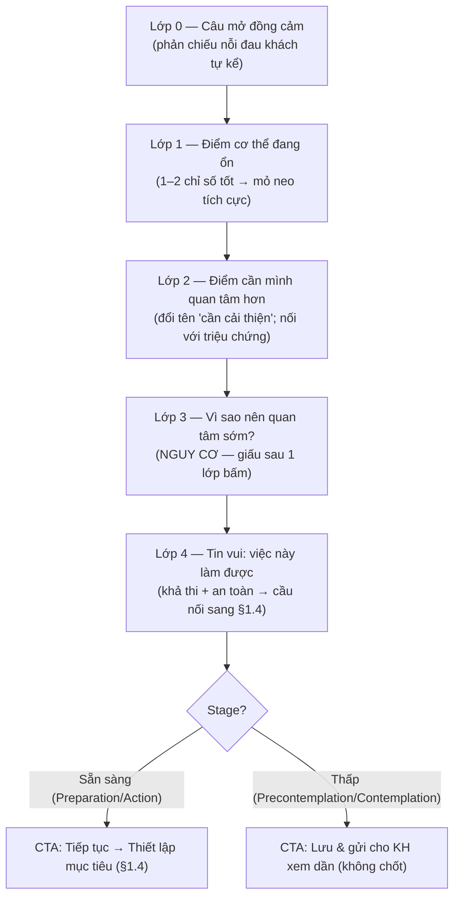

# Bản tư vấn theo hướng Đồng cảm (Empathy-Consultation) — v1.0

> **Mục đích.** Đặc tả cách thiết kế lại màn **"Bản tư vấn"** (`Workflow-HLV.md` §1.3) theo hướng **đồng cảm trước, phân tích sau** — để phù hợp với khách đang có nỗi đau sức khỏe và khách đa nghi/đề phòng, mà **không làm mất** chức năng tạo nhu cầu cải thiện (hỗ trợ chuyển đổi).
>
> **Quan hệ tài liệu.** Đây là một **tầng "empathy layer"** đặt phía trên §1.3 hiện có; không thay logic tính toán chỉ số, chỉ đổi **trật tự trình bày, ngôn ngữ, mức độ phơi bày thông tin và tông giọng**. Ghép cùng `docs/srs/Objection-Handler_v1.0.md` tại điểm chốt.
>
> **Nguồn tri thức.** Kỹ thuật "hỏi triệu chứng/nỗi đau trước → gắn vào chỉ số", hình ảnh hóa, làm gương, kể chuyện người thật — chắt lọc từ 2 video thực hành tư vấn 15 phút (công thức 1-7-2-3-2). Có **giảm liều** các kỹ thuật gây sốc/áp lực để bám nguyên tắc README *"AI hỗ trợ không thao túng"*.
>
> **Trạng thái.** Tài liệu brainstorm v1.0 — chờ phản hồi để chốt mẫu câu & catalog chỉ số.

---

## 1. Vấn đề với §1.3 hiện tại

Màn Bản tư vấn hiện mở đầu bằng **Card "Những điểm cần cải thiện"** rồi **"Nguy cơ bệnh lý"** — tức bắt đầu bằng *cái sai* và *cái đáng sợ*.

| Nhóm khách | Phản ứng bất lợi |
|---|---|
| **Có nỗi đau sức khỏe** | Thấy bị phán xét, ngợp, mất tự tin → phòng thủ, rút lui. |
| **Đa nghi / đề phòng** | Cảm nhận đây là "đòn tạo sợ để bán hàng" → mất niềm tin. |
| **(HLV mới)** | Khó dẫn dắt khi khách đã đóng cảm xúc ngay từ đầu. |

**Lưu ý:** vẫn cần chỉ ra điểm chưa tốt & nguy cơ (đó là động lực thay đổi). Vấn đề là **trật tự, ngôn ngữ và liều lượng**, không phải bỏ thông tin.

---

## 2. Nguyên tắc thiết kế

1. **Đồng cảm trước, phân tích sau.** Phản chiếu nỗi đau khách tự nói trước khi nêu bất kỳ con số nào.
2. **Mở bằng tích cực, đóng bằng hy vọng.** Có "điểm đang ổn" ở đầu, "việc này làm được" ở cuối.
3. **Nguy cơ theo cơ chế progressive disclosure.** Khách *chủ động mở* mới hiện — không phơi sẵn để dọa.
4. **Nối chỉ số với triệu chứng khách đã khai** (`aim.pain_points`, `trigger_event`) để "cá nhân hóa nỗi đau", không nói chung chung.
5. **Tông giọng theo DISC + điều chỉnh theo Stage.**
6. **Đồng cảm ≠ giấu sự thật & ≠ chẩn đoán y tế.** Thông tin đầy đủ, chỉ đổi cách & thứ tự trình bày.

---

## 3. Cấu trúc 5 lớp (thay cho 2 Card hiện tại)

### Lớp 0 — Câu mở đồng cảm *(mới, trên cùng)*
Sinh từ dữ liệu §1.1: `aim.trigger_event` (Q1), `aim.pain_points` (Q3), `primary_goal`.
> *Mẫu:* "Chị Nga chia sẻ dạo này hay mệt, mất ngủ và ngại lên cân sau sinh. Mình cùng xem cơ thể đang nói gì rồi tìm cách nhẹ nhàng nhất nhé."

Nếu chưa có dữ liệu pain point → dùng câu trung tính: "Mình cùng xem qua các chỉ số để hiểu cơ thể đang ở đâu nhé."

### Lớp 1 — "Điểm cơ thể đang ổn" *(mới)*
Chọn 1–2 chỉ số trong/gần ngưỡng tốt (vd: tỷ lệ nước, lượng cơ, lượng xương). Mục đích: mỏ neo tích cực cho người từng thất bại nhiều lần (`survey_responses` Q4).
> *Mẫu:* "Tin tốt là lượng cơ và mật độ xương của chị đang ở mức ổn — đây là nền tảng tốt để bắt đầu."

### Lớp 2 — "Điểm cơ thể cần mình quan tâm hơn" *(đổi tên từ 'cần cải thiện')*
- **Ngôn ngữ đồng hành**, không phán xét (xem bảng §4).
- Mỗi chỉ số **nối lại triệu chứng** khách đã kể.
- **Hình ảnh hóa nhẹ** (giảm liều so với video): "tương đương 6 chai nước 1 lít" thay vì "6 can dầu mỡ".

### Lớp 3 — "Vì sao nên quan tâm sớm?" *(NGUY CƠ — progressive disclosure)*
- Không phơi sẵn. Một dòng bấm được: *"Vì sao nên quan tâm sớm? ›"*. Mở mới hiện nguy cơ liên quan.
- Bắt buộc kèm rào: **"Đây là thông tin tham khảo về dinh dưỡng, không phải chẩn đoán y tế."**
- **Ngoại lệ DISC = C:** mở sẵn (nhóm này yên tâm khi có đủ dữ liệu).

### Lớp 4 — "Tin vui: việc này làm được" *(chuyển sang hy vọng)*
Kết bằng tính khả thi, không bằng sợ hãi. Lấy mục tiêu + tốc độ an toàn (business-rules) để khẳng định trong tầm tay → cầu nối sang §1.4.
> *Mẫu:* "Với cơ địa của chị, giảm 6kg trong 90 ngày là hoàn toàn trong tầm tay — trung bình 2kg/tháng, rất an toàn và bền vững."

---

## 4. Bảng ngôn ngữ & before/after theo chỉ số

Quy ước: cùng dữ liệu, đổi **nhãn + diễn giải + có nối triệu chứng**. Nguy cơ luôn đặt sau lớp bấm (Lớp 3).

| Chỉ số | ❌ Hiện tại (phán xét + dọa) | ✅ Đồng cảm (Lớp 2) | Nguy cơ ẩn ở Lớp 3 |
|---|---|---|---|
| **Cân nặng** | "Thừa 6kg" | "Cơ thể đang mang thêm ~6kg so với mức cân đối — bằng khoảng 6 chai nước 1L." | gánh nặng khớp, tim mạch |
| **Mỡ nội tạng** | "8 điểm 🔴 — tiểu đường, gan nhiễm mỡ, đột quỵ" | "Mỡ nội tạng 8 — nhỉnh hơn mức lý tưởng (1–4) một chút; thường là lý do thấy nặng nề, kém năng lượng." | rối loạn chuyển hóa, gan nhiễm mỡ |
| **% mỡ cơ thể** | "Cao" | "Tỷ lệ mỡ đang hơi cao so với độ tuổi — mình sẽ giảm mỡ mà vẫn giữ cơ." | — |
| **Tuổi sinh học** | "50 tuổi (già hơn 12 tuổi)" | "Cơ thể đang 'hoạt động' như tuổi 50 — tin vui là chỉ số này cải thiện nhanh khi mình điều chỉnh." | lão hóa sớm |
| **BMI** | "23.1 — thừa cân" | "BMI 23.1 — gần ngưỡng trên của mức khỏe mạnh, mình đưa về vùng an toàn nhé." | — |
| **Chỉ số cân đối** | "3 điểm — xấu" | "Tỷ lệ cơ–mỡ chưa cân đối; đây là phần cải thiện rõ nhất khi có lộ trình đúng." | — |
| **Nước / Cơ / Xương** (thường tốt) | (không nêu) | **Đưa lên Lớp 1** làm điểm tích cực. | — |

> **Nguyên tắc câu chữ:** thay "cao/thấp/xấu/thừa" → "đang nhỉnh hơn/thấp hơn mức lý tưởng một chút"; thêm cụm đồng hành "mình sẽ…/mình cùng…"; mọi nguy cơ nói ở thì điều kiện ("nếu để lâu…") không ở thì khẳng định.

---

## 5. Tông giọng theo DISC (áp cho nội dung hiển thị)

| DISC | Cách trình bày bản tư vấn |
|---|---|
| **D** — Quyết đoán | Ngắn, đúng trọng tâm: "3 chỉ số cần xử lý, làm được trong 90 ngày." Ít diễn giải. |
| **I** — Cảm xúc | Ấm áp, kèm **chuyện người thật / ảnh trước–sau** của hội viên cùng nhóm. |
| **S** — Cần an toàn | Trấn an nhiều, nhấn "có em đồng hành từng bước"; **giấu kỹ Lớp 3**. |
| **C** — Logic | **Mở sẵn** bảng số liệu chi tiết + nguồn chuẩn (WHO/Tanita); nhóm này muốn dữ liệu. |

> Chỉ áp cá nhân hóa khi `ai_data_sharing_enabled = true`. Khi tắt → dùng tông trung tính + cấu trúc 5 lớp mặc định, không kéo chuyện/người thật cá nhân hóa.

---

## 6. Điều chỉnh theo Stage (giai đoạn sẵn sàng)

| Stage | Hành vi màn hình |
|---|---|
| **Precontemplation / Contemplation** | Dừng ở Lớp 4; CTA chính = **"Lưu & gửi cho KH xem dần"**, KHÔNG đẩy chốt. Liên kết Objection Handler ẩn nhánh chốt gói. |
| **Preparation / Action** | Hiện CTA **"Tiếp tục → Thiết lập mục tiêu (§1.4)"** như luồng chuẩn. |

---

## 7. Map dữ liệu

Tái dùng nguồn của §1.3 (`health_profiles.tanita_data` + bảng chuẩn) + thêm đầu vào từ persona:

| Thành phần empathy | Nguồn dữ liệu |
|---|---|
| Lớp 0 — câu mở | `persona_data.aim.trigger_event` (Q1), `aim.pain_points[]` (Q3), `primary_goal` |
| Lớp 1 — điểm tốt | `tanita_data` đối chiếu ngưỡng → lọc chỉ số đạt |
| Lớp 2 — nối triệu chứng | ánh xạ `pain_points[]` ↔ chỉ số (bảng map cần xây) |
| Tông giọng | `disc_primary` / `disc_secondary` |
| Hành vi CTA | cột `stage` |
| Lịch sử "từng thử" | `survey_responses[]` (Q4) → dùng cho mỏ neo tích cực |

> Nội dung diễn giải vẫn sinh bởi `ConsultationAgent` (WHO + DISC), bám Knowledge Base, **không chẩn đoán y tế**. Empathy layer là tập **template + quy tắc trật tự/ngôn ngữ** áp lên output.

---

## 8. Ràng buộc đạo đức & tuân thủ

1. **Không giấu sự thật:** nguy cơ vẫn đầy đủ, chỉ chuyển sang cơ chế khách chủ động mở (Lớp 3).
2. **Không chẩn đoán y tế:** mọi nội dung bệnh lý là tham khảo dinh dưỡng, có dòng rào bắt buộc.
3. **Không thao túng cảm xúc:** giảm liều hình ảnh gây sốc; nguy cơ nói ở thì điều kiện.
4. **Consent:** cá nhân hóa DISC/Stage chỉ khi `ai_data_sharing_enabled = true`.
5. **Minh bạch nguồn:** giữ ghi chú nguồn chuẩn (WHO Expert Consultation 2004, Mifflin–St Jeor, Tanita BC-series…) như §1.3.
6. **Trao quyền KH:** luôn có lựa chọn "Lưu & xem sau", không ép tiến.

---

## 9. Liên kết tài liệu

- Ghép vào: `docs/to-be/Workflow-HLV.md` §1.3 (con trỏ tham chiếu đã chèn).
- Tiếp nối: `docs/srs/Objection-Handler_v1.0.md` (xử lý băn khoăn tại điểm chốt).
- Dữ liệu: `docs/technical/customer-persona-data-model_v1.0.md`; khung DISC `docs/to-be/customer-persona-disc-framework_v1.0.md`.
- Quy tắc tốc độ an toàn & mục tiêu: `docs/business-rules/Calorie-Meal-Business-Rules-v1.1.md`.
- Nguồn công thức 15 phút (1-7-2-3-2): transcript video, `docs/references/transcripts/`.

---

## 10. Việc cần làm tiếp (open items)

- [ ] Xây **bảng map triệu chứng ↔ chỉ số** (pain_point → chỉ số liên quan) cho Lớp 2.
- [ ] Catalog **mẫu câu đầy đủ 4 DISC** cho từng chỉ số (hiện mới demo).
- [ ] Cập nhật prototype `prototypes/hlv/hlv_ban_tu_van.html` theo cấu trúc 5 lớp.
- [ ] Thư viện **ảnh trước–sau / testimonial** hội viên (cho tông giọng I).
