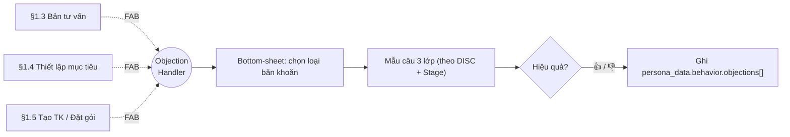
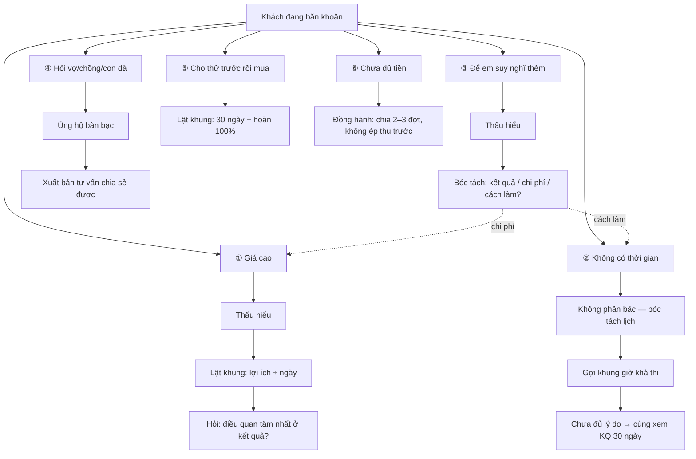

# Trợ lý Xử lý Băn khoăn / Từ chối (Objection Handler) — v1.0

> **Mục đích.** Đặc tả tính năng **Objection Handler** — một trợ lý ngữ cảnh, bật theo yêu cầu của HLV trong các màn tư vấn, giúp HLV (đặc biệt HLV mới) phản hồi đúng và nhân văn khi khách hàng băn khoăn/từ chối. Tài liệu này **ghép vào** `docs/to-be/Workflow-HLV.md` (mục 1.3 Bản tư vấn, 1.4 Thiết lập mục tiêu, 1.5 Tạo tài khoản/Đặt gói).
>
> **Nguồn tri thức.** Mẫu câu & kịch bản chắt lọc từ 2 video thực hành "tư vấn 15 phút" (công thức **1-7-2-3-2** của cộng đồng Nutrition Club / Herbalife). Transcript lưu tại `docs/references/transcripts/` (nếu được bổ sung).
>
> **Nguyên tắc nền.** Bám định hướng README: *"AI hỗ trợ không thay người & không thao túng; trao quyền không thâu tóm; minh bạch & quyền người dùng"*. Mọi mẫu câu là **gợi ý chỉnh sửa được**, không auto-gửi, không tạo áp lực sai sự thật.

---

## 1. Bối cảnh & vấn đề cần giải

Luồng tư vấn trong `Workflow-HLV.md` (§1.1 → §1.6) tối ưu cho HLV giỏi & khách hợp tác. Ba nhóm khách/HLV "đau" hiện chưa được hỗ trợ tại **điểm gãy** — khoảnh khắc khách nêu băn khoăn:

| Nhóm | Khó khăn tại điểm từ chối |
|---|---|
| **Khách có nỗi đau sức khỏe** | Dễ thấy bị phán xét/bị bán hàng → phòng thủ, rút lui. |
| **Khách đa nghi / đề phòng** | Cảm nhận luồng là "phễu bán hàng", cần xây niềm tin trước. |
| **HLV mới / thấy quy trình rườm rà** | Lúng túng, không biết đáp thế nào, mất tự nhiên trước khách. |

**Mục tiêu tính năng:** chuẩn hóa cách xử lý 6 nhóm băn khoăn phổ biến, cá nhân hóa theo **DISC + Stage** (dữ liệu đã có trong `customer_personas`), và **học dần** từ kết quả thực tế.

---

## 2. Nguyên tắc thiết kế

1. **HLV chủ động, không tự bật.** Objection Handler chỉ mở khi HLV bấm — app là "tai nghe thì thầm", không cướp hội thoại.
2. **3 lớp phản hồi cho mỗi nhánh:** **Thấu hiểu** (đồng cảm trước) → **Lật khung** (reframe giá trị) → **Câu hỏi tiến tới** (chốt nhẹ, mở đường). Đây là điểm khác biệt với video gốc (vốn chốt khá "rát"): luôn đồng cảm trước.
3. **Cá nhân hóa theo DISC + Stage**, chỉ khi `ai_data_sharing_enabled = true`.
4. **Gợi ý, không ép.** Mọi câu chỉnh sửa được; không có kịch bản gây áp lực sai sự thật (vd "sắp hết hàng").
5. **Học dần.** Ghi nhận loại từ chối + hiệu quả → cải thiện đề xuất & sinh tài liệu đào tạo.

---

## 3. Vị trí trong luồng (điểm tích hợp)

Một **nút nổi (FAB) "Khách đang băn khoăn"** xuất hiện ở 3 màn nóng nhất. Bấm → **bottom-sheet** trượt lên → chọn loại băn khoăn → hiện mẫu câu (đã cá nhân hóa).



> **Ràng buộc theo Stage:** nếu `stage ∈ {Chưa nghĩ tới, Đang cân nhắc}` → **ẩn nhánh chốt gói**, chỉ hiện gợi ý "làm ấm" để tránh chốt non.

---

## 4. Cây từ chối (Objection Tree)

6 nhánh chắt lọc từ video. Mỗi nhánh có 3 lớp; một số nhánh **rẽ tiếp** sang nhánh khác.



### 4.1. Bảng mẫu câu (tông giọng trung tính — mặc định)

| # | Loại | Thấu hiểu | Lật khung | Câu hỏi tiến tới |
|---|---|---|---|---|
| ① | **Giá cao** | "Em hiểu, đây là khoản đầu tư cho sức khỏe nên anh/chị cân nhắc kỹ là đúng." | "Mình nhìn theo lợi ích nhé — gói gồm [liệt kê quyền lợi]; chia ra mỗi ngày chỉ ~Xk." | "Nếu chi phí không phải vấn đề, điều anh/chị quan tâm nhất ở kết quả là gì ạ?" |
| ② | **Không có thời gian** | "Em hiểu lịch của anh/chị bận." | "Anh/chị làm ở đâu, mấy giờ vào ca, từ nhà tới nhóm bao xa ạ?" → app gợi khung giờ khả thi | "Người chưa sắp xếp được thường vì chưa đủ lý do — mình cùng xem kết quả 30 ngày sẽ thế nào nhé?" |
| ③ | **Để suy nghĩ thêm** | "Dạ được, quyết định cho sức khỏe nên thoải mái." | "Thường khi mình nói 'suy nghĩ thêm' là còn một điểm chưa rõ." | "Anh/chị đang phân vân về *kết quả*, *chi phí*, hay *cách thực hiện* ạ?" → rẽ nhánh |
| ④ | **Hỏi người thân** | "Anh/chị bàn với nhau là rất tốt." | "Để em chuẩn bị bản tóm tắt chỉ số + lộ trình mang về cho cả nhà xem cùng nhé?" | "Khi nào tiện em gọi lại để mình cùng chốt ạ?" |
| ⑤ | **Thử trước rồi mua** | "Em hiểu anh/chị muốn chắc chắn có kết quả." | "Bên em có hẳn 30 ngày trải nghiệm, *không hài lòng hoàn 100%* — anh/chị được trải nghiệm trọn vẹn luôn thay vì thử ngắn." | "Anh/chị muốn bắt đầu từ khung giờ nào ạ?" |
| ⑥ | **Chưa đủ tiền** | "Em hiểu. Mình không cần dồn ngay một lúc." | "Có thể chia [2–3] đợt để anh/chị bắt đầu đúng lúc cơ thể đang cần nhất." | "Anh/chị thấy bắt đầu tuần này hay đầu tháng tới hợp hơn ạ?" |

> Quyền lợi/giá tại nhánh ① lấy động từ catalog gói (`packaged-service-advice-v1.0.md`); KHÔNG hard-code số tiền trong tài liệu này.

### 4.2. Cá nhân hóa theo DISC (ví dụ nhánh ① Giá cao)

| DISC | Điều chỉnh tông giọng | Mẫu rút gọn |
|---|---|---|
| **D** — Quyết đoán | Ngắn, thẳng, nhấn kết quả & tốc độ | "Gói này cho kết quả nhanh nhất — anh bắt đầu hôm nay chứ?" |
| **I** — Cảm xúc | Kể chuyện người thật, năng lượng tích cực | "Chị Lan cùng nhóm cũng băn khoăn vậy, giờ giảm 5kg rồi đấy ạ." |
| **S** — Cần an toàn | Trấn an, nhấn đồng hành + chính sách hoàn tiền | "Anh/chị cứ yên tâm, có em đồng hành suốt và chính sách hoàn 100%." |
| **C** — Logic | Số liệu, bảng so sánh, dẫn nguồn | "Em gửi anh/chị bảng đối chiếu chi phí/lợi ích theo từng chỉ số nhé." |

> Engine sinh gợi ý kết hợp `disc_primary` + `stage` + `funnel_stage`, dùng chung **Next-Best-Action** (To-do TD-AC5 / TD-AC2). Có nêu `provenance.evidence` (các `qid` làm bằng chứng); HLV xác nhận/sửa trước khi dùng.

---

## 5. Đặc tả màn hình (bottom-sheet)

**Trạng thái 1 — Chọn loại băn khoăn**
- Lưới 6 chip lớn (icon + nhãn). Chip ⑤/⑥ và mọi nhánh "chốt gói" **ẩn** nếu Stage thấp.
- Ô "Khác…" cho HLV nhập tự do → ghi `objections[]` (loại = `other`), không sinh mẫu câu.

**Trạng thái 2 — Mẫu câu 3 lớp**
- 3 thẻ: **Thấu hiểu · Lật khung · Tiến tới**; mỗi thẻ có nút **Sao chép** và **Sửa nhanh**.
- Badge DISC/Stage đang áp dụng + link "đổi tông giọng" (D/I/S/C).
- Với nhánh có rẽ (③) → nút dẫn sang nhánh con. Với ④ → nút **"Xuất bản tư vấn chia sẻ"**. Với ② → ô nhập lịch → **"Gợi ý khung giờ"**.

**Trạng thái 3 — Phản hồi 1 chạm**
- Sau khi đóng sheet: "Câu này có hiệu quả không?" 👍 / 👎 / Bỏ qua → ghi log.

> Prototype đề xuất: `prototypes/hlv/hlv_objection_handler.html` (bottom-sheet, nối từ §1.3/1.4/1.5).

---

## 6. Mô hình dữ liệu

Tái dùng `customer_personas.persona_data` (xem `docs/technical/customer-persona-data-model_v1.0.md`). Bổ sung mảng sự kiện:

```jsonc
persona_data.behavior.objections = [
  {
    "type": "price | time | think | ask_family | trial_first | budget | other",
    "raw_note": "nguyên văn HLV ghi (tùy chọn)",
    "context_screen": "consultation | goal_setting | account_create",
    "disc_used": "D | I | S | C",
    "stage_at_time": "contemplation | preparation | ...",
    "outcome": "resolved | pending | lost | unknown",   // từ 👍/👎/bỏ qua
    "created_at": "ISO-8601",
    "coach_id": "..."
  }
]
```

- **Đọc:** Bản tư vấn lần sau **chủ động phòng trước** loại băn khoăn khách hay nêu (`type` xuất hiện nhiều + `outcome=lost`).
- **Tổng hợp:** Dashboard HLV thống kê "từ chối hay gặp / câu chốt tốt" → **tài liệu đào tạo tự sinh** cho HLV mới.

---

## 7. Ràng buộc đạo đức & tuân thủ (gắn cứng)

1. **Gợi ý, không auto-gửi.** Không có hành vi thay HLV nói với khách.
2. **Không thao túng.** Cấm kịch bản khan hiếm giả, đe dọa sức khỏe quá mức, hứa hẹn sai.
3. **Đồng cảm bắt buộc.** Lớp "Thấu hiểu" không được lược bỏ trong mọi nhánh.
4. **Consent.** Cá nhân hóa DISC/Stage chỉ chạy khi `ai_data_sharing_enabled = true`; nếu tắt → chỉ hiện mẫu câu trung tính §4.1.
5. **Không chẩn đoán y tế.** Nhánh liên quan bệnh lý chỉ diễn giải đồng cảm, dẫn về "tư vấn dinh dưỡng, không phải chữa bệnh".
6. **Minh bạch nguồn.** Khi dùng bằng chứng từ khảo sát, hiển thị `provenance.evidence`.

---

## 8. Liên kết tài liệu

- Ghép vào: `docs/to-be/Workflow-HLV.md` §1.3, §1.4, §1.5 (xem con trỏ tham chiếu đã chèn).
- Phụ thuộc dữ liệu: `docs/technical/customer-persona-data-model_v1.0.md`; khung persona/DISC `docs/to-be/customer-persona-disc-framework_v1.0.md`.
- Quy tắc gói/giá: `docs/business-rules/packaged-service-advice-v1.0.md`.
- Engine gợi ý: To-do TD-AC5 / TD-AC2 (Next-Best-Action).
- Công thức tư vấn 15 phút (1-7-2-3-2): nguồn video thực hành, transcript `docs/references/transcripts/`.
