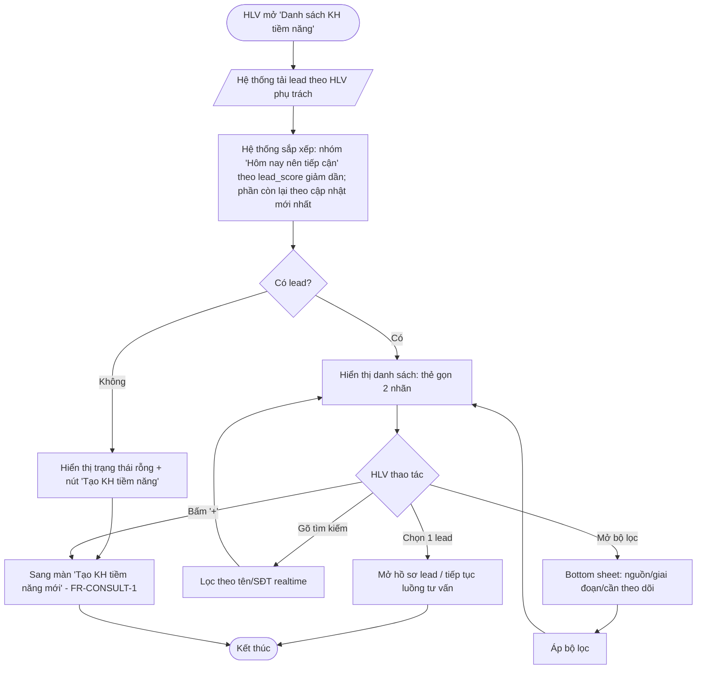

# SRS Sub-document — 2.1 Danh sách KH tiềm năng

**Thuộc:** `docs/srs/SRS_AnCare_v0.1.md` · **Module:** `FR-LEAD` · **Vai trò:** HLV
**Phiên bản:** v1.0 (draft) · **Cập nhật:** 2026-06-26
**Tuân thủ:** `docs/srs/UI-UX-Design-Language-Lean_v1.0.md` (khuôn **T2 — Danh sách**).
**Liên quan:** dữ liệu `docs/technical/customer-persona-data-model_v1.0.md`; nghiệp vụ `docs/to-be/Workflow-HLV.md §A.1`.

> **Mục tiêu màn:** giúp HLV **biết hôm nay nên tiếp cận ai** và **mở nhanh** lead để tư vấn/ghi chú — với giao diện *liếc-là-dùng*, ít chữ.

---

## 1. Phạm vi cụm màn

| Mã | Màn / Trạng thái | Mô tả |
|---|---|---|
| **S-LEAD-01** | Danh sách KH tiềm năng | Màn chính (T2): tìm kiếm + lọc + danh sách. |
| **S-LEAD-01a** | Trạng thái rỗng | Chưa có lead nào / bộ lọc không kết quả. |
| **S-LEAD-02** | Bộ lọc (bottom sheet) | Lọc theo nguồn/giai đoạn/cần theo dõi. |
| **S-LEAD-LOAD/ERR** | Đang tải / Lỗi tải | Skeleton + trạng thái lỗi-thử lại. |

> Màn này là **tab "KH tiềm năng"** trong "Danh sách KH" (gộp 2 tab). Sub-document này đặc tả phần KH tiềm năng; tab "KH của tôi" thuộc cụm Chi tiết KH.

---

## 2. Activity Diagram



---

## 3. Mô tả luồng xử lý

### 3.1 Luồng chính (Happy path)
1. HLV mở màn (từ Dashboard hoặc thanh điều hướng → "Danh sách KH" → tab "KH tiềm năng" mở mặc định).
2. Hệ thống gọi API lấy danh sách lead của HLV; hiển thị **skeleton** trong khi tải.
3. Hệ thống **sắp xếp**: nhóm **"Hôm nay nên tiếp cận"** (lead đến nhịp cần liên hệ) xếp theo `lead_score` giảm dần; nhóm **"Tất cả lead"** theo `updated_at` mới nhất.
4. Mỗi lead hiển thị **thẻ gọn**: avatar (chữ cái), tên, **nhãn 1 = giai đoạn (Stage)**, **nhãn 2 = "việc cần làm tiếp"**. (lead_score & DISC **ẩn**, chỉ dùng để sắp xếp/cá nhân hóa.)
5. HLV chọn 1 lead → mở hồ sơ/tiếp tục luồng tư vấn (FR-CONSULT). Hoặc bấm **FAB "+ Tạo KH tiềm năng"** → màn Tạo KH tiềm năng mới.

### 3.2 Luồng phụ
- **Tìm kiếm:** gõ tên/SĐT → lọc realtime trên danh sách hiện có (debounce ~300ms).
- **Lọc:** mở bottom sheet (S-LEAD-02), chọn nguồn (Nóng/Ấm/Lạnh) / giai đoạn / "cần theo dõi" → Áp dụng → danh sách cập nhật; chip "đang lọc" hiển thị ở đầu; nút "Xóa lọc".
- **Rỗng:** không có lead → S-LEAD-01a với minh họa + CTA "Tạo KH tiềm năng". Bộ lọc không ra kết quả → thông điệp "Không có lead khớp bộ lọc" + nút "Xóa lọc".
- **Lỗi tải:** hiển thị thông báo + nút "Thử lại".
- **Consent tắt:** vẫn hiển thị danh sách & giai đoạn (do HLV gắn); **không** hiển thị gợi ý AI cá nhân hóa.

### 3.3 Quy tắc sắp xếp & "Hôm nay nên tiếp cận" (logic)
- Một lead vào nhóm **"Hôm nay nên tiếp cận"** khi: tới nhịp cadence (đến hạn liên hệ tiếp) **hoặc** `funnel_stage` đang chờ hành động của HLV.
- Trong nhóm, sắp theo `lead_score` giảm dần (`lead_score` = hàm của *độ phù hợp × độ ấm × readiness* — xem `packaged-service-advice` & persona framework). **Không hiển thị số** `lead_score` ra UI.
- Giới hạn hiển thị nhóm "hôm nay" tối đa N (vd 5–7) để tránh quá tải; phần còn lại ở "Tất cả lead".

---

## 4. Wireframe (tuân thủ Design Language — khuôn T2)

> Quy ước: ` [ ] ` nút/ô; ` (•) ` chip; chữ trong khung là nội dung mẫu. Mỗi thẻ tối đa **2 nhãn** (L6). FAB **một hành vi** (L5). Không hiển thị số kỹ thuật (L4).

### S-LEAD-01 — Danh sách KH tiềm năng
```
┌───────────────────────────────────────────┐
│  KH tiềm năng                        [ ⌕ ] │  ← AppBar: tiêu đề + nút lọc (icon phễu)
├───────────────────────────────────────────┤
│  [ Tìm theo tên, số điện thoại…          ] │  ← Ô tìm kiếm
│  (•Tất cả) (Nóng) (Ấm) (Lạnh) (Cần th.dõi) │  ← Chip lọc nhanh (1 dòng, cuộn ngang)
├───────────────────────────────────────────┤
│  HÔM NAY NÊN TIẾP CẬN                       │  ← Nhãn nhóm (chữ phụ)
│  ┌───────────────────────────────────────┐ │
│  │ (L) Chị Lan            [Đang cân nhắc] │ │  ← avatar + tên + NHÃN 1 (giai đoạn)
│  │      → Mời tham gia buổi đo Tanita   › │ │  ← NHÃN 2 (việc cần làm tiếp) + chevron
│  └───────────────────────────────────────┘ │
│  ┌───────────────────────────────────────┐ │
│  │ (M) Anh Minh             [Chuẩn bị]   │ │
│  │      → Đặt lịch gặp 2:1              › │ │
│  └───────────────────────────────────────┘ │
│                                             │
│  TẤT CẢ LEAD                                │
│  ┌───────────────────────────────────────┐ │
│  │ (H) Cô Hạnh              [Mới]         │ │
│  │      → Gửi nội dung gieo nhận thức  › │ │
│  └───────────────────────────────────────┘ │
│  … (cuộn) …                                 │
│                                       ┌────┐│
│                                       │ +  ││  ← FAB: "Tạo KH tiềm năng" (1 hành vi)
│                                       └────┘│
├───────────────────────────────────────────┤
│ [Tổng quan] [Danh sách KH•] [Chat] [Hồ sơ] │  ← Thanh điều hướng dưới
└───────────────────────────────────────────┘
```
**Ghi chú thành phần (đối chiếu Lean):**
- *AppBar:* tiêu đề ngắn + 1 icon lọc. (Tránh nhồi action.)
- *Tìm kiếm + chip lọc nhanh:* lọc thường dùng để ngay trên màn; lọc nâng cao trong bottom sheet.
- *Thẻ lead:* **đúng 2 nhãn** — giai đoạn (badge) + việc cần làm tiếp (1 dòng). **Ẩn** lead_score, DISC, nguồn, kênh (đưa vào hồ sơ chi tiết). Cả thẻ là 1 vùng chạm (≥44px).
- *FAB:* **một** hành vi cố định "Tạo KH tiềm năng". (Không đổi đích theo tab.)

### S-LEAD-02 — Bộ lọc (bottom sheet)
```
┌───────────────────────────────────────────┐
│              ▁▁▁ (grip)                     │
│  Lọc KH tiềm năng                           │
│  Nguồn:   (Nóng) (Ấm) (Lạnh)                │
│  Giai đoạn: (Mới)(Đang cân nhắc)(Chuẩn bị)  │
│             (Đã đang làm)                   │
│  ( ) Chỉ hiện "cần theo dõi"                │
│  [ Xóa lọc ]              [ Áp dụng ]        │
└───────────────────────────────────────────┘
```

### S-LEAD-01a — Trạng thái rỗng
```
┌───────────────────────────────────────────┐
│  KH tiềm năng                        [ ⌕ ] │
├───────────────────────────────────────────┤
│            (minh họa nhẹ)                   │
│     Chưa có khách hàng tiềm năng nào         │
│   Thêm người đầu tiên để bắt đầu đồng hành   │
│            [  + Tạo KH tiềm năng  ]          │
└───────────────────────────────────────────┘
```

---

## 5. Thành phần & dữ liệu (Component ↔ Data mapping)

| Thành phần | Nguồn dữ liệu | Ghi chú hiển thị |
|---|---|---|
| Tên, avatar (chữ cái) | `users.full_name` | Avatar = chữ cái đầu |
| Nhãn 1 — Giai đoạn | `customer_personas.stage` | Map nhãn tiếng Việt (Mới/Đang cân nhắc/Chuẩn bị/Đã đang làm) |
| Nhãn 2 — Việc cần làm tiếp | `persona_data` → Next-Best-Action (FR-AIASSIST) | 1 dòng động từ |
| Sắp xếp (ẩn) | `lead_score`, cadence, `funnel_stage` | Không in số ra UI |
| Chip lọc nhanh | `source` (nóng/ấm/lạnh) | Chip "Tất cả" mặc định |
| Bộ lọc nâng cao | `source`, `stage`, cờ "cần theo dõi" | Bottom sheet |
| Tìm kiếm | `full_name`, `phone` | Debounce |

---

## 6. Đặc tả API (đề xuất)

> Tiền tố theo HLD: `/api/v1`. Auth: JWT (COACH). Chi tiết schema lead = subset `customer_personas` + `users`.

**6.1 Lấy danh sách lead**
```
GET /api/v1/coaches/{coachId}/prospects
    ?q=<text>                # tìm theo tên/sđt (optional)
    &source=hot|warm|cold    # optional, lặp được
    &stage=new|contemplation|preparation|action   # optional
    &needFollowUp=true       # optional
    &group=today|all         # optional; mặc định trả cả 2 nhóm
    &page=&pageSize=
→ 200 {
  "todayCount": 2,
  "groups": {
    "today": [ ProspectListItem ],
    "all":   [ ProspectListItem ]
  },
  "page": {...}
}
```
**ProspectListItem (item hiển thị thẻ):**
```json
{
  "userId": "uuid",
  "fullName": "Nguyễn Thị Lan",
  "stage": "contemplation",
  "stageLabel": "Đang cân nhắc",
  "nextBestAction": "Mời tham gia buổi đo Tanita",
  "source": "warm"
  // KHÔNG trả lead_score ra client UI (chỉ dùng server-side để sắp xếp),
  // hoặc trả 'rankHint' nội bộ nếu cần client giữ thứ tự.
}
```
**6.2 (Liên quan) Tạo lead** → dùng ở FR-CONSULT-1 (POST tạo `users` is_prospect=true + `customer_personas`). Đặc tả ở sub-document Tạo KH tiềm năng.

**Quy tắc server:** sắp xếp nhóm `today` theo `lead_score` desc; ẩn `lead_score` khỏi payload public; áp dụng phân quyền (HLV chỉ thấy lead mình phụ trách).

---

## 7. Acceptance Criteria

- **AC-LEAD-01** Given HLV có ≥1 lead, When mở màn, Then nhóm "Hôm nay nên tiếp cận" hiển thị trước, sắp theo độ ưu tiên giảm dần; mỗi thẻ hiện **đúng 2 nhãn** (giai đoạn + việc cần làm).
- **AC-LEAD-02** Given danh sách, When gõ tìm kiếm, Then danh sách lọc theo tên/SĐT trong ≤ 300ms (debounce), không reload toàn trang.
- **AC-LEAD-03** Given mở bộ lọc & chọn "Nóng" + "Đang cân nhắc", When Áp dụng, Then chỉ hiện lead khớp; có chỉ báo "đang lọc" + nút "Xóa lọc".
- **AC-LEAD-04** Given không có lead (hoặc lọc rỗng), Then hiển thị trạng thái rỗng phù hợp + CTA tạo lead.
- **AC-LEAD-05** Given bấm FAB "+", Then luôn mở màn "Tạo KH tiềm năng mới" (hành vi cố định, không phụ thuộc ngữ cảnh).
- **AC-LEAD-06** Given consent AI tắt, Then không hiển thị gợi ý AI; "việc cần làm tiếp" rơi về quy tắc tĩnh hoặc để trống.
- **AC-LEAD-07** UI không hiển thị bất kỳ con số kỹ thuật nào (lead_score…) — chỉ nhãn ngôn ngữ.

---

## 8. Đối chiếu Checklist Lean (§8 Design Language)
- [x] 1 việc chính (tìm & mở lead) + 1 CTA chính (FAB tạo).
- [x] Above-the-fold thấy ≥3 thẻ (T2).
- [x] Không thuật ngữ kỹ thuật ra UI (ẩn lead_score/DISC/Feasibility…).
- [x] Thẻ **≤2 nhãn**; màu theo 1 hệ thống (giai đoạn dùng thang trạng thái).
- [x] FAB **1 hành vi** cố định.
- [x] Chữ ≥13px, vùng chạm ≥44px.
- [x] Không có "Vì sao?" thừa (màn này không phải điểm quyết định tiền).

---

## 9. Open questions
- Nguồn **"việc cần làm tiếp"**: rule tĩnh theo `stage` (giai đoạn 1) hay NBA từ AI (giai đoạn sau)? `[TBD]`
- Ngưỡng nhịp **cadence** đưa lead vào "hôm nay nên tiếp cận" (số ngày theo nguồn/giai đoạn). `[TBD]`
- Có cho HLV **gắn cờ "ưu tiên thủ công"** ghim lên đầu không? `[TBD]`
- Nguồn **import lead** (danh bạ/MXH) & chống trùng — đặc tả ở module nhập liệu. `[TBD]`

---
*v1.0 — sub-document đầu tiên theo chuẩn mới (đặt trong `docs/srs/`). Prototype tham chiếu: `prototypes/hlv/hlv_danh_sach_kh_tiem_nang.html` (cần tinh chỉnh về đúng "2 nhãn/thẻ" theo wireframe này).*
