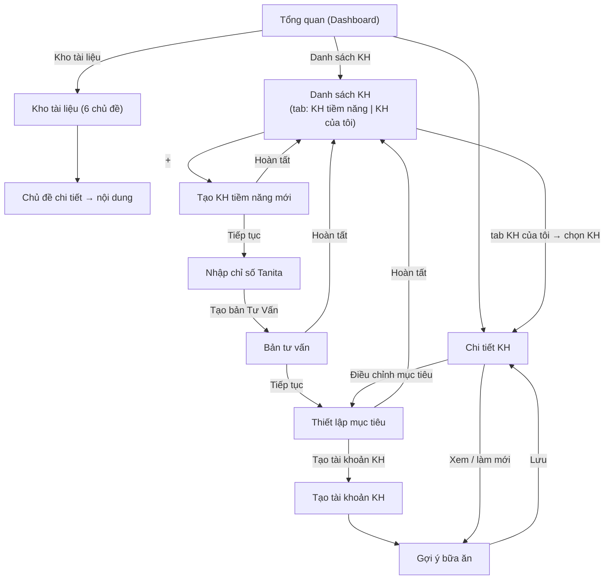

# Đặc tả UI-UX — Các màn hình phía HLV (ANCARE / SmartLife)

**Phiên bản:** v1.1 (draft) · **Cập nhật:** 2026-06-26
**Mục đích:** Tập hợp đầy đủ thiết kế UI-UX đã thống nhất cho **luồng HLV** (tạo KH tiềm năng → tư vấn → chuyển đổi → chăm sóc), bổ trợ cho phần nghiệp vụ ở `docs/to-be/Workflow-HLV.md`.

> **Cập nhật v1.1 (đồng bộ với luồng hiện tại):** màn **Bản tư vấn** chuyển sang **cấu trúc đồng cảm 5 lớp**; bổ sung **FAB "Khách đang băn khoăn" (Objection Handler)** ở các màn chốt; **Card "Khả thi bữa ăn"** ở Thiết lập mục tiêu; **Feasibility Score + chi phí/ngày + hướng dẫn người nấu** ở Gợi ý bữa ăn; **affordance "Vì sao?"** trên mọi kết quả (gói/%, Feasibility). Xem các đặc tả nguồn ở mục Liên quan.

**Liên quan:**
- Nghiệp vụ & sơ đồ: `docs/to-be/Workflow-HLV.md` (+ bản nâng cấp `Workflow-HLV_v1.1-draft.md`).
- Bản tư vấn đồng cảm: `docs/srs/Empathy-Consultation_v1.0.md`.
- Xử lý băn khoăn/từ chối: `docs/srs/Objection-Handler_v1.0.md`.
- Trải nghiệm hội thoại & "Vì sao": `docs/srs/Conversational-Explainable-UX_v1.0.md`.
- Dữ liệu chân dung: `docs/technical/customer-persona-data-model_v1.0.md`.
- Quy tắc gói: `docs/business-rules/packaged-service-advice-v1.0.md`.
- Quy tắc Calo/bữa ăn (3 nhóm + Persona-fit + Feasibility): `docs/business-rules/Calorie-Meal-Business-Rules-v1.1.md`.
- UI-UX phía KH: `docs/srs/UI-UX-Lo-trinh-Dong-ho-sinh-hoc_v1.0.md`.

---

## 0. Quy ước & hệ thiết kế

- **Quy ước file prototype:** màn HLV đặt trong `prototypes/hlv/` với prefix `hlv_`; màn KH trong `prototypes/kh/`. Tài nguyên chung: `prototypes/tabler-icons.min.css`.
- **Bảng màu:** nền `#fff` / `#f6f7f9`; chữ `#1a1d21` / `#6b7280`; **accent (HLV)** `#2f6f4f` (xanh đậm), accent-soft `#e7f1ec`. Bo góc `10–14px`. Icon: **Tabler Icons**.
- **Khung hiển thị:** mobile-first, `max-width 460px`; tablet dùng lại cùng bố cục card.
- **Thanh điều hướng dưới (HLV):** Tổng quan · Danh sách KH · Chat · Hồ sơ. *(v1.1: "KH tiềm năng" đổi thành "Danh sách KH" — màn gộp 2 tab.)*
- **Nguyên tắc chung:** progressive disclosure (card/nhóm gập mở), nút hành động cố định ở chân màn, trạng thái disable có dòng nhắc lý do, mọi xử lý AI tuân thủ `ai_data_sharing_enabled`.

### Danh sách màn hình & file

| # | Màn hình | Prototype |
|---|---|---|
| 0 | Tổng quan (Dashboard) | `hlv/hlv_tong_quan.html` |
| 1.0 | **Danh sách KH** (2 tab: KH tiềm năng · KH của tôi) | `hlv/hlv_danh_sach_kh.html` *(gộp; kế thừa `hlv_danh_sach_kh_tiem_nang.html`)* |
| 1.1 | Tạo KH tiềm năng mới | `hlv/hlv_tao_kh_tiem_nang.html` |
| 1.2 | Nhập chỉ số Tanita | `hlv/hlv_nhap_chi_so_tanita.html` |
| 1.3 | Bản tư vấn | `hlv/hlv_ban_tu_van.html` |
| 1.4 | Thiết lập mục tiêu | `hlv/hlv_thiet_lap_muc_tieu.html` |
| 1.5 | Tạo tài khoản KH | `hlv/hlv_tao_tai_khoan_kh.html` |
| 1.6 | Gợi ý bữa ăn (đa phiên bản) | `hlv/hlv_goi_y_bua_an.html` |
| 2 | Chi tiết KH | `hlv/hlv_chi_tiet_kh.html` |
| 3 | **Kho tài liệu** (khai thác kho tri thức) | `hlv/hlv_kho_tai_lieu.html` *(mới v1.1)* |
| 3.1 | Kho tài liệu — màn chủ đề chi tiết | `hlv/hlv_kho_tai_lieu_chu_de.html` *(mới v1.1)* |

---

## 1. Bản đồ điều hướng

---

## 2. Đặc tả từng màn hình

### 0. Tổng quan (Dashboard) — điểm vào ứng dụng HLV
- **Header:** avatar + lời chào + chuông thông báo.
- **KPI (4 ô):** KH đang chăm sóc · Lead tiềm năng · "Hôm nay nên tiếp cận" · **Gợi ý bữa ăn cần làm mới**.
- **Cảnh báo nổi bật:** KH có gợi ý bữa ăn hết hiệu lực 10 ngày → mở Chi tiết KH.
- **Truy cập nhanh (v1.1 — 3 nút):** **Danh sách KH** (gộp KH tiềm năng + KH của tôi) · **Kho tài liệu** · Chat. *(Thay 2 nút "KH tiềm năng" + "KH của tôi" cũ bằng 1 nút "Danh sách KH"; bổ sung nút "Kho tài liệu".)*
- **Danh sách KH cần chú ý:** thẻ KH (gói, ngày X/Y, trạng thái: cần làm mới TĐ / đúng lộ trình / cần nhắc) → Chi tiết KH.

### 1.0. Danh sách KH — 2 tab *(v1.1: gộp "KH tiềm năng" + "KH của tôi")*
> Gộp 2 nút cũ thành một màn có **thanh tab trên cùng**. Vào màn: **tab "KH tiềm năng" mở mặc định** (giữ nguyên hành vi cũ). Bấm tab "KH của tôi" để xem KH chính thức.

- **Thanh tab:** `KH tiềm năng` (mặc định) · `KH của tôi`. Lưu tab gần nhất để tiện dùng lại (tùy chọn).
- **Tab "KH tiềm năng"** (như §1.0 cũ):
  - Thanh tìm kiếm + bộ lọc (Tất cả / Nóng / Ấm / Lạnh / Cần theo dõi).
  - Nhóm "Hôm nay nên tiếp cận" + "Tất cả lead".
  - **Thẻ lead:** avatar, tên, **thẻ DISC**, giai đoạn (Stage), nguồn (nóng/ấm/lạnh), **lead score**, "việc cần làm tiếp" → mở luồng tư vấn (1.1→1.6).
  - **FAB "+"** → Tạo KH tiềm năng mới (`hlv_tao_kh_tiem_nang.html`).
- **Tab "KH của tôi"** (KH đã chính thức):
  - Thanh tìm kiếm + bộ lọc (Tất cả / Đúng lộ trình / Cần làm mới TĐ / Cần nhắc).
  - **Thẻ KH:** avatar, tên, **gói + ngày X/Y**, trạng thái lộ trình, cờ "gợi ý bữa ăn cần làm mới" → mở **Chi tiết KH** (§2).
  - **FAB "Thêm mới"** (nhánh tắt) → `hlv_tao_tai_khoan_kh.html` trực tiếp, bỏ qua B1–B4. Dùng khi KH đã quyết định và không cần qua giai đoạn tư vấn (giới thiệu, khách cũ, quen biết sẵn). Xem `Workflow-HLV_v1.1-draft.md §1 — Nhánh tắt`.
- **Bộ lọc/tìm kiếm áp riêng theo tab.** FAB thay đổi đích đến theo tab đang hiển thị: tab tiềm năng → tạo lead; tab KH của tôi → tạo tài khoản trực tiếp.

### 1.1. Tạo KH tiềm năng mới — 2 Card
- **Card "Thông tin cơ bản"** (→ `users`): Họ tên (bắt buộc), SĐT, Ngày sinh, Giới tính, **Chiều cao**, Email, Mã giới thiệu, **toggle consent AI**.
- **Card "Chân dung khách hàng"** (→ `customer_personas`): nhóm câu hỏi gập/mở — Nguồn & kênh, Mục tiêu & nỗi đau (Aim), Bối cảnh & lối sống, Yếu tố quyết định & rào cản, **Tín hiệu DISC** (đan vào, tùy chọn), Giai đoạn sẵn sàng (Stage). Mỗi câu trả lời → `persona_data.survey_responses[]`.
- **UX:** accordion theo Card (mặc định mở "Thông tin cơ bản"); Card chân dung gập sẵn + dấu ✓ khi đã có dữ liệu; khu vực **gợi ý AI** (DISC/Stage/cách tiếp cận + bằng chứng `qid`) hiện khi bật consent.
- **Hành động:** `Hoàn tất` → Danh sách · `Tiếp tục` → Nhập chỉ số Tanita.

### 1.2. Nhập chỉ số Tanita
- Nhập tay **hoặc** Chụp/Chọn ảnh → OCR/Vision tự điền (ô tự điền **tô xanh + nhãn "AI"**, sửa được).
- **Chiều cao** lấy read-only từ hồ sơ; **BMI tự tính** + phân loại.
- Nhóm: Cơ bản (Cân nặng, Chiều cao, BMI) · Thành phần cơ thể (mỡ, cơ, nước, xương, mỡ nội tạng) · Chỉ số khác (vóc dáng, tuổi sinh học, năng lượng nghỉ). Đơn vị dạng hậu tố; bàn phím số; tooltip ⓘ cho chỉ số mơ hồ.
- **CTA "Tạo bản Tư Vấn"** chỉ bật khi nhập đủ tất cả chỉ số.

### 1.3. Bản tư vấn — *cấu trúc đồng cảm 5 lớp (v1.1)*
> Thay cách mở đầu cũ ("điểm cần cải thiện" + "nguy cơ" phơi sẵn) bằng mạch **đồng cảm trước, phân tích sau**. Chi tiết: `Empathy-Consultation_v1.0.md`.
- **Đầu trang:** tên/mã KH, giới tính · tuổi · chiều cao, SĐT.
- **Lớp 0 — Câu mở đồng cảm:** phản chiếu nỗi đau/lý do khách tự kể (từ `aim.trigger_event`, `pain_points`).
- **Lớp 1 — "Điểm cơ thể đang ổn":** 1–2 chỉ số tốt (nước/cơ/xương) làm mỏ neo tích cực.
- **Lớp 2 — "Điểm cần mình quan tâm hơn":** ngôn ngữ đồng hành (không "xấu/thừa"); **nối với triệu chứng khách kể**; hình ảnh hóa nhẹ.
- **Lớp 3 — "Vì sao nên quan tâm sớm? ›":** nguy cơ **giấu sau 1 lớp bấm**, nói ở thì điều kiện, kèm rào "không chẩn đoán y tế". *(Ngoại lệ DISC=C: mở sẵn bảng số liệu chi tiết + nguồn WHO/Tanita.)*
- **Lớp 4 — "Tin vui: việc này làm được":** khẳng định mục tiêu khả thi & an toàn → cầu nối sang 1.4.
- **Tông giọng theo DISC** (D ngắn gọn · I chuyện người thật · S trấn an · C số liệu); chỉ cá nhân hóa khi `ai_data_sharing_enabled=true`.
- **FAB "Khách đang băn khoăn"** (Objection Handler) — bật mẫu câu 3 lớp khi khách nêu từ chối.
- **Hành động — 2 nút (theo Stage):** `Tiếp tục` (sẵn sàng) → Thiết lập mục tiêu · `Hoàn tất`/`Lưu & gửi KH xem dần` (Stage thấp → không chốt non) → lưu + Next-Best-Action → Danh sách.

### 1.4. Thiết lập mục tiêu
- **A. Thu thập:** Card "Mục tiêu cần cải thiện" (mỗi mục tiêu có **"Bao giờ muốn có kết quả?"** + đánh dấu ưu tiên), "Thói quen hiện tại", "Vấn đề/bệnh lý", và **Card "Khả thi bữa ăn" (mới v1.1)** — 4 chip chọn nhanh: **chế độ ăn** (mặn/bán chay/chay trứng-sữa/thuần chay), **ngân sách/ngày** (tiết kiệm/trung bình/thoải mái), **món thích/không thích**, **quyền chủ động bữa ăn** (tự nấu/phụ thuộc người nấu/ăn ngoài). → feed Persona-fit ở 1.6.
- **B. Lộ trình trải nghiệm (sau "Tính lộ trình"):**
  - **Gói = Tên gói (sản phẩm)** + **Thời gian (1/2/3 tháng, mặc định 3 tháng)** — chọn gói/đổi thời gian → **tính lại % cho mọi mục tiêu**; hiển thị **số ngày lộ trình** theo mục tiêu.
  - **Mục tiêu & % đạt được** từng mục tiêu, **mặc định đặt ở mức khả thi 100%** rồi mới cho nâng (đòn bẩy phụ: − / +); link "đặt về khả thi".
  - **Affordance "Vì sao? ›"** trên gói đề xuất và % đạt được — bung lời giải thích *căn cứ → quy tắc → bằng chứng cá nhân (qid)* (xem `Conversational-Explainable-UX_v1.0.md`).
  - **Lợi ích chương trình** (db/tĩnh). Chỉ hiện **tên gói**, không hiện giá.
  - Mục tiêu cân nặng được đánh dấu là **đầu vào gợi ý bữa ăn**.
- **FAB "Khách đang băn khoăn"** (Objection Handler) — nếu Stage thấp, ẩn nhánh chốt gói.
- **Hành động — 2 nút:** `Tạo tài khoản KH` (KH đồng ý) → màn 1.5 · `Hoàn tất` (chưa quyết) → lưu + Next-Best-Action.

### 1.5. Tạo tài khoản KH
- **Tài khoản:** Họ tên, SĐT, **Email, Mật khẩu**, Mã giới thiệu.
- **Gói dịch vụ:** tên gói + thời gian; **ngày bắt đầu** (auto theo hôm nay, chỉnh 1 lần); **ngày kết thúc** (auto theo số tháng).
- **Lưu mục tiêu chỉ số.**
- **Ảnh check-in:** chân dung · toàn thân · vòng eo.
- **Hành động:** "Tạo tài khoản & tạo gợi ý bữa ăn" → màn 1.6.

### 1.6. Gợi ý bữa ăn (đa phiên bản)
- **Thanh phiên bản:** số hiệu (#3) + trạng thái *Đang hiệu lực/Hết hiệu lực* + khoảng ngày (hiệu lực **10 ngày**) + **bộ chọn phiên bản** (xem bản cũ).
- **Tổng kết:** Calo/ngày, đạm/nước mục tiêu, số bữa, mục tiêu cân nặng.
- **Badge "Độ khả thi áp dụng" (Feasibility Score, mới v1.1):** xanh ≥80 / vàng 60–79 / đỏ <60; điểm thấp → nhắc HLV chỉnh (đổi món/ngân sách/độ phức tạp) trước khi giao. Kèm **"chi phí ước tính/ngày"**.
- **Đã lọc theo Persona-fit** (chế độ ăn, ngân sách, sở thích, quyền chủ động — từ Card 1.4); với chay tăng khẩu phần đủ đạm.
- **Mỗi bữa chia 3 nhóm thực phẩm** (xem `Calorie-Meal §2.1b`):
  - **Đạm** — calo + **đạm (g) mục tiêu** · món từ catalog protein.
  - **Xơ** — calo · món từ catalog rau xanh/vitamin.
  - **Đường/bột** — calo · món từ catalog tinh bột/đường.
- **Theo quyền chủ động:** nếu KH *phụ thuộc người nấu* → nút **"Xuất hướng dẫn cho người nấu/đi chợ"**; nếu *ăn ngoài* → hiển thị **cách gọi món thông minh** thay công thức.
- **Lưu ý chế độ:** hạn chế thịt đỏ/chiên-xào; nước ≥ 0,4 L/10 kg/ngày; chương trình 10 ngày → đo lại → điều chỉnh.
- **Hành động:** "Lưu & về Chi tiết KH".

### 2. Chi tiết KH (hoàn thiện vòng lặp)
- **Hồ sơ:** tên, giới/tuổi, gói (ngày X/Y), nút Chat.
- **Hành động nhanh:** Tiến độ · **Điều chỉnh mục tiêu** · Chat.
- **Gợi ý bữa ăn:** phiên bản hiện tại + trạng thái + **lịch sử phiên bản**; nút **"Đánh giá lại & tạo phiên bản mới"** (→ Thiết lập mục tiêu) và "Xem phiên bản hiện tại".
- **Tanita mới nhất**, **Mục tiêu chỉ số**, **Ảnh check-in**.

### 3. Kho tài liệu — khai thác kho tri thức *(mới v1.1)*
> Vào từ nút "Kho tài liệu" ở Tổng quan. Đây là **không gian khai thác kho tri thức cho HLV** (tự học + lấy nội dung chia sẻ cho KH/cộng đồng). Liên hệ Module Đào tạo (README §3) — nội dung tổ chức dạng micro-course.

**3.0 Màn lưới chủ đề (6 chủ đề):**
- Lưới 6 thẻ chủ đề (icon + tên + số lượng mục + thanh tiến độ đã học, tùy chọn):
  1. **Kiến thức dinh dưỡng** — video, slide bài giảng.
  2. **Kiến thức vận động** — video, slide bài giảng.
  3. **Phát triển bản thân** — slide đào tạo, video, tài liệu, sách.
  4. **Kỹ năng kinh doanh** — slide đào tạo, video, tài liệu, sách.
  5. **Câu chuyện bản thân** — video, slide (testimonial/câu chuyện thành công).
  6. **Danh mục Nhóm dinh dưỡng / CLB (Gym, Fit dinh dưỡng) & danh sách Huấn luyện viên.**
- **Thanh tìm kiếm** toàn kho + **bộ lọc theo định dạng** (Video · Slide · Tài liệu · Sách).
- Hàng "Gần đây / Đề xuất cho bạn" (tùy chọn, theo lịch sử xem).

**3.1 Màn chủ đề chi tiết (chủ đề 1–5 — thư viện nội dung):**
- Danh sách mục nội dung, mỗi mục: thumbnail, tiêu đề, **badge định dạng** (Video/Slide/Tài liệu/Sách), thời lượng/số trang, trạng thái đã xem.
- Bộ lọc phụ theo định dạng + sắp xếp (mới nhất / phổ biến).
- Mở mục → trình xem tương ứng (player video / xem slide / đọc tài liệu / sách). Nút **"Chia sẻ cho KH"** (gửi qua Chat) và **"Lưu"** (đánh dấu).

**3.1b Màn chủ đề 6 — Danh mục Nhóm dinh dưỡng/CLB & Huấn luyện viên** (khác 5 chủ đề trên):
- Danh sách **Nhóm dinh dưỡng / CLB** (tên, loại — Gym / Fit dinh dưỡng / chuyên sâu…, khu vực, ảnh) → chi tiết nhóm.
- Danh sách **Huấn luyện viên** (avatar, tên, vai trò/cấp bậc, nhóm trực thuộc) → hồ sơ HLV.
- Tìm kiếm + lọc theo khu vực / loại hình.

> **Consent & nguồn:** nội dung là tài nguyên đào tạo nội bộ; nếu có gợi ý cá nhân hóa "đề xuất cho bạn" thì tuân thủ `ai_data_sharing_enabled`. Danh mục Nhóm/HLV lấy từ dữ liệu vận hành (không trùng VNHUB — chỉ phục vụ tra cứu & kết nối).

---

## 3. Quản lý "Gợi ý bữa ăn" đa phiên bản

Mỗi gợi ý hiệu lực **10 ngày** → hết hạn thì đánh giá lại Tanita → điều chỉnh mục tiêu → tạo **phiên bản mới**; lưu **lịch sử**. Dashboard đếm số KH cần làm mới. Cấu trúc dữ liệu đề xuất: xem `Workflow-HLV.md §3` (meal_plan → versions[] → meals[] → groups[] {protein/fiber_vitamin/carb}).

---

## 4. Cross-cutting

- **HLV làm gương & chia sẻ:** HLV thực hiện chính lộ trình (dùng màn KH), **chia sẻ ảnh/kết quả qua Chat** tới KH/cộng đồng (nút "chia sẻ" trên hoạt động đã hoàn thành). Xem `Workflow-KH.md §E`.
- **Consent AI:** mọi gợi ý AI (DISC/Stage, OCR Tanita, bóc tách bữa ăn, generative copy, lớp "Vì sao") chỉ chạy khi `ai_data_sharing_enabled = true`; tắt → rơi về template trung tính.
- **Tách nghiệp vụ vs trình bày (Lớp quyết định vs Lớp diễn đạt):** logic chọn gói/tính %/Feasibility theo business-rules (kiểm chứng được); AI/DISC chỉ điều chỉnh **cách diễn đạt**, không quyết định kết quả. Xem `Conversational-Explainable-UX_v1.0.md`.
- **Đồng cảm & xử lý từ chối xuyên suốt:** màn tư vấn áp lớp đồng cảm (`Empathy-Consultation_v1.0.md`); FAB Objection Handler có ở các màn chốt (1.3/1.4/1.5) (`Objection-Handler_v1.0.md`).
- **Lớp "Vì sao?":** mọi kết quả/đề xuất (gói, %, Feasibility, DISC/Stage dự đoán) có affordance giải thích truy về bằng chứng (`provenance`).
- **Còn để ngỏ:** màn "Hồ sơ HLV", "Chat" (HLV) chưa dựng prototype mới (bộ cũ ở `prototypes/hlv-old/`, đã bỏ qua).

---
*Draft v1.0 — tổng hợp từ Workflow-HLV.md & các prototype trong `prototypes/hlv/`.*
