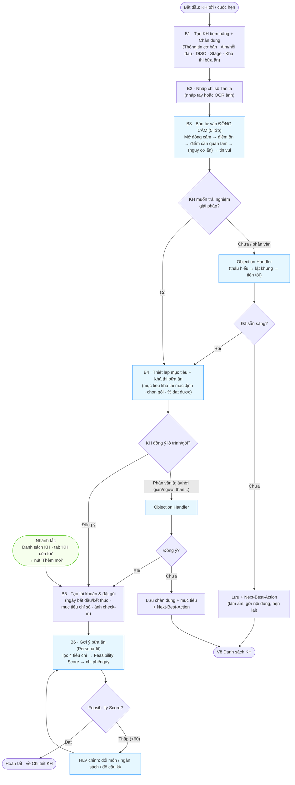

# Workflow HLV — Bản nâng cấp (DRAFT v1.1)

> **Trạng thái: DRAFT để thảo luận.** Bản này **không thay thế** `Workflow-HLV.md` (v1.0) mà mô tả **luồng tư vấn 15 phút sau khi áp dụng** 4 đề xuất nâng cấp. Chủ đích là *nhìn tổng thể* — mô tả luồng, mục tiêu mỗi bước, việc nên làm/cần tránh của HLV kèm lý do — chưa đi sâu chi tiết màn hình. Chi tiết nằm ở các tài liệu nguồn.
>
> **Bốn nâng cấp được hợp nhất trong bản này:**
> 1. **Empathy-Consultation** (`Empathy-Consultation_v1.0.md`) — bản tư vấn 5 lớp đồng cảm.
> 2. **Objection-Handler** (`Objection-Handler_v1.0.md`) — trợ lý xử lý băn khoăn/từ chối.
> 3. **Persona-fit & Feasibility** (`Calorie-Meal-Business-Rules-v1.1.md`) — 4 tiêu chí khả thi bữa ăn + điểm khả thi.
> 4. **Conversational-Explainable-UX** (`Conversational-Explainable-UX_v1.0.md`) — lớp "Vì sao?" + diễn đạt sống động.
>
> **Khung nền:** công thức tư vấn 15 phút **1-7-2-3-2** (nguồn 2 video thực hành), nguyên tắc README *"AI hỗ trợ không thao túng; con người ở vòng quyết định"*.

---

## 1. Activity Diagram — luồng tư vấn 15 phút (v1.1)

> Ô **nền xanh** là phần mới/được nâng cấp so với v1.0. Ô **nền xanh lá nhạt** là nhánh tắt (shortcut). Lớp **"Vì sao?"** (Conversational-Explainable-UX) không vẽ thành bước riêng vì nó **bám vào mọi ô có kết quả** (bản tư vấn, % đạt được, gói, Feasibility) — HLV/KH bấm để xem lập luận.

### Nhánh tắt: Tạo KH trực tiếp từ tab "KH của tôi"

Trên thực tế, HLV thường gặp trường hợp KH **đã sẵn sàng đăng ký ngay** mà không cần qua giai đoạn lead nurturing (ví dụ: khách được giới thiệu, khách cũ quay lại, quen biết sẵn). Trong trường hợp này, HLV có thể bấm nút **"Thêm mới"** tại tab "KH của tôi" để đi thẳng vào B5 (Tạo tài khoản), bỏ qua B1–B4.

- **Khi dùng:** KH đã quyết định, không cần tư vấn thêm; HLV đã trao đổi offline.
- **Không thu thập:** chân dung (DISC/Stage/Aim), chỉ số Tanita, bản tư vấn đồng cảm ở bước tạo — những bước này có thể bổ sung sau từ màn **Chi tiết KH** (đo Tanita, tạo gợi ý bữa ăn, cập nhật chân dung).
- **Cần tránh:** dùng nhánh tắt khi KH thực sự cần được tư vấn — bỏ qua B1–B3 đồng nghĩa bỏ lớp đồng cảm và dữ liệu cá nhân hóa.

---

## 2. Mục tiêu · Nên làm · Cần tránh theo từng bước

### B1 — Tạo KH tiềm năng & Chân dung

- **Mục tiêu:** tạo lead nhanh, thu đủ "nguyên liệu cảm xúc" (nỗi đau, mục tiêu) + tín hiệu DISC/Stage + 4 tiêu chí khả thi bữa ăn — làm đầu vào cá nhân hóa cho mọi bước sau.
- **Nên làm:** hỏi sớm Nhóm "Mục tiêu & nỗi đau" (Aim); chỉ bắt buộc Họ tên, phần còn lại bổ sung dần; đan tín hiệu DISC vào hội thoại tự nhiên.
- **Cần tránh:** biến thành phiên "điền form" dài dòng; hỏi như "làm test tính cách"; ép khai khi khách chưa thoải mái.
- **Lý do / tham chiếu:** dữ liệu Aim/`pain_points` là nguyên liệu cho **Empathy-Consultation Lớp 0–2**; ngân sách/chế độ ăn/quyền chủ động là đầu vào **Persona-fit (B6)**. Thiếu bước này, các bước sau mất "chất hiểu khách".

### B2 — Nhập chỉ số Tanita

- **Mục tiêu:** có dữ liệu cơ thể chính xác để sinh bản tư vấn; giảm tối đa công nhập liệu.
- **Nên làm:** ưu tiên OCR ảnh phiếu cân; tận dụng chiều cao đã có từ hồ sơ; đối chiếu nhanh giá trị AI nhận diện.
- **Cần tránh:** bắt nhập tay toàn bộ khi có thể chụp; để khách đứng cân trước mặt nhiều người (gây ngại — học từ video: không vây quanh khách).
- **Lý do:** trải nghiệm nhập liệu nhẹ nhàng giữ nhịp 15 phút; tôn trọng cảm giác riêng tư của khách có nỗi đau cơ thể.

### B3 — Bản tư vấn ĐỒNG CẢM (thay cho bản "chỉ số + nguy cơ")

- **Mục tiêu:** giúp khách *hiểu hiện trạng & thấy nhu cầu cải thiện* mà không bị dọa/phán xét; xây niềm tin.
- **Nên làm:** mở bằng câu phản chiếu nỗi đau khách tự kể → nêu điểm cơ thể đang ổn → nói điểm cần quan tâm bằng ngôn ngữ đồng hành, **nối với triệu chứng khách đã khai** → kết bằng "việc này làm được"; để **nguy cơ ẩn sau 1 lớp bấm**; đổi tông theo DISC.
- **Cần tránh:** mở đầu bằng danh sách "điểm xấu" + liệt kê bệnh; dùng từ phán xét ("béo phì", "xấu", "thừa"); phơi nguy cơ để tạo sợ hãi; chẩn đoán y tế.
- **Lý do / tham chiếu:** **Empathy-Consultation_v1.0** — khách có nỗi đau/đa nghi dễ phòng thủ nếu bị "tạo sợ"; đồng cảm trước giúp mở lòng. Dùng lớp **"Vì sao?"** để giải thích từng chỉ số khi khách (nhất là nhóm C) muốn bằng chứng.

### Điểm quyết định Q1 + Objection Handler (lần 1)

- **Mục tiêu:** xử lý băn khoăn *trước khi* sang thiết lập mục tiêu, không ép.
- **Nên làm:** khi khách phân vân, bấm **Objection Handler** → dùng mạch *Thấu hiểu → Lật khung → Tiến tới*; nếu Stage thấp, dừng lại làm ấm (Next-Best-Action), không cố chốt.
- **Cần tránh:** lờ đi băn khoăn để "đẩy" tiếp; dùng kịch bản gây áp lực; chốt non với khách "chưa nghĩ tới".
- **Lý do / tham chiếu:** **Objection-Handler_v1.0** (mạch 3 lớp, cá nhân hóa DISC); **Empathy-Consultation §6** (ẩn nhánh chốt khi Stage thấp).

### B4 — Thiết lập mục tiêu & Khả thi bữa ăn

- **Mục tiêu:** chốt mục tiêu *khả thi & an toàn* + gói phù hợp, để khách thấy "làm được" chứ không áp lực.
- **Nên làm:** mặc định đặt mục tiêu ở **mức khả thi 100%** rồi mới cho nâng; giải thích % đạt được qua lớp "Vì sao?"; thu 4 tiêu chí khả thi bữa ăn nếu chưa có ở B1.
- **Cần tránh:** đặt mục tiêu thách thức tối đa gây nản (nhất là người từng thất bại); chốt gói dựa cảm tính thay vì Business Logic; báo giá khi chưa neo giá trị.
- **Lý do / tham chiếu:** business-rules (tốc độ an toàn); **Conversational-Explainable-UX** (lớp "Vì sao?" cho % và gói); chuẩn bị đầu vào **Persona-fit**.

### Điểm quyết định Q2 + Objection Handler (lần 2)

- **Mục tiêu:** xử lý từ chối ở điểm chốt gói (giá, ngân sách, "hỏi người thân", "để nghĩ").
- **Nên làm:** dùng Objection Handler đúng nhánh; với "hỏi người thân" → xuất bản tư vấn chia sẻ được; tôn trọng quyết định "để sau".
- **Cần tránh:** thu tiền tạo áp lực, khan hiếm giả, hạ thấp khách khi từ chối.
- **Lý do / tham chiếu:** **Objection-Handler_v1.0** §4; README *"trao quyền không thâu tóm"*.

### B5 — Tạo tài khoản & đặt gói

- **Mục tiêu:** khởi tạo hành trình KH chính thức gọn gàng, đúng thời điểm cam kết.
- **Nên làm:** tự điền tối đa (gói, ngày bắt đầu/kết thúc); chụp ảnh check-in làm mốc động lực.
- **Cần tránh:** nhập trùng lặp thông tin đã có; biến bước hành chính thành rào cản cảm xúc.
- **Lý do:** giữ nhịp & cảm giác "bắt đầu nhẹ nhàng".

### B6 — Gợi ý bữa ăn (Persona-fit) + Feasibility

- **Mục tiêu:** thực đơn **đạt mục tiêu sức khỏe** mà **khả thi với đời sống thật** & không gây áp lực; thể hiện hệ thống hiểu khách.
- **Nên làm:** để hệ thống lọc theo 4 tiêu chí (chế độ ăn, ngân sách, sở thích, quyền chủ động); xem **Feasibility Score** + chi phí/ngày trước khi giao; nếu khách *phụ thuộc* → xuất "hướng dẫn cho người nấu/đi chợ".
- **Cần tránh:** giao thực đơn vượt ngân sách / quá cầu kỳ so với quyền chủ động / có món khách ngán; bỏ qua cảnh báo điểm khả thi thấp.
- **Lý do / tham chiếu:** **Calorie-Meal v1.1** Process 2.0 + §IX Feasibility Score — thực đơn bất khả thi là nguyên nhân chính khiến khách bỏ cuộc & thấy áp lực.

---

## 3. Bảng so sánh: Hiện tại (v1.0) vs Tương lai (v1.1)

| Khía cạnh | Hiện tại (v1.0) | Tương lai (v1.1) | Nguồn nâng cấp |
|---|---|---|---|
| **Mở đầu bản tư vấn** | "Những điểm cần cải thiện" + "Nguy cơ bệnh lý" (bắt đầu bằng cái xấu/đáng sợ) | Câu mở **đồng cảm** phản chiếu nỗi đau khách, rồi mới phân tích | Empathy-Consultation |
| **Cách trình nguy cơ** | Phơi sẵn → dễ gây sợ | **Ẩn sau 1 lớp bấm**, khách chủ động mở, có rào "không chẩn đoán" | Empathy-Consultation |
| **Tông giọng** | Trung tính, cố định cho mọi người | Đổi theo **DISC + Stage** | Empathy + Conversational-UX |
| **Xử lý từ chối** | Tùy kinh nghiệm HLV, không có công cụ | **Objection Handler**: 6 nhánh, mạch 3 lớp, cá nhân hóa DISC | Objection-Handler |
| **Đặt mục tiêu** | Hiện % rồi để HLV/KH tự kéo | Mặc định **mức khả thi**, có lớp "Vì sao?" giải thích % | Conversational-UX |
| **Gợi ý bữa ăn** | Theo calo + số bữa + bệnh lý | Thêm **Persona-fit** (chay/mặn, ngân sách, sở thích, quyền chủ động) + **Feasibility Score** + chi phí/ngày | Calorie-Meal v1.1 |
| **Khách phụ thuộc (bố mẹ già...)** | Không phân biệt | Xuất **hướng dẫn cho người nấu/đi chợ** | Calorie-Meal v1.1 |
| **Giải thích kết quả ("vì sao")** | Hộp đen — chỉ hiện kết quả | Lớp **"Vì sao?"** truy về bằng chứng (provenance) | Conversational-UX |
| **HLV mới** | Tự xoay xở câu nói | Có **script/talking points** theo bước (1-7-2-3-2) | Empathy + Objection |
| **Chốt khi Stage thấp** | Dễ chốt non | **Ẩn nhánh chốt**, chuyển làm ấm + Next-Best-Action | Empathy §6 |
| **Vai trò AI** | — | **Hỗ trợ, không quyết định** (tách lớp quyết định/diễn đạt); HLV xác nhận | Conversational-UX |
| **Trải nghiệm tổng thể của khách painful** | Dễ thấy bị bán hàng / phán xét | Thấy **được hiểu, được đồng hành, không áp lực** | Cả 4 |

---

## 4. Ghi chú & việc cần quyết định tiếp

- Bản v1.1 này **gói 4 nâng cấp vào một luồng** để anh/chị nhìn tổng thể; mỗi nâng cấp đã có tài liệu đặc tả riêng (xem mục đầu).
- Khi chốt hướng, các open-item nền tảng cần làm trước: (a) **decision trace** cho lớp "Vì sao?"; (b) **bảng map triệu chứng ↔ chỉ số** cho Empathy Lớp 2; (c) **trường dữ liệu catalog món** (`est_cost`, `complexity`, `diet_tags`, `availability`) cho Persona-fit; (d) **catalog mẫu câu DISC** cho Objection Handler.
- Khi được duyệt, nội dung draft này sẽ **hợp nhất vào `Workflow-HLV.md`** (nâng bản chính lên v1.1) và cập nhật prototype tương ứng.

---

**Tài liệu liên quan:** `Workflow-HLV.md` (v1.0 hiện hành) · `Empathy-Consultation_v1.0.md` · `Objection-Handler_v1.0.md` · `Calorie-Meal-Business-Rules-v1.1.md` · `Conversational-Explainable-UX_v1.0.md`.
