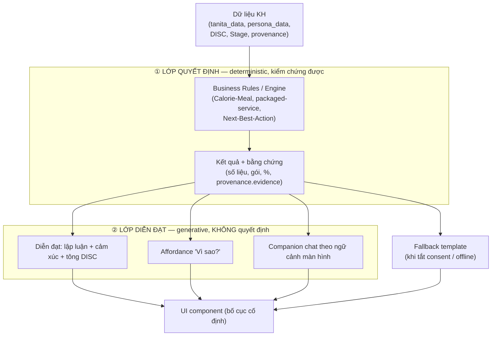

# Trải nghiệm Hội thoại & Giải thích được (Conversational & Explainable UX) — v1.0

> **Mục đích.** Trả lời một câu hỏi thiết kế nền tảng: *giao diện component cố định làm mất đi lập luận, khả năng thích ứng và cảm xúc mà một cuộc trò chuyện (chat) mang lại — làm sao đưa "chất hội thoại" trở lại app mà vẫn giữ được tính kiểm soát, an toàn và đúng chuẩn nghiệp vụ?*
>
> **Phạm vi.** Đây là **nguyên lý thiết kế xuyên suốt app** (cross-cutting), áp cho cả ứng dụng HLV và ứng dụng Khách hàng (KH). Không phải một màn hình đơn lẻ. Các tài liệu `Empathy-Consultation_v1.0.md` và `Objection-Handler_v1.0.md` là **hai hiện thực đầu tiên** của nguyên lý này.
>
> **Trạng thái.** Tài liệu brainstorm v1.0 — để anh/chị đọc & quyết định hướng đi, chưa chốt triển khai.

---

## 1. Vấn đề: hai mô hình giao diện, ba thứ bị mất

| | **Chat (hội thoại)** | **UI component cố định (hiện tại)** |
|---|---|---|
| Lập luận (*vì sao*) | Có — giải thích được từng kết luận | Mất — chỉ hiện kết quả |
| Thích ứng | Có — đổi cách nói theo phản ứng | Mất — cố định cho mọi người |
| Cảm xúc / ngữ điệu | Có — ấm, có "con người" | Mất — trung tính, khô |

Màn hình cố định trả về **kết quả** nhưng giấu mất **quá trình** và **con người** phía sau. Với một app chăm sóc sức khỏe — nơi niềm tin & cảm xúc quyết định việc khách có thay đổi hành vi hay không — đây là điểm yếu chiến lược.

### 1.1 Nguyên tắc phân ngữ cảnh (rất quan trọng)

App có **hai ngữ cảnh sử dụng khác nhau**, lời giải khác nhau:

- **Ngữ cảnh A — HLV ngồi cạnh khách (tư vấn 15 phút).** *Con người HLV* là người mang cảm xúc & lập luận, không phải app. App chỉ cần **trang bị "phần vì sao" dưới dạng talking points** để HLV nói ra. → Giải bằng lớp **Reasoning/Talking-points** (§4.1) + script (Empathy-Consultation, Objection-Handler).
- **Ngữ cảnh B — Khách tự dùng app (self-serve), không có HLV.** Đây là nơi vấn đề gay gắt nhất. → Cần đưa "chất chat" vào chính app: lớp **"Vì sao?"**, **generative copy**, **companion chat** (§4).

---

## 2. Nguyên lý cốt lõi: TÁCH 2 LỚP

> **Lớp Quyết định (deterministic)** và **Lớp Diễn đạt (generative)** phải tách rời.

**Vì sao tách lớp là chìa khóa:**

1. **An toàn:** LLM **không quyết định** kết quả y tế/nghiệp vụ — nó chỉ *kể lại* con số mà Business Rules đã tính (có thể kiểm chứng). Hết lo "AI bịa kết quả".
2. **Bố cục cố định + ngôn từ sống:** giữ layout component (kiểm soát được, dễ test) nhưng **chữ trong component sinh động theo từng người** → vừa an toàn vừa có cảm xúc.
3. **Có đường lui:** khi `ai_data_sharing_enabled = false` hoặc offline → rơi về template tĩnh, app vẫn chạy.
4. **Minh bạch:** mọi diễn đạt truy được về `provenance.evidence` → đúng nguyên tắc README *"AI hỗ trợ không thao túng; minh bạch & quyền người dùng"*.

---

## 3. Thang trưởng thành (maturity levels)

Triển khai tăng dần, mỗi mức đứng độc lập có giá trị:

| Mức | Tên | Mang lại | Chi phí |
|---|---|---|---|
| **L0** | UI tĩnh (hiện tại) | Kết quả | — |
| **L1** | **Lớp "Vì sao?"** trên mọi kết quả | *Lập luận* + minh bạch | Thấp (tận dụng provenance sẵn có) |
| **L2** | **Generative copy** trên khung cố định | *Cảm xúc* + tông DISC | Trung bình (LLM sinh copy) |
| **L3** | **Companion chat** neo theo màn hình | *Thích ứng* (hỏi–đáp tự do) | Cao (LLM + kiểm soát hội thoại) |
| **L4** | Conversational forms + Narration (giọng nói) | Thu thập kiểu trò chuyện, đọc dẫn dắt | Trung bình–cao |

> Khuyến nghị lộ trình: **L1 → L2 → L3**. L1 giải quyết ngay phần *lập luận* (đắt giá nhất, rẻ nhất), tận dụng `provenance` đã có trong mô hình persona.

---

## 4. Đặc tả từng cơ chế

### 4.1 Lớp "Vì sao?" (L1) — ưu tiên cao nhất

**Ý tưởng:** mỗi thành phần hiển thị một **kết quả/đề xuất** có affordance bấm được *"Vì sao? ›"* → bung ra lời giải thích có **dẫn chứng**.

**Áp dụng cho:**
- Gói đề xuất (§1.4) → "Vì sao gói này?"
- % khả thi từng mục tiêu (§1.4) → "Vì sao 80%?"
- Thực đơn / Feasibility Score (§1.6) → "Vì sao món này / điểm này?"
- DISC & Stage dự đoán (§1.1) → "Vì sao hệ thống nghĩ vậy?"
- Bản tư vấn từng chỉ số (§1.3) → đã có ở Empathy-Consultation Lớp 3.

**Cấu trúc nội dung giải thích (template 3 phần):**
1. **Căn cứ:** yếu tố đầu vào dùng để quyết định (mục tiêu, thời gian, DISC, ngân sách…).
2. **Quy tắc:** rule/logic áp dụng (vd "tốc độ an toàn 2kg/tháng × 3 tháng").
3. **Bằng chứng cá nhân:** trích `provenance.evidence` — các `qid` + nguyên văn câu trả lời của khách ("vì anh từng nói…").

> Ví dụ "Vì sao gói Tăng cường?": *"Vì mục tiêu giảm 6kg trong 90 ngày (anh chọn ở bước mục tiêu) + ngân sách Trung bình (Q11) + anh thiên về cần người đồng hành (Q9) → gói Tăng cường khớp nhất."*

**Dữ liệu cần:** đã có `provenance.evidence`, `survey_responses[]`, DISC/Stage trong `customer_personas` (xem `docs/technical/customer-persona-data-model_v1.0.md`). Engine quyết định cần **xuất kèm "trace"** (căn cứ + rule) để lớp này hiển thị.

### 4.2 Generative copy trên khung cố định (L2)

**Ý tưởng:** giữ nguyên layout component, nhưng **nội dung chữ** trong component do LLM sinh theo từng người thay vì template chết — ấm, có lý lẽ, đúng giọng DISC.

- `Empathy-Consultation_v1.0.md` chính là **bản hiện thực đầu tiên** của ý này cho màn Bản tư vấn. Tài liệu này đề xuất **hệ thống hóa** cho mọi màn có nội dung diễn giải.
- **Ràng buộc cứng:** generative copy chỉ được *diễn đạt lại* số liệu từ Lớp Quyết định; **cấm sinh con số/kết luận mới**. Mọi số trên màn đến từ Business Rules.
- **Kiểm soát chất lượng:** prompt có guardrail (không chẩn đoán y tế, không hứa hẹn sai, không gây áp lực); có bộ **template fallback** tương ứng từng component.

### 4.3 Companion chat neo theo màn hình (L3)

**Ý tưởng:** một ô chat thu nhỏ (dock) ở mỗi màn, **biết khách đang xem gì** (context = dữ liệu + kết quả màn hiện tại). Khách bấm gợi ý nhanh ("Vì sao gói này?", "Tôi ăn chay thì sao?") hoặc gõ tự do → AI trả lời tham chiếu thẳng dữ liệu trên màn.

- Mô hình **canvas + chat**: giao diện thao tác bên cạnh, hội thoại bổ trợ.
- **Phạm vi trả lời bị giới hạn (grounded):** chỉ trả lời dựa trên dữ liệu KH + Knowledge Base + kết quả engine; ngoài phạm vi → từ chối lịch sự / chuyển HLV.
- **Hành động từ chat:** có thể đề xuất thao tác ("đổi sang thực đơn chay?") nhưng **thực thi vẫn qua Lớp Quyết định** (chat không tự ý đổi kết quả).
- Với app HLV: companion đóng vai "trợ lý thì thầm" (gợi ý câu nói); với app KH: đóng vai "người đồng hành".

### 4.4 Conversational forms & Narration (L4)

- **Conversational forms:** ở chỗ form dài gây "vô cảm" (vd Card Chân dung §1.1), thay bằng vài lượt hỏi–đáp kiểu chat thân thiện rồi đổ vào field. Cảm giác "được hỏi han" thay vì "điền đơn".
- **Narration:** "HLV ảo" đọc/dẫn dắt bản tư vấn (text-to-speech), biến card tĩnh thành câu chuyện có nhịp — hợp khách lớn tuổi/ngại đọc.

---

## 5. Map dữ liệu & phụ thuộc

| Cơ chế | Nguồn dữ liệu | Phụ thuộc cần bổ sung |
|---|---|---|
| Lớp "Vì sao?" | `provenance.evidence`, `survey_responses[]`, DISC/Stage, kết quả engine | Engine phải **xuất "decision trace"** (căn cứ + rule) |
| Generative copy | Kết quả engine + persona + DISC | Bộ prompt + **template fallback** mỗi component |
| Companion chat | Dữ liệu màn hiện tại + Knowledge Base (RAG) | Hạ tầng RAG + kiểm soát phạm vi |
| Conversational forms | Ghi vào `persona_data` như form thường | Bộ câu hỏi hội thoại hóa |

> Tất cả lớp generative chỉ bật khi `ai_data_sharing_enabled = true`. Khi tắt → L0/template.

---

## 6. Ràng buộc đạo đức & tuân thủ

1. **Tách lớp là bắt buộc:** LLM không bao giờ quyết định kết quả y tế/nghiệp vụ; chỉ diễn đạt số liệu của Business Rules.
2. **Không chẩn đoán y tế:** mọi diễn giải sức khỏe kèm rào "tham khảo dinh dưỡng, không phải chẩn đoán".
3. **Minh bạch nguồn:** "Vì sao?" luôn trích được bằng chứng (`provenance`); không "hộp đen".
4. **Consent & quyền người dùng:** generative chỉ chạy khi bật consent; luôn có fallback template.
5. **Không thao túng:** guardrail cấm tạo cấp bách giả, hứa hẹn sai, áp lực cảm xúc.
6. **Con người ở vòng quyết định:** với app HLV, mọi gợi ý là để HLV xác nhận/sửa, không tự gửi cho khách.

---

## 7. Lộ trình đề xuất (để cân nhắc)

- **Bước 1 (L1):** thêm affordance "Vì sao?" cho 3 kết quả nóng nhất: gói đề xuất, % khả thi, Feasibility Score. Yêu cầu engine xuất decision trace. *Chi phí thấp, giá trị tức thì.*
- **Bước 2 (L2):** hệ thống hóa generative copy (mở rộng Empathy-Consultation ra các màn khác) + bộ fallback.
- **Bước 3 (L3):** companion chat grounded, bắt đầu ở app KH màn Bản tư vấn / Gợi ý bữa ăn.
- **Sau đó (L4):** conversational forms cho Card Chân dung; narration cho nhóm khách lớn tuổi.

---

## 8. Liên kết tài liệu

- Hiện thực của nguyên lý: `docs/to-be/Empathy-Consultation_v1.0.md` (generative copy cho Bản tư vấn), `docs/to-be/Objection-Handler_v1.0.md` (diễn đạt theo DISC).
- Dữ liệu & provenance: `docs/technical/customer-persona-data-model_v1.0.md`.
- Engine quyết định: `docs/business-rules/Calorie-Meal-Business-Rules-v1.1.md`, `docs/business-rules/packaged-service-advice-v1.0.md`; Next-Best-Action (To-do TD-AC5/TD-AC2).
- Áp dụng trong luồng: `docs/to-be/Workflow-HLV.md` §1.1, §1.3, §1.4, §1.6.
