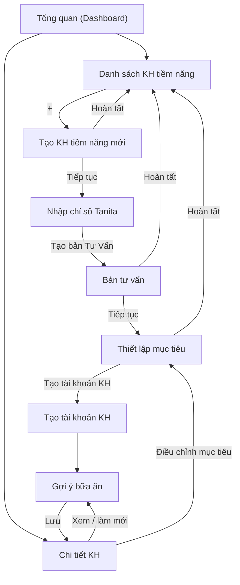

# Đặc tả UI-UX — Các màn hình phía HLV (ANCARE / SmartLife)

**Phiên bản:** v1.0 (draft) · **Cập nhật:** 2026-06-18
**Mục đích:** Tập hợp đầy đủ thiết kế UI-UX đã thống nhất cho **luồng HLV** (tạo KH tiềm năng → tư vấn → chuyển đổi → chăm sóc), bổ trợ cho phần nghiệp vụ ở `docs/to-be/Workflow-HLV.md`.
**Liên quan:**
- Nghiệp vụ & sơ đồ: `docs/to-be/Workflow-HLV.md`.
- Dữ liệu chân dung: `docs/technical/customer-persona-data-model_v1.0.md`.
- Quy tắc gói: `docs/business-rules/packaged-service-advice-v1.0.md`.
- Quy tắc Calo/bữa ăn (3 nhóm): `docs/business-rules/Calorie-Meal-Business-Rules-v1.1.md`.
- UI-UX phía KH: `docs/to-be/UI-UX-Lo-trinh-Dong-ho-sinh-hoc_v1.0.md`.

---

## 0. Quy ước & hệ thiết kế

- **Quy ước file prototype:** màn HLV đặt trong `prototypes/hlv/` với prefix `hlv_`; màn KH trong `prototypes/kh/`. Tài nguyên chung: `prototypes/tabler-icons.min.css`.
- **Bảng màu:** nền `#fff` / `#f6f7f9`; chữ `#1a1d21` / `#6b7280`; **accent (HLV)** `#2f6f4f` (xanh đậm), accent-soft `#e7f1ec`. Bo góc `10–14px`. Icon: **Tabler Icons**.
- **Khung hiển thị:** mobile-first, `max-width 460px`; tablet dùng lại cùng bố cục card.
- **Thanh điều hướng dưới (HLV):** Tổng quan · KH tiềm năng · Chat · Hồ sơ.
- **Nguyên tắc chung:** progressive disclosure (card/nhóm gập mở), nút hành động cố định ở chân màn, trạng thái disable có dòng nhắc lý do, mọi xử lý AI tuân thủ `ai_data_sharing_enabled`.

### Danh sách màn hình & file

| # | Màn hình | Prototype |
|---|---|---|
| 0 | Tổng quan (Dashboard) | `hlv/hlv_tong_quan.html` |
| 1.0 | Danh sách KH tiềm năng | `hlv/hlv_danh_sach_kh_tiem_nang.html` |
| 1.1 | Tạo KH tiềm năng mới | `hlv/hlv_tao_kh_tiem_nang.html` |
| 1.2 | Nhập chỉ số Tanita | `hlv/hlv_nhap_chi_so_tanita.html` |
| 1.3 | Bản tư vấn | `hlv/hlv_ban_tu_van.html` |
| 1.4 | Thiết lập mục tiêu | `hlv/hlv_thiet_lap_muc_tieu.html` |
| 1.5 | Tạo tài khoản KH | `hlv/hlv_tao_tai_khoan_kh.html` |
| 1.6 | Gợi ý bữa ăn (đa phiên bản) | `hlv/hlv_goi_y_bua_an.html` |
| 2 | Chi tiết KH | `hlv/hlv_chi_tiet_kh.html` |

---

## 1. Bản đồ điều hướng

---

## 2. Đặc tả từng màn hình

### 0. Tổng quan (Dashboard) — điểm vào ứng dụng HLV
- **Header:** avatar + lời chào + chuông thông báo.
- **KPI (4 ô):** KH đang chăm sóc · Lead tiềm năng · "Hôm nay nên tiếp cận" · **Gợi ý bữa ăn cần làm mới**.
- **Cảnh báo nổi bật:** KH có gợi ý bữa ăn hết hiệu lực 10 ngày → mở Chi tiết KH.
- **Truy cập nhanh:** KH tiềm năng · KH của tôi · Chat.
- **Danh sách KH cần chú ý:** thẻ KH (gói, ngày X/Y, trạng thái: cần làm mới TĐ / đúng lộ trình / cần nhắc) → Chi tiết KH.

### 1.0. Danh sách KH tiềm năng — điểm vào luồng tạo lead
- Thanh tìm kiếm + bộ lọc (Tất cả / Nóng / Ấm / Lạnh / Cần theo dõi).
- Nhóm "Hôm nay nên tiếp cận" + "Tất cả lead".
- **Thẻ lead:** avatar, tên, **thẻ DISC**, giai đoạn (Stage), nguồn (nóng/ấm/lạnh), **lead score**, "việc cần làm tiếp".
- **FAB "+"** → Tạo KH tiềm năng mới.

### 1.1. Tạo KH tiềm năng mới — 2 Card
- **Card "Thông tin cơ bản"** (→ `users`): Họ tên (bắt buộc), SĐT, Ngày sinh, Giới tính, **Chiều cao**, Email, Mã giới thiệu, **toggle consent AI**.
- **Card "Chân dung khách hàng"** (→ `customer_personas`): nhóm câu hỏi gập/mở — Nguồn & kênh, Mục tiêu & nỗi đau (Aim), Bối cảnh & lối sống, Yếu tố quyết định & rào cản, **Tín hiệu DISC** (đan vào, tùy chọn), Giai đoạn sẵn sàng (Stage). Mỗi câu trả lời → `persona_data.survey_responses[]`.
- **UX:** accordion theo Card (mặc định mở "Thông tin cơ bản"); Card chân dung gập sẵn + dấu ✓ khi đã có dữ liệu; khu vực **gợi ý AI** (DISC/Stage/cách tiếp cận + bằng chứng `qid`) hiện khi bật consent.
- **Hành động:** `Hoàn tất` → Danh sách · `Tiếp tục` → Nhập chỉ số Tanita.

### 1.2. Nhập chỉ số Tanita
- Nhập tay **hoặc** Chụp/Chọn ảnh → OCR/Vision tự điền (ô tự điền **tô xanh + nhãn "AI"**, sửa được).
- **Chiều cao** lấy read-only từ hồ sơ; **BMI tự tính** + phân loại.
- Nhóm: Cơ bản (Cân nặng, Chiều cao, BMI) · Thành phần cơ thể (mỡ, cơ, nước, xương, mỡ nội tạng) · Chỉ số khác (vóc dáng, tuổi sinh học, năng lượng nghỉ). Đơn vị dạng hậu tố; bàn phím số; tooltip ⓘ cho chỉ số mơ hồ.
- **CTA "Tạo bản Tư Vấn"** chỉ bật khi nhập đủ tất cả chỉ số.

### 1.3. Bản tư vấn
- **Đầu trang:** tên/mã KH, giới tính · tuổi · chiều cao, SĐT.
- **Card 1 "Những điểm cần cải thiện":** chỉ số chưa tốt (chấm màu); bấm mỗi mục mở chi tiết **Phân tích hiện trạng** + **Nguy cơ bệnh lý**.
- **Card 2 "Bảng phân tích chỉ số chi tiết":** mỗi dòng = chuẩn WHO/Tanita + giá trị (tô màu) + phân tích; **mặc định 2 dòng**, còn lại sau "Xem thêm"; ghi chú nguồn cuối bảng.
- **Hành động — 2 nút:** `Tiếp tục` (KH muốn trải nghiệm) → Thiết lập mục tiêu · `Hoàn tất` (chưa quyết) → lưu + Next-Best-Action (memory-note) → Danh sách.

### 1.4. Thiết lập mục tiêu
- **A. Thu thập:** Card "Mục tiêu cần cải thiện" (mỗi mục tiêu có **"Bao giờ muốn có kết quả?"** + đánh dấu ưu tiên), "Thói quen hiện tại", "Vấn đề/bệnh lý".
- **B. Lộ trình trải nghiệm (sau "Tính lộ trình"):**
  - **Gói = Tên gói (sản phẩm)** + **Thời gian (1/2/3 tháng, mặc định 3 tháng)** — chọn gói/đổi thời gian → **tính lại % cho mọi mục tiêu**; hiển thị **số ngày lộ trình** theo mục tiêu.
  - **Mục tiêu & % đạt được** từng mục tiêu; **đòn bẩy phụ:** tinh chỉnh mục tiêu (− / +) / "đặt về khả thi" (100%).
  - **Lợi ích chương trình** (db/tĩnh). Chỉ hiện **tên gói**, không hiện giá.
  - Mục tiêu cân nặng được đánh dấu là **đầu vào gợi ý bữa ăn**.
- **Hành động — 2 nút:** `Tạo tài khoản KH` (KH đồng ý) → màn 1.5 · `Hoàn tất` (chưa quyết) → lưu + Next-Best-Action.

### 1.5. Tạo tài khoản KH
- **Tài khoản:** Họ tên, SĐT, **Email, Mật khẩu**, Mã giới thiệu.
- **Gói dịch vụ:** tên gói + thời gian; **ngày bắt đầu** (auto theo hôm nay, chỉnh 1 lần); **ngày kết thúc** (auto theo số tháng).
- **Lưu mục tiêu chỉ số.**
- **Ảnh check-in:** chân dung · toàn thân · vòng eo.
- **Hành động:** "Tạo tài khoản & tạo gợi ý bữa ăn" → màn 1.6.

### 1.6. Gợi ý bữa ăn (đa phiên bản)
- **Thanh phiên bản:** số hiệu (#3) + trạng thái *Đang hiệu lực/Hết hiệu lực* + khoảng ngày (hiệu lực **10 ngày**) + **bộ chọn phiên bản** (xem bản cũ).
- **Tổng kết:** Calo/ngày, đạm/nước mục tiêu, số bữa, mục tiêu cân nặng.
- **Mỗi bữa chia 3 nhóm thực phẩm** (xem `Calorie-Meal §2.1b`):
  - **Đạm** — calo + **đạm (g) mục tiêu** · món từ catalog protein.
  - **Xơ** — calo · món từ catalog rau xanh/vitamin.
  - **Đường/bột** — calo · món từ catalog tinh bột/đường.
- **Lưu ý chế độ:** hạn chế thịt đỏ/chiên-xào; nước ≥ 0,4 L/10 kg/ngày; chương trình 10 ngày → đo lại → điều chỉnh.
- **Hành động:** "Lưu & về Chi tiết KH".

### 2. Chi tiết KH (hoàn thiện vòng lặp)
- **Hồ sơ:** tên, giới/tuổi, gói (ngày X/Y), nút Chat.
- **Hành động nhanh:** Tiến độ · **Điều chỉnh mục tiêu** · Chat.
- **Gợi ý bữa ăn:** phiên bản hiện tại + trạng thái + **lịch sử phiên bản**; nút **"Đánh giá lại & tạo phiên bản mới"** (→ Thiết lập mục tiêu) và "Xem phiên bản hiện tại".
- **Tanita mới nhất**, **Mục tiêu chỉ số**, **Ảnh check-in**.

---

## 3. Quản lý "Gợi ý bữa ăn" đa phiên bản

Mỗi gợi ý hiệu lực **10 ngày** → hết hạn thì đánh giá lại Tanita → điều chỉnh mục tiêu → tạo **phiên bản mới**; lưu **lịch sử**. Dashboard đếm số KH cần làm mới. Cấu trúc dữ liệu đề xuất: xem `Workflow-HLV.md §3` (meal_plan → versions[] → meals[] → groups[] {protein/fiber_vitamin/carb}).

---

## 4. Cross-cutting

- **HLV làm gương & chia sẻ:** HLV thực hiện chính lộ trình (dùng màn KH), **chia sẻ ảnh/kết quả qua Chat** tới KH/cộng đồng (nút "chia sẻ" trên hoạt động đã hoàn thành). Xem `Workflow-KH.md §E`.
- **Consent AI:** mọi gợi ý AI (DISC/Stage, OCR Tanita, bóc tách bữa ăn) chỉ chạy khi `ai_data_sharing_enabled = true`.
- **Tách nghiệp vụ vs trình bày:** logic chọn gói/tính % theo business-rules; DISC chỉ điều chỉnh tông giọng tư vấn.
- **Còn để ngỏ:** màn "Hồ sơ HLV", "Chat" (HLV) chưa dựng prototype mới (bộ cũ ở `prototypes/hlv-old/`, đã bỏ qua).

---
*Draft v1.0 — tổng hợp từ Workflow-HLV.md & các prototype trong `prototypes/hlv/`.*
