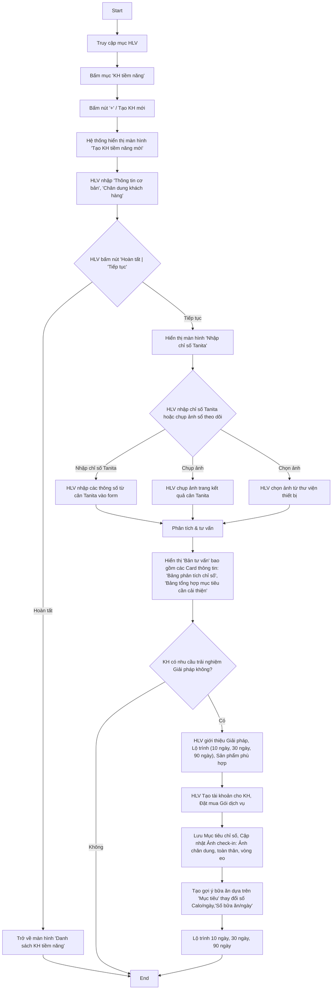

# Các workflow chính 

## A. Workflow dành cho HLV

### 1. Tạo KH tiềm năng và Chuyển đổi thành KH chính thức

**Mục tiêu:** Rút gọn và chuẩn hóa luồng tạo KH tiềm năng và Tư vấn, chuyển đổi thành KH chính thức.

#### 1.1. Màn hình "Tạo KH tiềm năng mới"

Màn hình này sử dụng cho việc Tạo, Sửa thông tin KH tiềm năng. Để phù hợp cho việc hiển thị trên màn hình điện thoại cũng như màn hình máy tính bảng, màn hình này được chia thành các Card thông tin như sau:
- Card **Thông tin cơ bản** → ghi vào bảng `users`.
- Card **Chân dung khách hàng** → ghi vào bảng `customer_personas` (xem `docs/technical/customer-persona-data-model_v1.0.md`).

> **Nguyên tắc UX:** Chỉ **Họ tên** bắt buộc; mọi trường còn lại tùy chọn để HLV tạo nhanh trong lúc làm ấm và *bổ sung dần*. Mỗi câu hỏi ở Card Chân dung khách hàng khi được trả lời sẽ sinh 1 phần tử trong `persona_data.survey_responses[]` (kèm `qid` + nguyên văn câu hỏi), đồng thời cập nhật trường suy luận tương ứng. Prototype: `prototypes/kh_tiem_nang_form.html`.

> **Tối ưu hiển thị (progressive disclosure):** Vì cả 2 Card đều dài, áp dụng cơ chế **accordion theo Card**:
> - Mặc định **chỉ mở Card "Thông tin cơ bản"**; Card "Chân dung khách hàng" **gập sẵn** (chỉ hiện tiêu đề + chú thích "Tùy chọn · bổ sung dần").
> - Mở một Card sẽ tự gập Card kia để giữ tập trung trên màn hình điện thoại.
> - Bên trong Card Chân dung khách hàng, mỗi **nhóm câu hỏi** cũng gập/mở riêng; mặc định mở 2 nhóm ưu tiên (Nguồn, Mục tiêu & nỗi đau — Aim).
> - Card Chân dung khách hàng hiển thị **dấu ✓** khi đã có ít nhất 1 thông tin, giúp HLV biết đã bắt đầu điền mà không cần mở ra.
> - HLV luôn có thể bấm **Hoàn tất** ngay sau khi nhập Họ tên (tạo lead tối thiểu), rồi quay lại bổ sung chân dung sau.

##### a) Card "Thông tin cơ bản" (→ `users`)

| Trường | Bắt buộc | Kiểu nhập | Map `users` |
|---|---|---|---|
| Họ tên | ✅ | text | `full_name` |
| Số điện thoại | — | tel | `phone` |
| Ngày sinh | — | date | `dob` |
| Giới tính | — | chọn (Nam/Nữ/Khác) | `gender` |
| Email | — | email | `email` |
| Mã giới thiệu (nếu có) | — | text | `referral_code` |
| Đồng ý chia sẻ dữ liệu cho AI | — | toggle | `ai_data_sharing_enabled` |

> Khi lưu, hệ thống tạo `users` với `is_prospect=true` và bản ghi `customer_personas` 1:1. Toggle consent điều khiển việc có đưa dữ liệu cho LLM phân tích hay không (Apple 5.1.1(i)).

##### b) Card "Chân dung khách hàng" (→ `customer_personas`)

Bố cục theo nhóm câu hỏi (gập/mở để gọn trên điện thoại). `qid` khớp Bộ câu hỏi Phần V của khung persona. Cột **Map** ghi đích trong `persona_data` / cột nóng.

**Nhóm 0 — Nguồn & phân công**

| Trường | Kiểu nhập | Map |
|---|---|---|
| Nguồn lead | chọn: Nóng / Ấm / Lạnh | cột `source` |
| Kênh tiếp cận | chip nhiều lựa chọn: Zalo, Facebook, TikTok, Gặp trực tiếp, Giới thiệu | `persona_data.behavior.channels[]` |
| HLV phụ trách | chọn (mặc định HLV hiện tại) | cột `assigned_coach_id` |

**Nhóm 1 — Mục tiêu & nỗi đau (Aim)** *(quan trọng nhất, nên hỏi sớm)*

| qid | Câu hỏi | Kiểu nhập | Map |
|---|---|---|---|
| Q-goal | Mục tiêu sức khỏe trội | chọn: Giảm cân / Tăng cơ / Kiểm soát đường huyết / Tăng năng lượng / Tiêu hóa / Làm đẹp da | cột `primary_goal` |
| Q1 | Điều gì khiến anh/chị bắt đầu quan tâm lúc này? | text ngắn | `survey_responses[]` + `aim.trigger_event` |
| Q3 | Vấn đề sức khỏe nào làm phiền nhất? | chip + text | `aim.pain_points[]` |
| Q2 | 3 tháng tới mọi thứ tốt thì anh/chị hình dung mình thế nào? | text | `aim.success_definition` |
| Q4 | Đã từng thử cách nào trước đây? Kết quả? | text | `survey_responses[]` |

**Nhóm 2 — Bối cảnh & lối sống (People/Resource)**

| qid | Câu hỏi | Kiểu nhập | Map |
|---|---|---|---|
| Q-demo | Độ tuổi / Nghề nghiệp / Khu vực | chọn + text | `persona_data.demographics` |
| Q7 | Ràng buộc thời gian/công việc/gia đình | text | `demographics.family_status` |
| Q6 | Một ngày thường diễn ra thế nào? | text | `behavior.lifestyle` |

**Nhóm 3 — Yếu tố quyết định & rào cản (Resource/Objection)**

| qid | Câu hỏi | Kiểu nhập | Map |
|---|---|---|---|
| Q9 | Điều gì quan trọng nhất khi quyết định? | chọn nhiều: Kết quả nhanh / Bằng chứng khoa học / Chi phí / Có người đồng hành | `behavior.decision_factors[]` (+ tín hiệu DISC) |
| Q10 | Điều gì còn khiến anh/chị băn khoăn? | chip + text | `behavior.objections[]` |
| Q11 | Ngân sách hợp lý cho sức khỏe | chọn dải (tùy chọn, hỏi sau) | `behavior.budget_sensitivity` |
| Q12 | Tự quyết hay cần trao đổi với ai? | chọn: Tự quyết / Hỏi vợ-chồng / Hỏi con / Khác | `survey_responses[]` |

**Nhóm 4 — Tín hiệu DISC** *(đan vào hội thoại, ngắn, tùy chọn — KHÔNG gọi là "test")*

| qid | Câu hỏi | Kiểu nhập | Tín hiệu |
|---|---|---|---|
| Q13 | Thích trình bày ngắn gọn hay chi tiết đầy đủ? | chọn | ngắn=D · chi tiết=C |
| Q14 | Hứng thú với câu chuyện người thật hay số liệu khoa học? | chọn | chuyện=I · số liệu=C |
| Q15 | Thích bắt đầu ngay hay chuẩn bị kỹ rồi mới làm? | chọn | ngay=D/I · kỹ=S/C |
| Q16 | Thay đổi: làm nhanh hay cần thời gian làm quen? | chọn | nhanh=D · cần thời gian=S |
| — | DISC gợi ý (hệ thống suy luận, HLV xác nhận/sửa) | chọn D/I/S/C + phụ | cột `disc_primary`/`disc_secondary`, provenance |

**Nhóm 5 — Giai đoạn sẵn sàng (Stage)**

| qid | Câu hỏi | Kiểu nhập | Map |
|---|---|---|---|
| Q17 | Đang ở giai đoạn nào? | chọn: Chưa nghĩ tới / Đang cân nhắc / Muốn bắt đầu sớm / Đã đang làm | cột `stage` |
| Q5 | Thang 0–10 sẵn sàng thay đổi — vì sao không thấp hơn? | slider 0–10 + text | `stage_of_change.readiness_score` + `motivation_quotes[]` |
| Q18 | Nếu có lộ trình phù hợp, muốn bắt đầu khi nào? | chọn: Ngay / Tuần này / Trong tháng / Chưa rõ | `survey_responses[]` |

**Khu vực gợi ý của AI (chỉ hiển thị khi đã bật consent):**
Sau khi nhập, nếu `ai_data_sharing_enabled=true`, hệ thống có thể hiển thị thẻ gợi ý "DISC dự đoán / Giai đoạn / Cách tiếp cận đề xuất" kèm các `qid` làm bằng chứng (`provenance.evidence`); HLV xác nhận hoặc chỉnh trước khi lưu.

**Hành động cuối màn hình:** `Hoàn tất` (lưu, về Danh sách) · `Tiếp tục` (lưu, sang màn "Nhập chỉ số Tanita"). Nếu HLV bấm `Hoàn tất`, hệ thống sẽ quay về màn Danh sách. Nếu HLV bấm `Tiếp tục`, hệ thống sẽ lưu thông tin KH tiềm năng và chuyển sang màn "Nhập chỉ số Tanita".

#### 1.2. Màn hình "Nhập chỉ số Tanita"

Màn hình này sử dụng cho việc Nhập thủ công, Nhập tự động (qua việc chụp ảnh form thông tin trên Sổ theo dõi tại Nhóm dinh dưỡng, hoặc upload file ảnh chụp từ thư viện hình ảnh trên thiết bị). 

## B. Workflow dành cho Khách hàng

**Mục tiêu**: Tối ưu hóa trải nghiệm khách hàng trong quá trình sử dụng app, từ sử dụng tính năng, đến tương tác với HLV và cộng đồng.

### 1. Check-in hàng ngày

