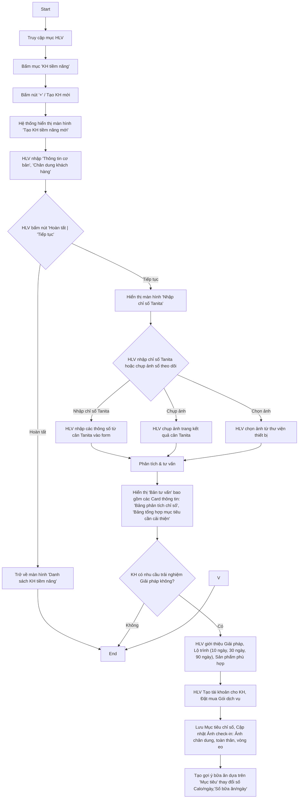

# Các workflow chính 

## A. Workflow dành cho HLV

### 1. Tạo KH tiềm năng và Chuyển đổi thành KH chính thức

**Mục tiêu:** Rút gọn và chuẩn hóa luồng tạo KH tiềm năng và Tư vấn, chuyển đổi thành KH chính thức.

#### 1.1. Màn hình "Tạo KH tiềm năng mới"

Màn hình này sử dụng cho việc Tạo, Sửa thông tin KH tiềm năng. Để phù hợp cho việc hiển thị trên màn hình điện thoại cũng như màn hình máy tính bảng, màn hình này được chia thành các Card thông tin như sau:
- Card **Thông tin cơ bản** → ghi vào bảng `users`.
- Card **Chân dung khách hàng** → ghi vào bảng `customer_personas` (xem `docs/technical/customer-persona-data-model_v1.0.md`).

> **Nguyên tắc UX:** Chỉ **Họ tên** bắt buộc; mọi trường còn lại tùy chọn để HLV tạo nhanh trong lúc làm ấm và *bổ sung dần*. Mỗi câu hỏi ở Card Chân dung khách hàng khi được trả lời sẽ sinh 1 phần tử trong `persona_data.survey_responses[]` (kèm `qid` + nguyên văn câu hỏi), đồng thời cập nhật trường suy luận tương ứng. Prototype: `prototypes/kh_tiem_nang_form.html`.

> **Tối ưu hiển thị (progressive disclosure):** Vì cả 2 Card đều dài, áp dụng cơ chế **accordion theo Card**:
> - Mặc định **chỉ mở Card "Thông tin cơ bản"**; Card "Chân dung khách hàng" **gập sẵn** (chỉ hiện tiêu đề + chú thích "Tùy chọn · bổ sung dần").
> - Mở một Card sẽ tự gập Card kia để giữ tập trung trên màn hình điện thoại.
> - Bên trong Card Chân dung khách hàng, mỗi **nhóm câu hỏi** cũng gập/mở riêng; mặc định mở 2 nhóm ưu tiên (Nguồn, Mục tiêu & nỗi đau — Aim).
> - Card Chân dung khách hàng hiển thị **dấu ✓** khi đã có ít nhất 1 thông tin, giúp HLV biết đã bắt đầu điền mà không cần mở ra.
> - HLV luôn có thể bấm **Hoàn tất** ngay sau khi nhập Họ tên (tạo lead tối thiểu), rồi quay lại bổ sung chân dung sau.

##### a) Card "Thông tin cơ bản" (→ `users`)

| Trường | Bắt buộc | Kiểu nhập | Map `users` |
|---|---|---|---|
| Họ tên | ✅ | text | `full_name` |
| Số điện thoại | — | tel | `phone` |
| Ngày sinh | — | date | `dob` |
| Giới tính | — | chọn (Nam/Nữ/Khác) | `gender` |
| Chiều cao | — | số (cm) | `health_profiles` / hồ sơ KH |
| Email | — | email | `email` |
| Mã giới thiệu (nếu có) | — | text | `referral_code` |
| Đồng ý chia sẻ dữ liệu cho AI | — | toggle | `ai_data_sharing_enabled` |

> Khi lưu, hệ thống tạo `users` với `is_prospect=true` và bản ghi `customer_personas` 1:1. Toggle consent điều khiển việc có đưa dữ liệu cho LLM phân tích hay không (Apple 5.1.1(i)).

##### b) Card "Chân dung khách hàng" (→ `customer_personas`)

Bố cục theo nhóm câu hỏi (gập/mở để gọn trên điện thoại). `qid` khớp Bộ câu hỏi Phần V của khung persona. Cột **Map** ghi đích trong `persona_data` / cột nóng.

**Nhóm 0 — Nguồn & phân công**

| Trường | Kiểu nhập | Map |
|---|---|---|
| Nguồn lead | chọn: Nóng / Ấm / Lạnh | cột `source` |
| Kênh tiếp cận | chip nhiều lựa chọn: Zalo, Facebook, TikTok, Gặp trực tiếp, Giới thiệu | `persona_data.behavior.channels[]` |
| HLV phụ trách | chọn (mặc định HLV hiện tại) | cột `assigned_coach_id` |

**Nhóm 1 — Mục tiêu & nỗi đau (Aim)** *(quan trọng nhất, nên hỏi sớm)*

| qid | Câu hỏi | Kiểu nhập | Map |
|---|---|---|---|
| Q-goal | Mục tiêu sức khỏe trội | chọn: Giảm cân / Tăng cơ / Kiểm soát đường huyết / Tăng năng lượng / Tiêu hóa / Làm đẹp da | cột `primary_goal` |
| Q1 | Điều gì khiến anh/chị bắt đầu quan tâm lúc này? | text ngắn | `survey_responses[]` + `aim.trigger_event` |
| Q3 | Vấn đề sức khỏe nào làm phiền nhất? | chip + text | `aim.pain_points[]` |
| Q2 | 3 tháng tới mọi thứ tốt thì anh/chị hình dung mình thế nào? | text | `aim.success_definition` |
| Q4 | Đã từng thử cách nào trước đây? Kết quả? | text | `survey_responses[]` |

**Nhóm 2 — Bối cảnh & lối sống (People/Resource)**

| qid | Câu hỏi | Kiểu nhập | Map |
|---|---|---|---|
| Q-demo | Độ tuổi / Nghề nghiệp / Khu vực | chọn + text | `persona_data.demographics` |
| Q7 | Ràng buộc thời gian/công việc/gia đình | text | `demographics.family_status` |
| Q6 | Một ngày thường diễn ra thế nào? | text | `behavior.lifestyle` |

**Nhóm 3 — Yếu tố quyết định & rào cản (Resource/Objection)**

| qid | Câu hỏi | Kiểu nhập | Map |
|---|---|---|---|
| Q9 | Điều gì quan trọng nhất khi quyết định? | chọn nhiều: Kết quả nhanh / Bằng chứng khoa học / Chi phí / Có người đồng hành | `behavior.decision_factors[]` (+ tín hiệu DISC) |
| Q10 | Điều gì còn khiến anh/chị băn khoăn? | chip + text | `behavior.objections[]` |
| Q11 | Ngân sách hợp lý cho sức khỏe | chọn dải (tùy chọn, hỏi sau) | `behavior.budget_sensitivity` |
| Q12 | Tự quyết hay cần trao đổi với ai? | chọn: Tự quyết / Hỏi vợ-chồng / Hỏi con / Khác | `survey_responses[]` |

**Nhóm 4 — Tín hiệu DISC** *(đan vào hội thoại, ngắn, tùy chọn — KHÔNG gọi là "test")*

| qid | Câu hỏi | Kiểu nhập | Tín hiệu |
|---|---|---|---|
| Q13 | Thích trình bày ngắn gọn hay chi tiết đầy đủ? | chọn | ngắn=D · chi tiết=C |
| Q14 | Hứng thú với câu chuyện người thật hay số liệu khoa học? | chọn | chuyện=I · số liệu=C |
| Q15 | Thích bắt đầu ngay hay chuẩn bị kỹ rồi mới làm? | chọn | ngay=D/I · kỹ=S/C |
| Q16 | Thay đổi: làm nhanh hay cần thời gian làm quen? | chọn | nhanh=D · cần thời gian=S |
| — | DISC gợi ý (hệ thống suy luận, HLV xác nhận/sửa) | chọn D/I/S/C + phụ | cột `disc_primary`/`disc_secondary`, provenance |

**Nhóm 5 — Giai đoạn sẵn sàng (Stage)**

| qid | Câu hỏi | Kiểu nhập | Map |
|---|---|---|---|
| Q17 | Đang ở giai đoạn nào? | chọn: Chưa nghĩ tới / Đang cân nhắc / Muốn bắt đầu sớm / Đã đang làm | cột `stage` |
| Q5 | Thang 0–10 sẵn sàng thay đổi — vì sao không thấp hơn? | slider 0–10 + text | `stage_of_change.readiness_score` + `motivation_quotes[]` |
| Q18 | Nếu có lộ trình phù hợp, muốn bắt đầu khi nào? | chọn: Ngay / Tuần này / Trong tháng / Chưa rõ | `survey_responses[]` |

**Khu vực gợi ý của AI (chỉ hiển thị khi đã bật consent):**
Sau khi nhập, nếu `ai_data_sharing_enabled=true`, hệ thống có thể hiển thị thẻ gợi ý "DISC dự đoán / Giai đoạn / Cách tiếp cận đề xuất" kèm các `qid` làm bằng chứng (`provenance.evidence`); HLV xác nhận hoặc chỉnh trước khi lưu.

**Hành động cuối màn hình:** `Hoàn tất` (lưu, về Danh sách) · `Tiếp tục` (lưu, sang màn "Nhập chỉ số Tanita"). Nếu HLV bấm `Hoàn tất`, hệ thống sẽ quay về màn Danh sách. Nếu HLV bấm `Tiếp tục`, hệ thống sẽ lưu thông tin KH tiềm năng và chuyển sang màn "Nhập chỉ số Tanita".

#### 1.2. Màn hình "Nhập chỉ số Tanita"

Truy cập khi HLV bấm **"Tiếp tục"** ở màn 1.1. Mục đích: nhập kết quả đo Tanita của KH tiềm năng để tạo **Bản tư vấn**. Cho phép **nhập tay** hoặc **chụp/chọn ảnh** phiếu cân → hệ thống OCR/Vision tự nhận diện và điền chỉ số. Prototype: `prototypes/nhap_chi_so_tanita.html`.

**Cải tiến UI-UX so với thiết kế ban đầu:**

1. **Chiều cao lấy sẵn từ hồ sơ KH** (đã nhập ở Card Thông tin cơ bản, màn 1.1) — hiển thị **read-only** với nhãn "từ hồ sơ", HLV không phải nhập lại. Bản chất màn này chỉ nhập **các chỉ số đo được từ cân Tanita**. BMI **tự tính** từ chiều cao (hồ sơ) + cân nặng, hiển thị read-only kèm phân loại (Thiếu cân / Bình thường / Thừa cân / Béo phì).
2. **Nhóm trường** thay vì danh sách phẳng 9 dòng:
   - *Cơ bản*: Cân nặng (kg) · Chiều cao (cm, từ hồ sơ) · BMI (tự tính).
   - *Thành phần cơ thể*: Tỷ lệ mỡ (%) · Khối lượng cơ (kg) · Tỷ lệ nước (%) · Khối lượng xương (kg) · Mỡ nội tạng (mức).
   - *Chỉ số khác*: Vóc dáng (1–9) · Tuổi sinh học (tuổi) · Năng lượng nghỉ ngơi (kcal).
3. **Đơn vị hiển thị dạng hậu tố** ngay trong ô nhập; ô có viền rõ + focus ring (khắc phục cảm giác "bị khóa" của nền xám ở bản gốc); **bàn phím số** (`inputmode`).
4. **Luồng OCR rõ ràng**: sau khi chụp/chọn ảnh → banner "Đã nhận diện N chỉ số", các ô tự điền được **tô xanh + nhãn "AI"** để HLV phân biệt với giá trị nhập tay và đối chiếu phiếu cân.
5. **Chú thích chỉ số mơ hồ**: "Mỡ nội tạng" (mức 1–12 bình thường, ≥13 cao), "Vóc dáng" (physique rating 1–9) có icon ⓘ tooltip.
6. **Nút "Tạo bản Tư Vấn"** chỉ kích hoạt khi đã nhập **đầy đủ tất cả chỉ số Tanita** (Cân nặng, Tỷ lệ mỡ, Khối lượng cơ, Tỷ lệ nước, Khối lượng xương, Mỡ nội tạng, Vóc dáng, Tuổi sinh học, Năng lượng nghỉ ngơi); khi disable có dòng nhắc lý do. Chiều cao đã có sẵn từ hồ sơ nên không tính vào điều kiện nhập.
7. Nút **Quay lại** dạng icon tròn ở góc trái footer, CTA chiếm phần còn lại.

**Map dữ liệu:** các chỉ số ghi vào `health_profiles.tanita_data` (JSONB) như hiện trạng; BMI có thể lưu hoặc tính lại khi đọc. Nguồn giá trị (OCR vs nhập tay) nên ghi nhận để kiểm chứng.

**Hành động:** `Tạo bản Tư Vấn` → chạy phân tích & sinh "Bản tư vấn" (Card *Bảng phân tích chỉ số* + *Bảng tổng hợp mục tiêu cần cải thiện*) theo workflow ở mục 1.

Màn hình này sử dụng cho việc Nhập thủ công, Nhập tự động (qua việc chụp ảnh form thông tin trên Sổ theo dõi tại Nhóm dinh dưỡng, hoặc upload file ảnh chụp từ thư viện hình ảnh trên thiết bị). 

#### 1.3. Màn hình "Bản tư vấn"

Truy cập khi HLV bấm **"Tạo bản Tư Vấn"** ở màn 1.2. Hệ thống tính toán & phân tích các chỉ số (đối chiếu chuẩn WHO/Tanita), sau đó hiển thị màn này. Prototype: `prototypes/ban_tu_van.html`.

**Nhiệm vụ màn hình:** kể về **hiện trạng thông số sức khỏe** của KH, **đối chiếu mức tiêu chuẩn** để KH hiểu trạng thái hiện tại và **các nguy cơ tiềm ẩn** — làm cơ sở để KH thấy nhu cầu cải thiện (hỗ trợ chuyển đổi).

**Đầu trang:** thông tin KH — Tên/Mã (vd "KH03"), giới tính · tuổi · chiều cao, số điện thoại.

**Card 1 — "Những điểm cần cải thiện"**
- Liệt kê **các chỉ số chưa tốt** (severity vàng/đỏ), mỗi dòng: tên chỉ số + giá trị hiện tại + chấm màu mức độ.
- **Bấm vào mỗi chỉ số** → mở bảng chi tiết gồm 2 phần:
  - **Phân tích hiện trạng** — diễn giải chỉ số so với chuẩn, mức chênh, định hướng cải thiện.
  - **Nguy cơ bệnh lý** — các rủi ro sức khỏe liên quan nếu không cải thiện.
- Ví dụ các mục: Cân nặng (60 kg), Mỡ nội tạng (8 điểm), Chỉ số cân đối (3 điểm), Tuổi sinh học (50 tuổi), BMI (23.1).

**Card 2 — "Bảng phân tích chỉ số chi tiết"**
- Mỗi dòng gồm: **Tên chỉ số · chuẩn tham chiếu (WHO/Tanita)** · **Giá trị** (tô màu theo mức độ) · **Phân tích ngắn**.
- Danh sách đầy đủ: Cân nặng, Mỡ cơ thể, Mỡ nội tạng, Lượng cơ bắp, Chỉ số cân đối, Năng lượng nghỉ ngơi, Tuổi sinh học, Lượng xương, Nước, BMI.
- **Mặc định chỉ hiển thị 2 dòng đầu**; phần còn lại ẩn sau nút **"Xem thêm"** (bấm để mở/thu gọn — đổi nhãn "Thu gọn").
- Cuối bảng có **ghi chú nguồn** (các bảng tham chiếu chuẩn, WHO Expert Consultation 2004, Mifflin–St Jeor, Tanita BC-series…).

**Khối "Bài phân tích chi tiết các chỉ số":** dẫn nhập rằng hệ thống sẽ sinh bài tư vấn cá nhân hóa dựa trên bảng phân tích trên.

**Hành động — 2 nút (HLV chọn theo quyết định của KH):**

Sau khi trình bày bản tư vấn, HLV hỏi KH có muốn **trải nghiệm giải pháp** không, rồi chọn 1 trong 2 nút:

1. **CTA "Tiếp tục"** — bấm khi **KH quyết định trải nghiệm**. Hệ thống chuyển sang màn **"Thiết lập mục tiêu"** (mục 1.4) để thu thập nốt các thông tin còn thiếu của **Chân dung khách hàng**: thói quen hiện tại, mục tiêu ưu tiên của KH, và các vấn đề/bệnh lý đang gặp. (Các thông tin này tiếp tục ghi vào `customer_personas` — `persona_data.behavior`, `aim`, kèm `survey_responses[]`.)
2. **"Hoàn tất"** — bấm khi **KH chưa ra quyết định trải nghiệm**. Hệ thống **tính toán hành động kế tiếp dựa trên DISC** (và giai đoạn sẵn sàng — Stage) để **đề xuất cho HLV** việc nên làm tiếp, ví dụ:
   - Tiếp tục làm ấm (nội dung/tông giọng theo DISC).
   - Chia sẻ video/bài học phù hợp.
   - Dẫn tới cuộc gặp 2/1 với người phù hợp (TAB/chuyên gia).
   - Đặt lịch nhắc theo cadence.

   > Gợi ý này lấy từ engine **Next-Best-Action** (To-do TD-AC5 / TD-AC2): kết hợp `disc_primary` + `stage` + `funnel_stage` → đề xuất bước kế tiếp; chỉ sinh khi `ai_data_sharing_enabled=true`. KH được đưa về Danh sách KH tiềm năng kèm "việc cần làm tiếp".

**Map dữ liệu:** kết quả phân tích lấy từ `health_profiles.tanita_data` + bảng chuẩn tham chiếu; nội dung diễn giải sinh bởi `ConsultationAgent` (WHO + DISC) — bám Knowledge Base, không chẩn đoán y tế.

#### 1.4. Màn hình "Thiết lập mục tiêu"

Truy cập khi HLV bấm **"Tiếp tục"** ở màn 1.3 (KH đồng ý trải nghiệm). Prototype: `prototypes/thiet_lap_muc_tieu.html`. Màn gồm **2 phần**: (A) thu thập thông tin, (B) lộ trình trải nghiệm hệ thống tính ra.

**A. Thu thập thông tin (bổ sung chân dung khách hàng)**

- **Card "Mục tiêu cần cải thiện"** — danh sách chỉ số chưa tốt (kế thừa từ Bản tư vấn). Mỗi mục tiêu **bổ sung câu hỏi "Bao giờ bạn muốn có kết quả?"** (chọn mốc: 10/30/60/90 ngày, 6 tháng, dài hạn) và cho phép **đánh dấu ưu tiên**. → `persona_data.aim` (mục tiêu + `desired_timeframe`), cột `primary_goal`.
- **Card "Thói quen hiện tại"** — ăn uống, vận động, giấc ngủ (chọn nhanh dạng chip). → `persona_data.behavior.lifestyle`.
- **Card "Vấn đề/bệnh lý đang gặp"** — chip + ghi chú (tiền sử, dị ứng, lưu ý). → `persona_data.aim.pain_points[]` + ghi chú y tế. *(Chỉ ghi nhận để cá nhân hóa & cảnh báo HLV — không chẩn đoán y tế.)*

> Thời hạn mong muốn (`desired_timeframe`) là **đầu vào bắt buộc** để hệ thống sang bước tính toán & cá nhân hóa lộ trình. Mọi câu trả lời ghi kèm `survey_responses[]`.

**B. Lộ trình trải nghiệm (hệ thống tính & trả về)**

Sau khi HLV bấm **"Tính lộ trình trải nghiệm"**, hệ thống lưu bổ sung chân dung và tính lộ trình. Card "Lộ trình trải nghiệm đề xuất" lấy **gói làm đòn bẩy chính** và **tinh chỉnh mục tiêu làm đòn bẩy phụ**:

1. **Gói giải pháp đề xuất** — gồm **2 thông tin tách biệt**:
   - **Tên gói** — đại diện **bộ sản phẩm hỗ trợ** KH được hưởng (vd "Gói Khởi đầu / Tăng cường / Toàn diện"). Gói phù hợp theo Business Logic được **đánh dấu "Đề xuất"**, chọn sẵn. Chỉ hiện **tên gói**, không hiện giá/chi tiết (HLV chia sẻ trực tiếp).
   - **Thời gian** — **thời gian mua** (1 / 2 / 3 tháng), **mặc định 3 tháng** (đánh dấu "Tốt nhất" để có kết quả tối ưu). Đổi Thời gian → hệ thống **tính lại % thành công cho TẤT CẢ mục tiêu**.
   - **Số ngày lộ trình** — hiển thị **dựa trên mục tiêu KH đã chọn trước đó** (thời hạn mong muốn ở Card "Mục tiêu cần cải thiện"), vd "Lộ trình 90 ngày". Số ngày này gắn với mục tiêu, hiển thị kèm thời gian gói đang chọn.
2. **Mục tiêu & mức đạt được (theo gói đang chọn)** — liệt kê từng mục tiêu kèm **% đạt được** dưới gói đã chọn (vd: Giảm cân 100% · Mỡ nội tạng 80% · Tuổi sinh học 60%). Với mỗi mục tiêu:
   - **Đòn bẩy phụ — tinh chỉnh mục tiêu:** nút **− / +** để giảm tính thách thức từng mục tiêu; link **"đặt về khả thi"** đưa mục tiêu về mức khả thi 100% của gói. Mức khả thi (`cap`) = **tốc độ an toàn** (business-rules, Decision Table 1) × thời lượng gói; không vượt trần an toàn.
   - Mục tiêu sau điều chỉnh lưu vào `customer_personas` (`persona_data.aim.adjusted_target` theo từng mục tiêu + gói đã chọn).
3. **Lợi ích khi tham gia chương trình** — lấy từ database hoặc nội dung tĩnh.

> 🍽️ **Liên kết chức năng tiếp theo:** Mục tiêu **cân nặng sau điều chỉnh (giảm/tăng X kg)** chính là **đầu vào** của chức năng *Tính & gợi ý bữa ăn* (số Calo/ngày, số bữa/ngày) — xem `docs/business-rules/Calorie-Meal-Business-Rules-v1.0.md`. Vì vậy mục tiêu cân nặng được đánh dấu rõ trên màn hình.

> ⚠️ **Lưu ý nghiệp vụ:** Việc đề xuất & chọn gói cũng như tính % đạt được **KHÔNG** suy luận tùy ý mà căn cứ **Business Logic** dựa trên *mục tiêu*, *thời gian trải nghiệm* và *chân dung khách hàng* (DISC/Stage/ngân sách…). Bộ quy tắc đặc tả tại `docs/business-rules/packaged-service-advice-v1.0.md` (cần bổ sung catalog gói + ngưỡng thực tế).

**Hành động — 2 nút:**

1. **CTA "Tạo tài khoản KH"** — bấm khi **KH đồng ý với lộ trình đề xuất**. Chuyển sang màn **"Tạo tài khoản KH"** (đặt mua gói, lưu mục tiêu chỉ số, ảnh check-in… theo workflow mục 1).
2. **"Hoàn tất"** — bấm khi **KH chưa quyết định mua gói nào**. Hệ thống **lưu chân dung KH kèm mục tiêu mong muốn**, rồi **tính & đề xuất hành động kế tiếp** dựa trên DISC + Stage. Hành động này **không hiển thị ngay trên màn hình**, mà được lưu vào chân dung khách hàng như một **memory-note cho HLV** (vd: tiếp tục làm ấm, gửi video bài học, dẫn tới gặp 2/1…). → ghi `persona_data` + ghi chú Next-Best-Action (TD-AC5/TD-AC2); KH về Danh sách KH tiềm năng kèm "việc cần làm tiếp".

Khi bấm nút **"Tạo tài khoản KH"**, hệ thống chuyển sang màn hình **"Tạo tài khoản KH"**. Màn hình này cho phép nhập các thông số như email, mật khẩu, ngày gói dịch vụ bắt đầu (tự động lấy theo thời gian hiện tại khi HLV bấm nút **"Tạo tài khoản KH"**, HLV chỉ thay đổi ngày gói dịch vụ bắt đầu một lần), ngày gói dịch vụ kết thúc (tự động tính theo số tháng gói dịch vụ KH đã mua).

Sau khi hoàn tất việc tạo Tài khoản KH, hệ thống thực hiện tính "Gợi ý bữa ăn", và chuyển về màn hình chi tiết KH. Màn hình này cho phép HLV xem và cập nhật thêm các thông số như: Chỉ số Tanita, Mục tiêu chỉ số, Ảnh check-in, ...

### 2. Chăm sóc Khách hàng (KH của tôi)

## B. Workflow dành cho Khách hàng

**Mục tiêu**: Tối ưu hóa trải nghiệm khách hàng trong quá trình sử dụng app, từ sử dụng tính năng, đến tương tác với HLV và cộng đồng.

### 1. Check-in hàng ngày

