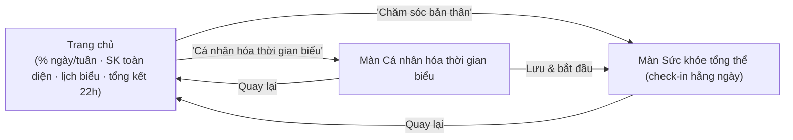
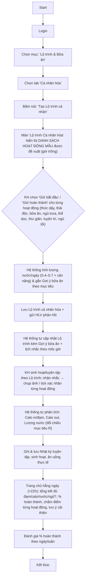

# Các Workflow chính dành cho đối tượng Khách hàng

## 0. Chuỗi điều hướng (Navigation)

- **Trang chủ** (`prototypes/trang_chu.html`): hiển thị **% hoàn thành ngày/tuần**, **đánh giá sức khỏe toàn diện** (Thân–Tâm–Trí), **lịch biểu cần làm** (học tập, làm quiz, sự kiện…), và **tổng kết cuối ngày (≈22h)**: đủ đạm/calo/nước/ngủ?, % hoàn thành, chấm điểm từng hoạt động, lưu ý cải thiện.
- Từ Trang chủ có các mục chức năng, nổi bật:
  - **"Cá nhân hóa thời gian biểu"** (hiển thị nhỏ) → màn cấu hình giờ & số bữa (§A.1).
  - **"Chăm sóc bản thân"** → màn **"Sức khỏe tổng thể"** để check-in nhiệm vụ hằng ngày (§A→§D).

> 👥 **HLV làm gương:** Chuỗi điều hướng này dành cho **Khách hàng**, nhưng **HLV cũng thực hiện chính các nhiệm vụ này** (qua cùng các màn) để **làm gương**. HLV có thể **chia sẻ** việc đã làm — qua **hình ảnh, chat** — và **gửi cho Khách hàng** (nút "chia sẻ" trên hoạt động đã hoàn thành). Xem thêm `Workflow-HLV.md`.

## A. Workflow tổng quát "Cá nhân hóa Lộ trình và Gợi ý bữa ăn"

> **Bối cảnh (Quy trình 002 — CSKH theo lộ trình):** KH **tự thiết kế lộ trình** thay đổi thói quen/lối sống/sức khỏe **dựa trên lộ trình mẫu** hệ thống gợi ý. Mục tiêu cân nặng (từ màn "Thiết lập mục tiêu", `Workflow-HLV.md §1.4`) là đầu vào để **gợi ý bữa ăn** (Calo/ngày, số bữa) theo `docs/business-rules/Calorie-Meal-Business-Rules-v1.0.md`.

> **Triết lý lộ trình — Thân · Tâm · Trí:** lộ trình giúp KH thay đổi & đạt kết quả tốt hơn trên 3 trụ cột — **Thân** (sức khỏe thể chất & tinh thần), **Tâm** (lối sống lành mạnh, yêu thương, biết ơn, quản trị cảm xúc), **Trí** (kiến thức về quản trị tài chính, đầu tư, kinh doanh…). Mỗi hoạt động trong ngày đều quy về một trụ cột (xem cột "Trụ cột" ở §B).

**Sơ đồ quy trình:**

---

## A.1 Màn "Cá nhân hóa thời gian biểu" (trước khi dùng hằng ngày)

Trước khi sử dụng màn **"Sức khỏe tổng thể"** hằng ngày, KH **cá nhân hóa thời gian biểu** một lần (và có thể chỉnh lại sau). Prototype: `prototypes/ca_nhan_hoa_thoi_gian_bieu.html`.

KH tùy biến:
- **Số bữa ăn/ngày**: 3 / 4 / 5 bữa (hệ thống sinh đúng số "nhiệm vụ ăn" tương ứng — vd 5 bữa = Sáng, Phụ sáng, Trưa, Phụ chiều, Tối).
- **Giờ bắt đầu / kết thúc** cho từng hoạt động (thức dậy, thải độc, các bữa ăn, ngủ trưa, thể dục, thư giãn/thiền, PTBT, ngủ tối).

> ⚖️ **Quy tắc điểm theo độ tối ưu:** mỗi hoạt động có **khung giờ tối ưu** theo đồng hồ sinh học. Giờ KH chọn **càng lệch khung tối ưu → điểm tối đa của hoạt động đó càng giảm** (đúng khung = tối đa 3đ, lệch vừa = tối đa 2đ, lệch nhiều = tối đa 1đ). Màn hiển thị **"Mức tối ưu đồng hồ sinh học (%)"** và **tổng điểm tối đa/ngày** để KH cân nhắc. Mục đích: khuyến khích KH sắp lịch gần nhịp sinh học tối ưu, nhưng vẫn linh hoạt để thực hiện được trọn vẹn.

Lưu lại → áp dụng cho màn "Sức khỏe tổng thể" hằng ngày.

## B. Lộ trình mẫu — các hoạt động đề xuất

Khi tạo lộ trình, hệ thống hiển thị **danh sách hoạt động mẫu** (giờ để trống); KH **chọn giờ** cho từng hoạt động phù hợp nhịp sống của mình. Mỗi hoạt động gắn **loại xác nhận** (📷 chụp ảnh hoặc ✓ tick) để hệ thống nhắc & ghi nhận.

| # | Hoạt động | Trụ cột | Thời lượng / khung giờ gợi ý | KH cấu hình | Xác nhận khi nhắc |
|---|---|---|---|---|---|
| 1 | **Thức dậy** | Thân | 4h / 5h / 6h (chọn) | Giờ dậy | 📷 chụp ảnh |
| 2 | **Thải độc / uống nước buổi sáng** | Thân | 6h–7h | Giờ | ✓ tick |
| 3 | **Bữa ăn** (Sáng / Trưa / Tối) | Thân | theo khung | Giờ mỗi bữa | 📷 chụp ảnh (món ăn) |
| 4 | **Ngủ trưa** | Thân | ~30 phút | Chọn giờ | ✓ tick |
| 5 | **Thể dục / vận động** | Thân | 30–60 phút | Chọn giờ | 📷 chụp ảnh |
| 6 | **Thư giãn / phục hồi** (spa, sauna, xông, nghe nhạc, **thiền**, biết ơn) | Tâm | ~60 phút, lúc yên tĩnh | Chọn giờ | ✓ tick |
| 7 | **PTBT — Phát triển bản thân** (đọc sách, Zoom đào tạo kỹ năng/kiến thức: tài chính, đầu tư, kinh doanh…; tại Nhóm Dinh dưỡng hoặc qua Zoom) | Trí | ~60 phút, khung tối 20h–21h | Chọn giờ + hình thức | 📷 chụp ảnh (vd chép bài) |
| 8 | **Ngủ tối** | Thân | — | Giờ đi ngủ | ✓ tick |

**Quy tắc lượng nước:** `Lượng nước/ngày = (0.4 – 0.7) × cân nặng (kg)` → hệ thống tính sẵn và phân bổ nhắc uống nước trong ngày.

> Hoạt động zoom/nhóm (mục 7) có thể gắn **cộng đồng** (nhắc chụp ảnh nhóm) để tăng động lực.

---

## C. Hệ thống tự động phân tích & nhắc việc

**Tự động phân tích (đối chiếu mục tiêu — R):**
- **Calo in / đạm** — từ ảnh & nhật ký bữa ăn (VisionAgent).
- **Calo out** — từ vận động/thể dục (đối chiếu mục tiêu R).
- **Lượng nước** — so với mức `0.4–0.7 × kg` (đối chiếu mục tiêu R).

**Tự động nhắc theo mốc giờ** (gắn từng hoạt động ở mục B), kèm loại xác nhận:
- Giờ dậy → nhắc 📷 chụp ảnh.
- Giờ vệ sinh / thải độc → nhắc ✓ tick.
- Giờ ăn → nhắc 📷 chụp ảnh món ăn.
- Giờ tập → nhắc 📷 chụp ảnh.
- Giờ thiền / ngủ trưa → nhắc ✓ tick.
- Giờ luyện trí → nhắc 📷 chụp ảnh (vd chép bài học).
- Giờ ngủ tối → nhắc ✓ tick.
- Giờ học Zoom (nhóm) → nhắc 📷 chụp ảnh nhóm (cộng đồng).

---

## C.1 Ghi nhận bữa ăn (2 chế độ)

Khi KH check-in một bữa ăn, mở pop-up nhỏ với **2 cách nhập (kết hợp được)**:
1. **📷 Chụp ảnh / Upload ảnh → AI bóc tách:** hệ thống gọi **API AI** tự nhận diện **tên các món** + **ước lượng đơn vị đo (bát/lạng…)** và số lượng → KH **sửa lại** tên/đơn vị/số lượng nếu chưa đúng.
2. **Nhập tay theo form:** mỗi món gồm **Tên món** (gà/cá/tôm/rau/nấm…), **Đơn vị đo** (bát/lạng…), **Số lượng** → hệ thống gọi **API tính số Calo nạp vào**.

Cả hai chế độ tổng hợp thành **một danh sách món** với **Calo/đạm tạm tính** (đối chiếu mục tiêu); lưu vào nhật ký bữa ăn → cập nhật múi đồng hồ + Calo in. **Số nhiệm vụ ăn trong ngày** bằng **số bữa** đã cấu hình ở màn "Cá nhân hóa thời gian biểu".

## D. Trang chủ hằng ngày (tổng kết ≈ 22h)

Cuối ngày, trang chủ hiển thị bản tổng kết nổi bật:
- **Đủ đạm? đủ Calo? đủ nước? đủ ngủ?** — trạng thái Tốt / Cần lưu ý.
- **% hoàn thành lộ trình** trong ngày + **chấm điểm từng hoạt động**.
- **Lưu ý cải thiện** (về ăn uống, vận động, ảnh check-in còn thiếu…).
- **Đánh giá % hoàn thành theo ngày / tuần** (xu hướng).

---

## E. Lưu ý vận hành — HLV làm gương (bắt buộc với Quy trình 002)

> **HLV phải làm gương:** HLV cũng **thực hiện chính lộ trình** này (dùng cùng chuỗi màn Trang chủ → Cá nhân hóa → Sức khỏe tổng thể), **chụp ảnh & check-in đánh giá lộ trình của mình như một khách hàng**. HLV có thể **chia sẻ kết quả qua hình ảnh & chat, gửi cho Khách hàng / cộng đồng** để truyền cảm hứng. Đây là phương pháp **đào tạo bằng cách làm gương**. (Tham chiếu: `Workflow-HLV.md`.)

---

## F. Liên kết dữ liệu & nghiệp vụ
- **Đầu vào gợi ý bữa ăn:** mục tiêu cân nặng (`adjusted_target`) + thời gian gói → Calo/ngày, số bữa/ngày (`docs/business-rules/Calorie-Meal-Business-Rules-v1.0.md`).
- **Nhật ký thực tế:** ảnh/tick từng hoạt động ghi vào nhật ký ngày (meal/activity logs) phục vụ phân tích & báo cáo.
- **Phản hồi HLV:** lộ trình KH tự thiết kế được gửi HLV duyệt/điều chỉnh trước khi chốt.
